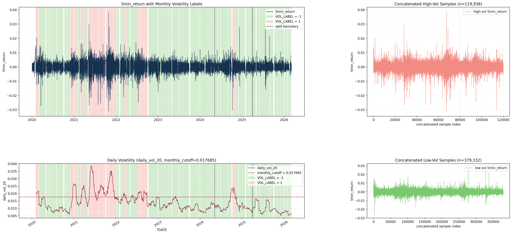
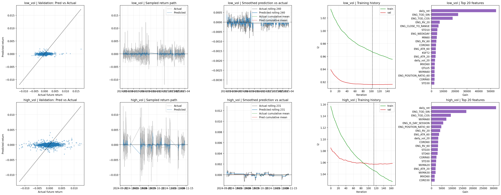
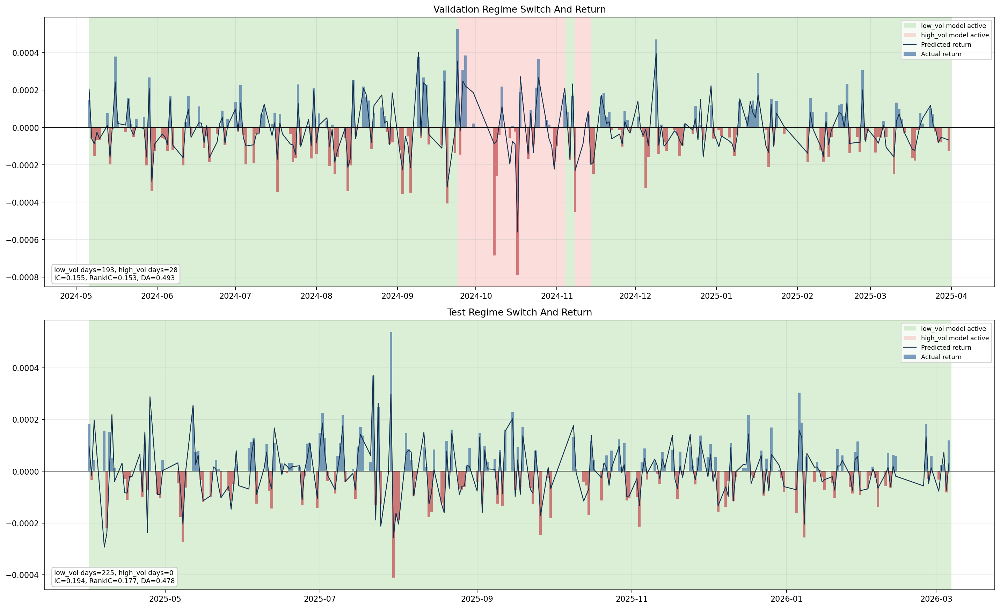
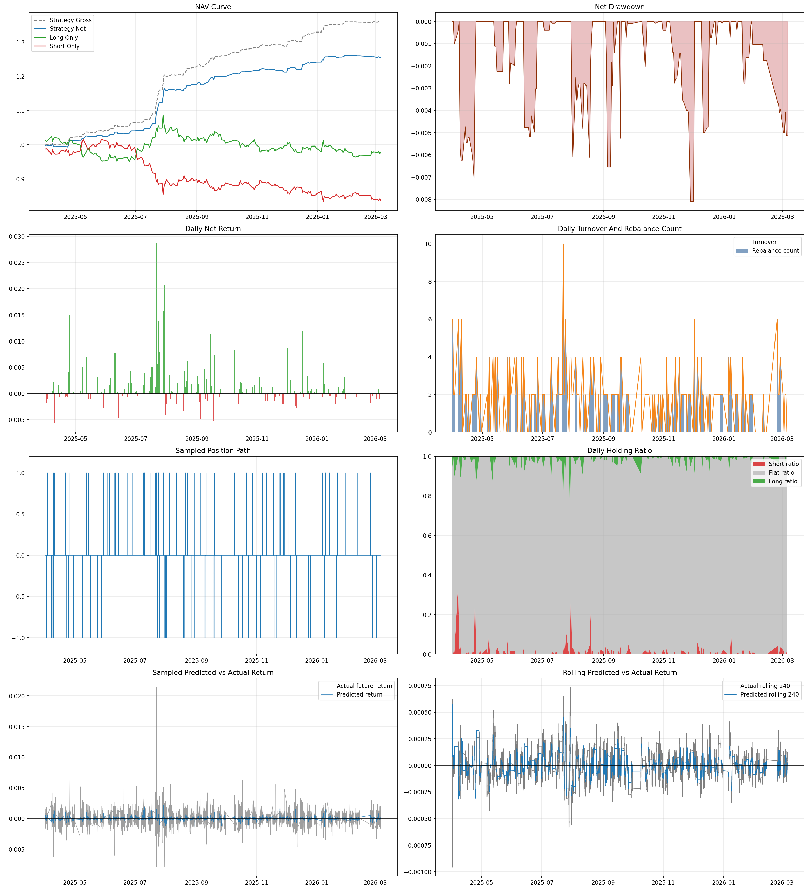

# CTA_vol

`CTA_vol` 是一个基于 5 分钟级商品期货数据的双 regime CTA 研究项目。它会先把分钟行情与因子做融合，再使用训练集上估计出的波动率 cutoff 将样本划分为 `low_vol` / `high_vol` 两类，分别训练两个 LightGBM 回归模型，最后用验证集确定开平仓阈值，并在测试集上做规则化回测。

当前实现遵循两个核心原则：

- 市场状态切分只使用训练集计算出的 cutoff，不用模型来决定高波或低波。
- 训练、回测、阈值、成本、路径和输出文件都统一放在 `config.yaml` 中管理，尽量减少散落的硬编码。

## 1. 项目结构

```text
CTA_vol/
├── config.yaml
├── pipeline/
│   ├── config_utils.py
│   ├── dataset.py
│   ├── modeling.py
│   ├── train.py
│   ├── train_products.py
│   ├── backtest.py
│   ├── backtest_macro.py
│   ├── factor_engine.py
│   ├── judge_macro.py
│   └── build_product_registry.py
├── scripts/
│   ├── audit_mid_weekly_inputs.py
│   ├── audit_mid_weekly_importance.py
│   ├── apply_soft_dup_decisions.py
│   ├── update_registry_with_mid_weekly.py
│   └── compare_runs.py
├── dataloader/
│   ├── dataloader.py
│   └── splitByVol.py
├── data/
│   ├── RBZL.SHF.csv
│   └── factors/
└── results/
    ├── cache/
    ├── models/
    ├── backtest/
    └── reports/
```

各模块职责如下：

- `config.yaml`
  - 集中配置数据路径、样本切分、波动率划分、LightGBM 超参数、信号规则和回测参数。
- `pipeline/dataset.py`
  - 负责原始数据读取、因子融合、工程特征生成、训练目标构造、调用 `splitByVol` 划分 regime，并输出训练/验证/测试集。
- `dataloader/splitByVol.py`
  - 负责基于训练集样本计算波动率 cutoff，并对全样本打高波/低波标签。
- `pipeline/modeling.py`
  - 负责分别训练 `low_vol` 与 `high_vol` 两个 LightGBM 模型，保存模型与训练诊断图。
- `pipeline/backtest.py`
  - 负责用验证集预测值生成交易阈值、在测试集上生成持仓路径、计算净值和回测图。
- `scripts/`
  - 一次性/辅助脚本：中观输入 audit、软重复裁决、registry 更新、A/B 对比、feature importance audit。均自足，不从 `pipeline/` 导入。

## 2. 数据输入约定

### 2.1 主行情数据

默认读取：

- `data/RBZL.SHF.csv`

要求至少包含以下字段：

- `TDATE`
- `OPEN`
- `HIGH`
- `LOW`
- `CLOSE`

如有以下字段，会自动用于工程特征：

- `VOLUME`
- `AMOUNT`
- `POSITION`

当前这套样本不依赖主力合约标识。只要时间序列已经按你的方式整理好并能直接训练，就可以直接使用。

### 2.2 因子数据

默认读取：

- `data/factors/*.csv`

每个因子文件要求：

- 必须包含一列时间字段，列名可大小写不同，但逻辑上要等于 `tdate`
- 只能再包含一个实际因子值列

项目会自动把所有因子按时间戳并到分钟行情上，并在训练集上做缺失率和方差过滤。

## 3. 当前默认流程

当前默认配置下，完整流程如下：

1. 读取分钟行情与所有因子文件。
2. 合并因子，并补充一组工程特征，例如收益率、波动率、ATR、量价比值、时段特征等。
3. 构造未来 5 bar 收益：
   - `future_return = future_close / CLOSE - 1`
4. 构造训练目标：
   - 默认目标是 `target_vol_norm`
   - 即用未来收益除以局部波动尺度后的标准化目标
5. 按月度边界切分 `train / val / test`。
6. 在训练集上计算 `daily_vol_20` 的 cutoff，并据此将样本标记为 `low_vol` / `high_vol`。
7. 分别在高波、低波训练样本上训练两个 LightGBM 模型。
8. 用验证集预测值按分位数确定开仓阈值、平仓阈值和成本过滤阈值。
9. 在测试集上按每日 regime 路由到对应模型，并完成回测。

## 4. 默认配置说明

当前 `config.yaml` 里的关键默认值如下：

### 4.1 数据与样本切分

- `target_horizon: 5`
- `train_ratio: 0.70`
- `valid_ratio: 0.15`
- `test_ratio: 0.15`
- `vol_split.window: 20`
- `vol_split.vol_percentage: 0.70`
- `vol_split.regime_label_source: daily`
- `vol_split.split_granularity: month`

解释：

- 未来收益预测 horizon 是 5 个 bar
- 训练、验证、测试按时间顺序切分
- 高低波切分使用训练集 `daily_vol_20` 的 70% 分位数作为 cutoff

### 4.2 模型

- `model.target_column: target_vol_norm`
- `model.scale_method: robust`
- `model.num_boost_round: 400`
- `model.early_stopping_rounds: 50`
- `model.common_params.metric: l2`

解释：

- 训练标签默认是波动率归一化后的未来收益
- 特征默认使用 `RobustScaler`
- `l2` 是平方误差损失，较大的预测错误会被惩罚得更重

### 4.3 信号与回测

- `signal.entry_quantile: 0.88`
- `signal.exit_quantile: 0.45`
- `signal.confirmation_bars: 2`
- `signal.min_hold_bars: 4`
- `signal.cooldown_bars: 2`
- `signal.enforce_cost_filter: true`
- `backtest.commission_rate: 0.0001`
- `backtest.slippage_rate: 0.0001`
- `backtest.flatten_at_day_end: true`

解释：

- 开仓阈值来自验证集预测值绝对值的高分位
- 平仓阈值来自较低分位
- 默认会考虑手续费和滑点，并要求信号至少覆盖往返成本
- 默认日末平仓

## 5. 如何运行

在代码根目录下执行：

```bash
python pipeline/train.py
python pipeline/backtest.py
```

如果你改了原始数据或因子，想强制重建融合缓存：

```bash
python pipeline/train.py --force-rebuild
python pipeline/backtest.py --force-rebuild
```

如果你要跑全品种批量训练：

```bash
python pipeline/train_products.py --all
```

批量训练会在终端输出每个品种的开始、成功、失败状态，并把运行中间状态持续写到 `results/runs/<run_id>/`。常用文件包括：

- `manifest.json`
- `run_summary.json`
- `run_summary.csv`
- `failed_products.json`

默认还会先检查 `product_registry.json` 里的日期覆盖范围。当前配置要求品种至少覆盖 `2021-01-01` 到 `2026-01-01`；不满足的品种会被直接标记为 `skipped_insufficient_coverage`，不会进入训练。

如果上一次批量训练里有失败或中断，可以直接补跑缺失品种：

```bash
python pipeline/train_products.py --resume-run <run_id>
```

`--resume-run` 会保留上次已经 `success` 的品种，只重新训练未成功的品种。

训练脚本会输出：

- `results/models/low_vol/`
- `results/models/high_vol/`
- `results/models/training_summary.json`
- `results/reports/training_diagnostics.png`
- `results/reports/regime_model_comparison.png`

回测脚本会输出：

- `results/backtest/backtest_summary.json`
- `results/reports/backtest_report.png`

默认不会生成一堆中间 CSV。只有当 `backtest.save_prediction_table: true` 时，才会额外保存预测表。

## 6. 输出文件说明

### 6.1 缓存

- `results/cache/merged_features.parquet`
  - 因子融合与工程特征后的全量缓存
- `results/cache/merged_features_meta.json`
  - 缓存元信息

### 6.2 模型

- `results/models/low_vol/model.txt`
- `results/models/high_vol/model.txt`
- `results/models/*/scaler.pkl`
- `results/models/*/meta.json`
- `results/models/*/feature_importance.json`

### 6.3 训练摘要

- `results/models/training_summary.json`

主要包括：

- 数据集统计
- cutoff 信息
- 特征列
- 两个 regime 模型各自的参数和验证/测试预测指标
- 合并后的 validation / test 预测指标

### 6.4 回测摘要

- `results/backtest/backtest_summary.json`

主要包括：

- 两个 regime 的交易阈值
- validation / test 的预测指标
- validation / test 的策略表现
- 测试集月度收益

## 7. 图表说明

### 7.1 `vol_regime_split.png`

展示波动率切分结果，重点用于确认：

- cutoff 是否合理
- 高波 / 低波标签与时间区间是否匹配
- `train / val / test` 的边界位置



### 7.2 `training_diagnostics.png`

每个 regime 各有一整行训练诊断图，主要包括：

- `Pred vs Actual`
  - 预测值和真实未来收益的散点图
- `Sampled return path`
  - 抽样后的实际收益和预测收益时间序列
- `Smoothed prediction vs actual`
  - 滚动均值和平滑后走势
- `Training history`
  - LightGBM 训练/验证损失曲线
- `Top features`
  - 特征重要性

如果你怀疑过拟合，优先看 `Training history`：

- `train loss` 持续下降，但 `val loss` 先降后升并明显分叉，通常是过拟合信号



### 7.3 `regime_model_comparison.png`

这张图不是简单的柱状指标对比，而是时间轴对比图：

- 上半部分是验证集
- 下半部分是测试集
- 背景色表示当时实际启用的是 `low_vol` 还是 `high_vol` 模型
- 柱子表示当日平均 `future_return`
- 线表示当日平均 `pred_return`

适合回答两个问题：

- 某段时间到底切到了哪个模型
- 切到该模型之后，预测方向和真实收益是否同向



### 7.4 `backtest_report.png`

回测图包含以下面板：

- NAV 曲线
- 净值回撤
- 日收益
- 日换手与调仓次数
- 抽样持仓路径
- 日度持仓占比
- 抽样预测收益 vs 实际收益
- 滚动预测收益 vs 实际收益
- `Validation Model Switch And Daily Return`
- `Test Model Switch And Daily Return`

最后两张图是双轴图，阅读时尤其要注意：

- 背景色表示这段时间实际使用的是 `low_vol` 还是 `high_vol` 模型
- 柱子表示 `daily net return`
- 黑线表示 `Net NAV`

如果只看柱子，很容易把“日收益有波动”误读成“累计一直在亏”。判断某一段时间整体是否赚钱，应该优先看黑色净值线。



### 7.5 `long only` 和 `short only` 基准

在 NAV 面板里还会画两个基准：

- `Long only`
  - 在可交易 bar 上尽量保持 `+1` 多头；若开启 `flatten_at_day_end`，则会在日末回到 `0`
- `Short only`
  - 在可交易 bar 上尽量保持 `-1` 空头；若开启 `flatten_at_day_end`，则会在日末回到 `0`

它们的作用是给策略提供一个简单的多头/空头参照，不代表模型信号本身。

## Tips

1. 波动率归一化(用未来5bar算return，然后用滚动波动率缩放，使得高波动率时大收益也能计入，并进行floor防止小波动率小收益算出过大)
2. 额外添加因子：多周期收益率、RV、均线偏离、VMAP偏离等，涵盖部分event-driven的因子
3. 训练lightGBM时设置`feature_fraction=0.8`每棵树随机取部分特征避免过拟合、设置`bagging_fraction=0.8`和`bagging_freq=5`
4. 对高波动/能覆盖交易成本/极端收益样本加权
5. 入场阈值、出场阈值
6. N根K线后才确认执行，且有最小持仓，禁止直接反转而是多平空
7. 做类别平衡。三分类最容易塌向多数类，建议先试`class_weight`、样本重加权，或者控制 `short/flat/long` 的样本比例。同时要思考，为什么要三分类，是否换成两个二分类效果更好
8. 优化目标看 `macro_f1`($F1=2\times \frac{Precision\times Recall}{Precision + Recall}$) 和每类召回，不要只看 accuracy。三分类里 accuracy 很容易误导。因为会倾向于多数类导致accuracy虚高
9. 单独检查 long 和 short 的命中率。最终赚钱靠的是两端，不是 flat 类分得多准。
   做 walk-forward，不要只看一次固定切分。时序问题里这比继续堆参数重要。
   先减少特征噪声。现在虽然已经筛到 50 个因子，但仍可能太多，建议继续压缩到更稳定的一组。
10. 最后调 LightGBM 参数。真正值得先试的是`num_leaves、min_child_samples、learning_rate、feature_fraction`，但这排在标签和样本分布之后。
11. 不能预测>0就做多，而是考虑大于阈值或者类似`pred_return >= 90% 分位` 做多；同时开仓阈值$\theta_{open}$和平仓阈值$\theta_{close}$要分开，设置no-trade zone,并且为了保持惯性需要$\theta_{open} \gt \theta_{close}$，避免来回跳动
12. 不能允许做多直接到做空，而是先平仓到0，下次再决定是否做空。并且必须考虑好成本，得同量级。e.g. `pred_return`为0.03%，而滑点+交易成本单边各为0.0001，那么翻仓(开仓+平仓)一次为0.0004即0.04%；或者用桶阈值进行划分，将prediction划为10个桶，只有落在第1个桶long，在第10个桶short
13. 除了普通的预测，还有**事件识别** - 输入市场状态，输出：当前是否发生某类事件; 当前属于哪类事件; 当前应不应该激活某个 expert / 策略
14. LightGBM不只是输入因子，还可以先人为划分状态向量(Market, Trend, Momentum等)，然后与关键因子交互，使用cell weight给样本加权
15. 除了本身的模型，还可以用一个额外的high residual来拟合残差，这个的训练应该更加保守用更少特征更浅树等等
16. **分成高波和低波的样本进行切分数据集**，切分以后把高波拼接一起和低波拼接一起，然后进行训练(尽量按月切分，日度波动统计作为切分标准，如果有rolling在当月做rolling)
