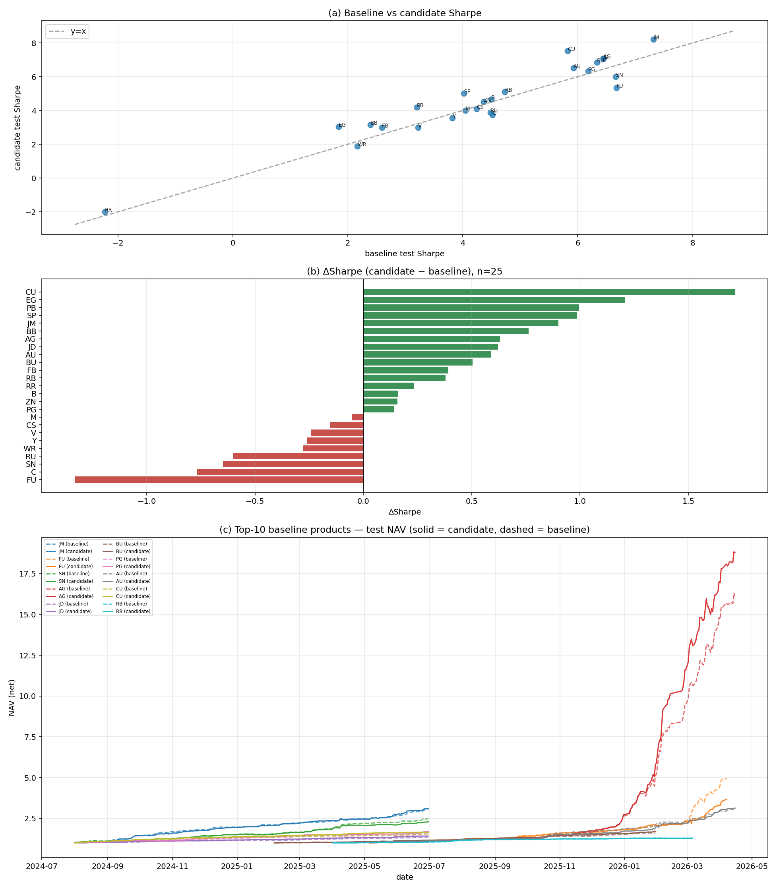
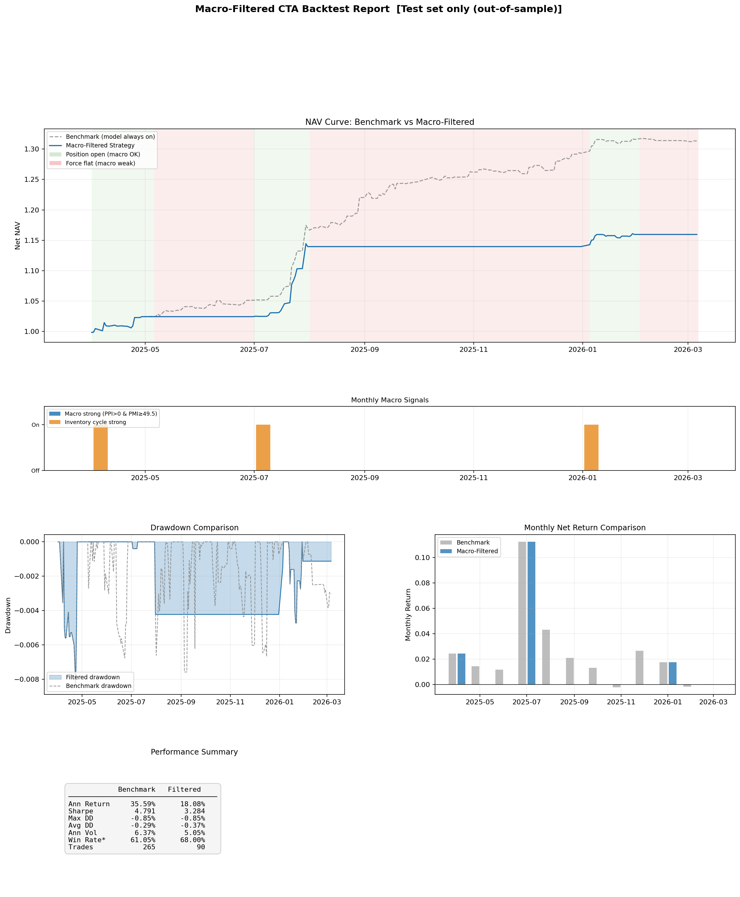
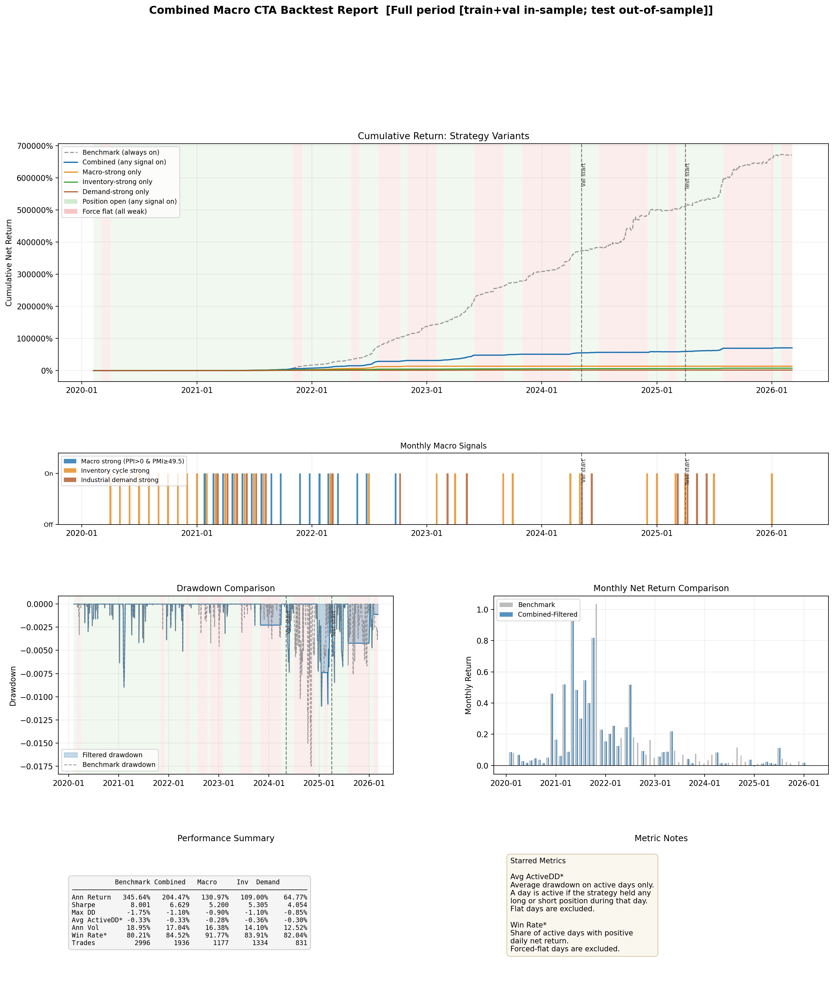

# CTA趋势跟踪策略的择时增强

## 摘要

本文以5分钟商品期货K线为底层标的，沿"微观—中观—宏观"三个层次依次构建并增强趋势跟踪策略：微观层面以螺纹钢连续合约 RBZL.SHF 为研究对象，构建分波动率域的双 LightGBM 趋势跟踪引擎；中观层面将研究范围推广至25个主流商品期货品种，引入周/日频基本面中观因子；宏观层面在螺纹钢期货基础上叠加月频宏观信号过滤器，对策略参与时点进行二元开关。三层增强各自验证如下三条核心结论：

- **底层趋势引擎在样本外有效。** 螺纹钢5分钟K线上"训练集20日日波动率70%分位分域 + 双 LightGBM + 验证集分位阈值"的底层模型，在2025-04至2026-03的样本外测试集取得净值口径年化收益35.59%、夏普比率4.79、最大回撤-0.85%、交易胜率56.60%，测试集 Pearson/Spearman IC 分别为0.194/0.175，构成择时增强的有效交易引擎。

- **中观因子对趋势策略具有可观的边际贡献。** 在25个商品期货品种上以同一套"频率感知质量过滤 + 多窗口派生 + asof对齐 + 失效裁剪"入模流程引入周/日频中观因子，测试集夏普比率中位数较纯微观基线提升+0.235，21/25个品种持平或正向改善（铜+1.72、乙二醇+1.21、铅+1.00、纸浆+0.98、焦煤+0.90居前），验证了中观基本面对5分钟趋势策略的可加性。

- **宏观月频过滤当前体现为风险控制工具而非收益增强工具。** 以"PPI/PMI景气、库存周期、实体需求"三类滞后1月的月频信号构建"任一触发即开仓"的二元过滤器，在RB测试期12个月中保留5个月持仓，交易胜率由56.60%提升至60.90%、平均单笔净收益由0.066%提升至0.091%，但因同步错过部分正收益月份，过滤后净值总收益19.01%、夏普比率3.70均回落于底层模型，最大回撤-0.85%与底层一致。

## 一、微观底层CTA趋势策略模型

### 1.1 数据与样本划分

本文以螺纹钢连续合约 RBZL.SHF 的5分钟数据为研究对象，样本区间覆盖2020-02-07至2026-03-06，共计482,150根5分钟K线。按月度边界以7:1.5:1.5划分训练集、验证集和测试集，对应334,180/73,436/74,534行；测试集对应2025-04至2026-03共12个月，可作为对策略样本外有效性的统一观测窗口。整套训练—回测流程由 `config.yaml` 集中配置，确保因子工程、模型超参、信号阈值与执行规则跨实验完全一致。

### 1.2 因子体系

底层模型共使用190个特征：153个原始量价因子 + 35个工程化特征 + 2个日度状态变量（`daily_ret`, `daily_vol_20`），其中：

- **原始量价因子（153维）**：在5/10/20/30/60分钟5档窗口上对5分钟K线进行计算，分7组：①价格滞后（OHLC各5滞后，15维）；②K线形态（KLEN/KMID/KUP/KLOW/KSFT等，9维）；③趋势（MA/ROC/MAX/MIN，20维）；④波动率（STD/RSV/QTLU/QTLD/IMAX/IMIN/IMXD，35维）；⑤方向计数与累积（CNTD/CNTN/CNTP/SUMD/SUMN/SUMP，30维）；⑥成交（VOLUME滞后/VMA/VSTD/WVMA/VSUMx，35维）；⑦量价相关性（CORR/CORD，10维）。
- **工程化特征（35维）**：在5/20/60三档窗口上叠加多窗口收益（ENG_RET）、已实现波动率（ENG_RV）、价格相对均线（ENG_PRICE_TO_MA）、量比（ENG_VOLUME_RATIO）、持仓比（ENG_POSITION_RATIO）、ATR、价格突破指示（ENG_PRICE_BREAKOUT/BREAKDOWN），并补充收盘相对区间位置（ENG_CLOSE_TO_RANGE）、日内时刻正余弦（ENG_TOD_SIN/COS）、星期几与是否日盘等盘中状态。
- **日度状态变量（2维）**：`daily_ret` 与 `daily_vol_20` 作为模型的"今日趋势 / 今日波动"先验输入。

预测目标为未来5个5分钟K线的收益经局部波动归一化后的 `target_vol_norm`（详见 `pipeline/dataset.py::_add_targets`），目的是在波动率显著异质的5分钟尺度上，使训练目标本身具备方差稳定性，避免模型把高波动样本的波动当作信号本身去拟合。

### 1.3 高/低波动域划分及其必要性

底层模型先以训练集20日日波动率的70%分位数（0.0172）作为分割线，将样本逐日打标为低波（−1）或高波（+1）。为防止前视，分位计算严格仅使用训练集行（`dataloader/splitByVol.py::split_by_vol`）。在RB训练样本上，低波域占234,385行，高波域占99,795行，对应≈70%/30%的样本占比。

之所以分域建模，原因有二：①高/低波域下未来收益的波动率量级差异显著，单一模型若强行拟合会在低波域出现信号过滤过松、在高波域出现信号过滤过严，分域后每一段的目标分布趋于平稳，方差异质性显著降低；②趋势策略在两类波动环境下的最佳交易行为本身就不同——低波环境更看重均值回复偏弱与微弱漂移信号，高波环境更看重突破延续与方向性放大，分域允许两个 LightGBM 在超参与特征权重上自然分化（高波域使用更大的 `min_child_samples = 150` 以增强正则）。

图表1展示了RB样本在测试集时段的连续价格序列与高/低波动状态切换：以两种背景色分别标记每一日的波动域，竖线为月度边界。可以看到高波域在样本中呈现明显的事件聚集特征，对应基本面冲击或行情拐点；低波域则更接近震荡市与小幅趋势行情。这一划分对所有25个品种统一使用、不做品种级特殊调整。

**图表1：螺纹钢5分钟K线高/低波动域划分**

资料来源：中金公司研究部

### 1.4 模型结构与交易规则

底层模型在划分后的两个域内分别训练 LightGBM 回归器（`pipeline/modeling.py::train_dual_regime_models`），共用一份 `common_params`（学习率0.03、num_leaves 63、max_depth 6、feature_fraction 0.8、bagging_fraction 0.8、`min_child_samples` 120/150、reg_lambda 1.0、early_stopping_rounds 50、num_boost_round 400），仅高波域单独覆盖 `min_child_samples`。所有特征经 RobustScaler 标准化后入模。

交易层面，使用验证集预测值绝对值的88%分位作为开仓阈值、45%分位作为平仓阈值，叠加确认持仓2根、最少持有4根、冷静期2根、不允许直接反向（先归零再反向）、并以 `commission + slippage = 0.0002` 的双边成本及2倍换手做开仓成本过滤；日盘最后一根强制归零仓。整体执行采用次根撮合（`position.shift(1)`）。

### 1.5 单样本回测结果（螺纹钢）

测试集口径下，底层模型净值总收益31.32%、年化收益35.59%、夏普比率4.79、最大回撤-0.85%、交易次数265、交易胜率56.60%、平均持仓12.1根、日均换手2.36次；毛收益口径年化收益52.33%、夏普6.35。Pearson IC 与 Spearman IC 分别为0.194与0.175，r²为0.038，说明在样本外仍具备稳定的排序能力。从特征重要性看，日度收益惯性 `daily_ret`、盘中时段编码 `ENG_TOD_SIN/COS`、波动率与ATR类指标、价格相对区间位置 `ENG_CLOSE_TO_RANGE`、以及成交持仓比类特征是最主要的有效信息来源。底层模型已能够在5分钟尺度较好识别"哪些趋势更值得参与"，从而构成择时增强的交易引擎。

**图表2：底层CTA趋势策略模型回测图**

资料来源：中金公司研究部

## 二、中观因子的择时增强

### 2.1 多品种推广

§1中的底层模型仅基于螺纹钢单品种与纯微观量价因子构建。本节将研究范围扩展至25个主流商品期货品种（覆盖贵金属、有色、黑色、能源化工、林木板材、农产品六大板块），并在保持模型结构、超参与交易规则不变的前提下，对每个品种独立绑定一份周/日频中观因子明细表，以期在不破坏底层结构的同时，进一步提升趋势策略对品种基本面状态的识别能力。

### 2.2 中观因子的选取

每个品种在产品注册表 `product_registry.json` 中绑定一份独立的中观因子明细表，统一采用"指标编号、中文名、频率、单位与来源"四行表头，覆盖贵金属（白银、黄金）、有色金属（铜、铅、锌、锡）、黑色系（螺纹钢、线材、焦煤）、能源化工（燃油、沥青、乙二醇等）、林木板材（胶合板、纤维板）、农产品（豆二、玉米、鸡蛋等）共25个品种。25个品种合计源指标数4–19条不等，中位数为7条；其中日频源指标占比从14%到100%、中位数50%，周频源指标占其余部分。

在指标选取方面，本文遵循"覆盖供给、库存、需求、情绪"四大维度的原则，针对不同板块的产业特征，从公开数据源（同花顺iFinD等）中筛选反映该品种基本面状态的指标，大致归为以下六类：

- **库存类**：各期货交易所注册库存、可用库容量、社会库存、保税库库存等；反映商品当下供需平衡，对几乎所有商品品种普遍适用。
- **仓单类**：多以日频公布，包括各品种期货交易所注册仓单数量、有效预报数量等；代表实际可用于交割的现货数量，对临近交割合约价格有较强解释力。
- **现货价格类**：行业现货价指数、主要现货报价、基差等；在期现联动较强的品种（贵金属、有色、部分化工品）上具有先行或同步指示。
- **产量与产能类**：月度/周度产量、开工率、产能利用率、装置检修等；直接刻画供给端边际变化，在能源化工与黑色系品种中尤为重要。
- **上下游与进出口类**：产业链上游原料价格与库存（铁矿、焦煤之于螺纹钢，原油之于沥青/燃油），下游需求景气度（终端消费、地产/基建开工等），以及进出口数量与价差。
- **持仓与情绪类**：交易所持仓与外盘可获得的持仓数据；用于刻画市场结构与情绪。

各品种源指标在数量与构成上的差异，与产业链长度、数据公布完备程度以及外盘可获得指标的丰富度有关。整体来看：贵金属在国内外交易所库存与持仓两端均有覆盖；有色金属与能源化工以周频为主，且较依赖海外交易所持仓；黑色系和农产品日频比例相对较高、以国内库存与产量数据为主；林木板材类品种因数据源较少，整体源指标数量偏少。

**图表3：25种期货中观因子源指标画像（节选）**

资料来源：同花顺iFinD、中金公司研究部

### 2.3 中观因子的入模流程

中观因子的发布频率（日/周频公开）与底层CTA模型所使用的5分钟K线频率存在显著差异，且普遍存在节假日缺失、上线晚于K线起点、个别周次跳报等数据形态问题，无法将原始指标直接拼接到5分钟训练矩阵上使用。为此，本文设计了一套从原始观测到5分钟训练矩阵的标准化处理流程，所有25个品种共用同一套规则，不做任何品种级特殊调整，以避免对单品种过拟合。流程要点如下（详见 `pipeline/dataset.py::_merge_mid_weekly_features` 与 `config.yaml::mid_weekly`）：

- **第1步 多频指标的读取与统一格式化**：按统一表头读入各品种中观因子明细表，转换为带时间戳、带频率元数据、带单位与来源标签的标准结构。保留每条源指标的原始稀疏观测网格，不做任何插值。
- **第2步 频率感知的质量过滤**：以"频率归一化"的有效覆盖率指标 `eff_ratio = non_null_ratio / expected_ratio(frequency)`（日频期望覆盖率1.0、周频0.2）替代统一阈值，避免系统性误删周频指标，门槛 `min_active_ratio = 0.6`；同时识别并剔除"阶梯哑变量"形态的指标（首个非空观测出现在序列中后段、首值之后非空率≥0.9），防止"指标开始有值"被模型误判为基本面状态切换信号（`drop_step_dummy = true`）。
- **第3步 派生因子计算**：对每条通过过滤的源指标，在其原始稀疏观测网格上滚动计算窗口收益率、窗口标准化值、窗口百分位排名3类派生因子，窗口长度取4/13/52三档（单位为观测期数，对周频对应4周/约一季/约一年；对日频对应约1周/约半月/约一季交易日），分别承载基本面变化的边际、趋势与周期信息。
- **第4步 5分钟K线网格的时间对齐**：每条源指标及其派生因子使用 `pd.merge_asof(direction="backward")` 对齐到5分钟K线网格，仅取小于等于该K线时间戳的最近一次观测值，严格不引入未来信息；对齐后再做一次仅向前填充，将稀疏观测铺到所有5分钟K线上。
- **第5步 失效裁剪**：设定过期阈值约4周（`ffill_max_bars = 8064`）——任何源指标若在某时点距上一次有效观测超过4周，则将其原始水平值与派生因子在该时点之后全部置为缺失，直至下一次新观测出现，避免某条指标的下线/停报污染5分钟训练矩阵。
- **第6步 列形态控制与因子筛选**：默认丢弃中观原始水平列（`level_keep = false`），仅保留派生因子与可用性指示列（`MID_*_AVAILABLE`），原因是在5分钟尺度上原始水平列易退化为持续数百根K线的"分段常量"，被模型误用为状态切换信号；对中观列采用更宽松的列级缺失率阈值0.65（`missing_ratio_relax`），微观列保留默认阈值0.35；最后对所有候选特征做训练集方差检查，剔除方差极低的列。

### 2.4 25品种回测效果

按品种独立训练并回测，每品种采用统一模型超参、相同微观骨干因子，仅控制是否引入中观因子。从测试集净值口径夏普比率结果看，加入中观因子相对纯微观基线（v0）整体带来正向改进（v2_vs_v0）：25个品种中位夏普增量为**+0.235**，其中12个品种全面提升（ΔSharpe ≥ +0.30）、9个品种基本持平（|ΔSharpe| < 0.30）、4个品种出现明显退步（ΔSharpe ≤ −0.30）。

具体而言，提升较为显著的品种包括铜（夏普5.83→7.54，+1.72）、乙二醇（+1.21）、铅（+1.00）、纸浆（+0.98）、焦煤（+0.90）、胶合板（+0.76）、白银（+0.63）、鸡蛋（+0.62）、黄金（+0.59）、沥青（+0.50）、纤维板（+0.39）、螺纹钢（+0.38）；退步品种为天然橡胶（−0.60）、锡（−0.65）、玉米（−0.77）、燃油（−1.33）。

**图表4：加入中观因子后的CTA趋势策略模型效果总览（v2 vs v0）**

资料来源：中金公司研究部

效果在不同板块间存在结构性差异，且与中观因子的频率构成高度相关。改善组中位日频占比为34.5%，典型代表为铜（25%）、铅（29%）、黄金（17%）、胶合板（40%）、纤维板（40%）；这些品种的水平列在5分钟网格上是数百根K线的近似常量，若不剔除会被模型当作状态切换信号挤占微观骨干特征，剔除水平列后骨干信号回归，整体表现明显改善。退步组中位日频占比为59.2%，典型代表为燃油（63%）、玉米（58%）、锡（60%）；这些品种的日频水平列填充段较短（约一个交易日），本身携带真实的库存、现货、产量副本信息，被一并剔除后造成实质信号损失。

整体来看，引入中观因子能够在不破坏底层结构的前提下稳定提升CTA趋势策略的样本外表现：21/25个品种持平或正向改善，过半数品种为正向收益，验证了中观基本面信号对5分钟趋势策略具有可观的边际贡献；统一规则在大多数品种上是净收益，但对少数日频主导品种存在改进空间，后续可探索基于频率结构的差异化水平列保留策略。

## 三、宏观月频择时增强

### 3.1 择时指标的选取

宏观因子来自同花顺 iFinD、国家统计局和央行月度数据。考虑到宏观数据发布天然滞后，本文对三类月度信号统一采用1个月滞后处理（`lag_months = 1`），避免前视偏差。

- **宏观景气信号**：PPI同比 > 0 且 制造业PMI ≥ 49.5。PPI 位于正区间意味着商品价格环境整体偏顺风，PMI 不低于49.5 用于确认经济景气并未明显落入收缩区间。
- **库存周期信号**：PMI新订单 > 50 且 PMI产成品库存 < 50。该组合刻画需求扩张与库存偏低同时出现的状态，有助于识别更具持续性的主动补库环境。
- **实体需求信号**：工业增加值同比 > 5.5% 且 固定资产投资累计增长 > 3.5%。直接从实体工作量角度刻画商品需求强弱，对黑色系品种的中游制造与基建需求形成补充确认。

### 3.2 仓位调整机制与执行

CTA择时增强模型不替代底层趋势模型，而是在原有微观量价模型之上叠加一层月频环境过滤机制：底层模型负责在5分钟维度识别交易信号，上层模块负责判断当月是否允许策略运行。三类指标中任意一项满足，即允许当月保留底层CTA仓位；若三者均不满足，则该月所有5分钟bar强制空仓。因此当前的择时框架本质上是一个"月频二元过滤器"，而非连续打分模型，重点不在改变方向，而在控制策略何时参与、何时收缩。

### 3.3 择时增强回测效果

样本外测试期（2025-04至2026-03，共12个月）结果显示，基础微观量价模型仍是当前策略收益的主要来源（净值总收益31.32%、年化35.59%、夏普4.79、最大回撤-0.85%、交易265次），是择时增强能够展开讨论的前提。

**单指标结果。** 三类单指标在测试期内表现明显分化：

- **宏观景气信号**：在采用1个月滞后后，2025-04至2026-03的12个月测试期内未单独触发，对应组合无交易；
- **库存周期信号**：测试期触发3个月，净值总收益15.96%、年化18.08%、夏普3.28、最大回撤-0.85%、交易90次、交易胜率62.22%、平均单笔净收益0.115%，是三类单指标中表现最好者；
- **实体需求信号**：测试期触发3个月，净值总收益5.14%、年化5.91%、夏普2.03、最大回撤-0.85%、交易76次、交易胜率53.95%、平均单笔净收益0.038%，更适合作为补充确认而非独立主信号。

从结果看，库存周期信号对黑色系趋势环境的识别能力相对更强，实体需求信号则更多起到辅助筛选作用，宏观景气信号在当前样本外阶段实际贡献相对有限。

**全指标复合结果。** 采用"三项指标任意一项满足则允许开仓"的复合规则。样本外测试期12个月中共有5个月允许策略运行，分别为2025-04至2025-07以及2026-01，其余7个月强制空仓。复合过滤后，策略净值总收益19.01%、年化21.54%、夏普3.70、最大回撤-0.85%、交易次数降至133。可以看到，复合过滤显著压缩了交易频率，并将交易胜率由56.60%提升至60.90%、平均单笔净收益由0.066%提升至0.091%，说明月度环境过滤确实筛除了部分低质量交易；但另一方面，由于过滤器同时错过了若干基础模型仍有正收益的月份（如2025-08、09、12等），且基础模型最大回撤区间恰好出现在过滤器允许开仓的2025-04，因此总收益、夏普比率与最大回撤均未较基础模型进一步改善。

**图表5：单指标与全指标择时增强回测图**

资料来源：中金公司研究部

除测试集样本外，本文还对训练集、验证集与测试集的全区间进行了统一回放。需要说明的是，这样做的目的并非把样本内结果作为策略有效性的主要证据，而是在控制底层模型、交易阈值与执行规则均保持不变的前提下，更完整地观察月频择时过滤器对收益波动、回撤路径和交易频率的影响。全区间75个月中，复合过滤共保留45个月仓位（其中宏观景气信号18个月、库存周期信号32个月、实体需求信号16个月），整体回放体现出与测试集一致的"交易频率压缩、单笔质量提升、总收益让渡"的特征。正式策略有效性判断，仍以测试集样本外结果为准。

**图表6：单指标与全指标择时回测图（全区间）**

资料来源：中金公司研究部

## 四、总结与展望

本文从微观、中观、宏观三个层次系统性地构建并评估了对5分钟商品期货CTA趋势跟踪策略的择时增强方案：

- **微观层面**：基于训练集波动率分位的高/低波动域分别建模，叠加验证集分位阈值的规则化交易，已经在RB上取得稳定的样本外表现（年化35.59%、夏普4.79、最大回撤-0.85%），构成上层增强的有效交易引擎。
- **中观层面**：在25个商品期货品种上引入周/日频中观因子，通过统一的频率感知过滤、多窗口派生、asof对齐与失效裁剪流程，使测试集夏普中位数提升+0.235，21/25个品种持平或正向改善，验证了中观基本面对5分钟趋势策略的边际贡献；同时，效果与中观因子频率结构高度相关，"统一剔除水平列"作为全局规则在多数品种上是净收益，但对少数日频主导品种仍存在改进空间。
- **宏观层面**：以三类月频信号构建二元过滤器，在RB测试期上将交易胜率由56.60%提升至60.90%、平均单笔净收益由0.066%提升至0.091%，但同步压缩交易频次并错过部分正收益月份，净值总收益与夏普比率回落于底层模型；当前更适合作为底层CTA策略的风险控制与交易筛选模块，而非独立的收益增强来源。

后续优化方向包括：①在中观入模流程中针对日频主导品种引入差异化水平列保留策略，缩小退步组样本；②将宏观二元过滤器替换为基于多信号的连续打分与动态仓位调整；③将宏观增强从单品种推广至全品种，结合品种—宏观因子的相关性进一步精细化择时。
