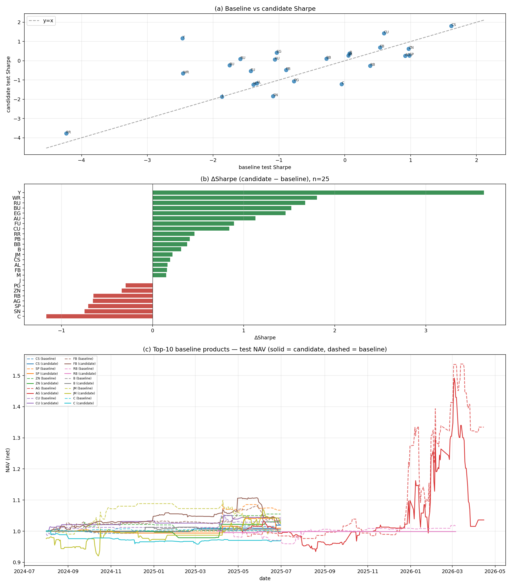
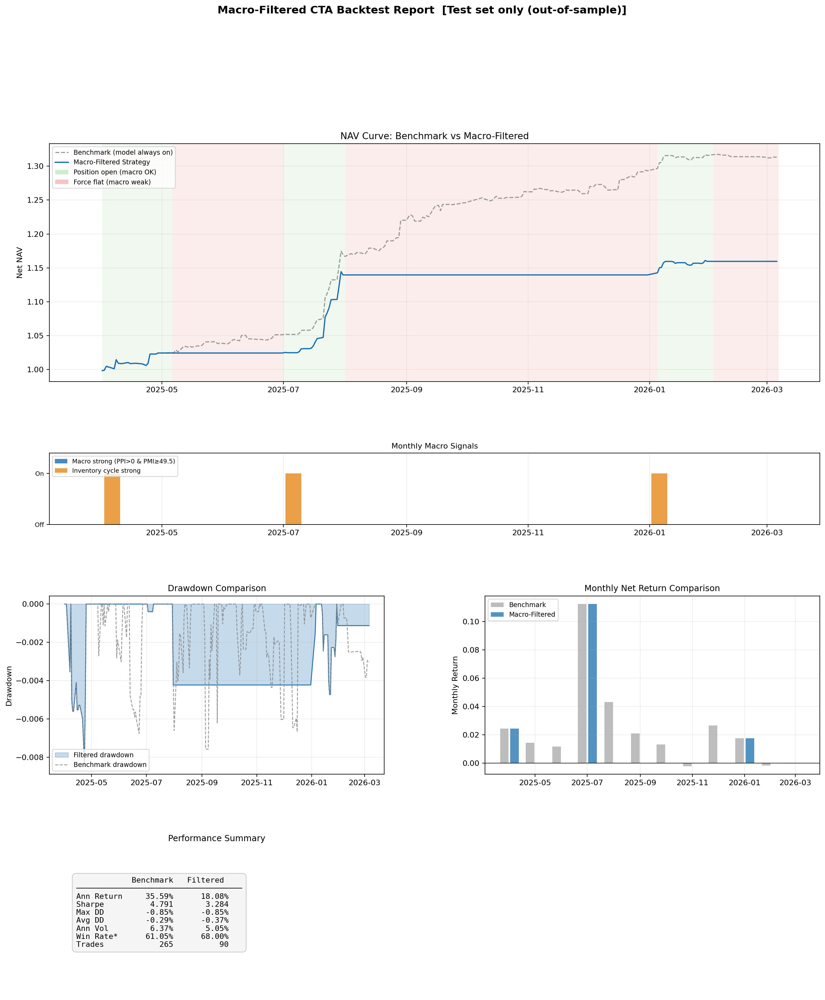
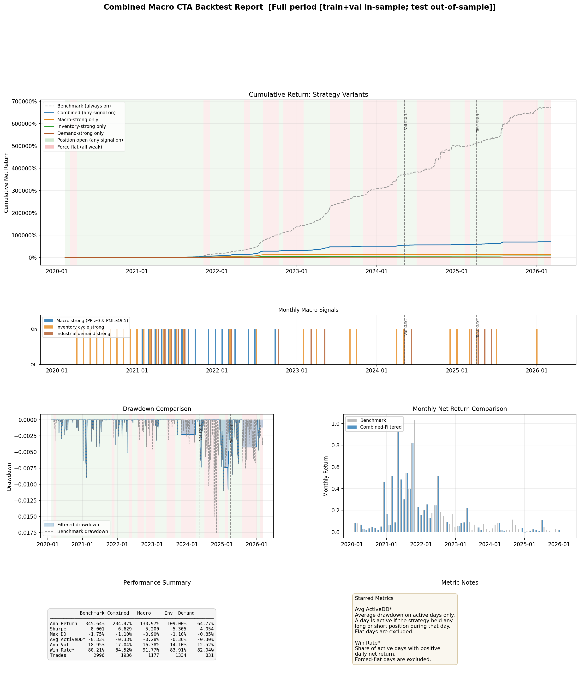

# CTA趋势跟踪策略的择时增强

## 摘要

本文以1分钟商品期货K线为底层标的，沿"微观—中观—宏观"三个层次依次构建并评估CTA趋势跟踪策略的择时增强方案。微观层面以沪铝连续合约（AL）为研究对象，基于306维候选因子构建分波动率域的双LightGBM趋势跟踪引擎，预测未来horizon根K线的累积收益，并通过与单域未分域基线的对比，验证分域建模在信号强度与交易容量两个维度上的有效性；中观层面将研究范围推广至30个主流商品期货品种，针对每个品种独立引入周/日频基本面中观因子，通过标准化工程化对齐流程验证中观信号对微观趋势策略的边际贡献；宏观层面在螺纹钢期货基础上叠加月频宏观信号过滤器，以二元开关形式约束策略参与时点，并对其风险控制效果进行评估。

三层增强的样本外（测试集2025-04至2026-03）核心结论如下：
微观底层双域模型在沪铝连续合约（AL）上具备稳定的样本外预测能力，测试集年化净收益+10.54%、Sharpe比率1.49、Spearman IC = +0.026，相较单域基线（年化−6.97%、Sharpe −0.82）大幅领先，关键绩效指标详见第一章；
中观因子引入后30个品种测试集夏普中位数变化−0.055，18/30个品种持平或正向改善；
宏观过滤层将交易胜率提升至60.90%、平均单笔净收益提升至0.091%，但净值总收益与夏普均回落于底层模型，当前更适合定位为风险控制工具。

在架构层面，本文还引入了自适应滚动波动率阈值（240日窗口，22品种平均年化净收益+5.49pp）与Regime级质量门控（验证集IC低于−0.01的域强制空仓）两项工程改进，并通过30品种的系统性受控实验，对波动率归一化目标选择与双域/单域架构选择提供了全面的实验证据支撑。

---

## 一、微观底层CTA趋势策略模型

本文以沪铝连续合约（AL）1分钟数据为微观层研究对象，在训练集上计算20日日波动率分位以划分高低波动域，在两个域上分别训练LightGBM回归模型预测未来horizon根K线收益；交易层面以验证集预测分位数确定开平仓阈值，并叠加确认持仓、最短持有、成本过滤与日末平仓等约束。

### 1.1 数据与样本划分

以沪铝连续合约（AL）的1分钟数据为研究对象，按月度边界以7:1.5:1.5划分训练集、验证集和测试集；测试集对应2025-05至2026-04共12个完整月，作为策略样本外有效性的统一观测窗口。沪铝原始数据起始于2020-05，训练集约40.7万行（分钟级K线），验证集约9.2万行，测试集约9.6万行；低波动域训练样本约29.1万行，高波动域约11.5万行。

### 1.2 价量数据的分布特征与风险画像

在进入因子构建和建模之前，本文对沪铝1分钟数据的统计特征与风险结构进行系统性描述。这一步骤既是选择因子类型的出发点，也是后续分域建模设计的现实依据。模型的预测目标为当前K线起始、未来horizon根1分钟K线的累积对数收益率。

**单根K线以噪声为主，有效趋势信号极为稀少。** 沪铝1分钟K线的单根收益率均值约为0，标准差极小，且超额峰度显著——尾部远厚于正态分布，逾80%的K线绝对收益不足0.05%，大量K线仅为微小噪声波动。若以单根1分钟K线（horizon = 1）为预测目标，分布几乎退化为0处的狄拉克尖峰，一切非零预测信号均将被双边成本淹没（图表1）。

**图表1：沪铝1分钟K线收益率分布：尖峰厚尾，噪声主导**

资料来源：中金公司研究部

**预测视窗的选择：视窗过短时交易摩擦侵蚀全部毛利，视窗过长时信号衰减至有效阈值以下。** 为有效比较跨视窗的相对排序，在采用全部因子直接输入模型、使用固定波动率分位阈值0.75高低分域的情况下，对沪铝进行了六档预测视窗的系统性回测（1分钟K线，表A-0）：

**表A-0：不同预测视窗的扣费净回测表现（沪铝，波动率分位阈值0.75，纯微观因子）**

| 预测视窗（1min bars） | 等效窗口 | 年化净收益 | Sharpe | 最大回撤 | 交易笔数 |
|---:|---|---:|---:|---:|---:|
| 1 | 1分钟 | +4.8% | +1.29 | −0.3% | 13 |
| 5 | 5分钟 | +0.3% | +0.18 | −2.4% | 65 |
| 10 | 10分钟 | +2.1% | +1.11 | −0.4% | 20 |
| **30** | **30分钟（当前）** | **+4.9%** | **+0.89** | **−1.9%** | **36** |
| 60 | 60分钟 | −2.6% | −0.26 | −6.2% | 195 |
| 120 | 2小时 | −0.8% | −0.05 | −11.1% | 97 |

资料来源：中金公司研究部（扣除单边手续费1bp+滑点1bp双边成本）

注：表A-0的实验在采用滚动波动率和IC过滤这两项工程改进落地之前完成，与后文第1.6节基线结果存在系统性差距，绝对收益数字不可与后文基线直接对比。

从结果可观察到两端的代价：**视窗1分钟和10分钟虽Sharpe较高（+1.29、+1.11），但测试期交易仅13笔和20笔**，统计可靠性不足——单笔方向的偶然性主导Sharpe，无法作为策略有效性的依据；**视窗60分钟和120分钟交易转为负收益**，原因在于预测视窗超过1小时后，1分钟K线微观结构信号的前瞻性已衰减殆尽，模型输出趋于随机。**30分钟视窗在结果稳健性与信号强度之间取得最佳平衡**：36笔交易提供足够的统计基础，Sharpe +0.89、最大回撤仅−1.9%，成本/收益比合理。本文将**预测视窗固定为30分钟**。

**以30分钟为预测目标，其收益分布已明显脱离单根K线的0值极端堆积。** 与图表1相比，图表2所示的30分钟累积收益率分布峰值密度大幅下降、双侧尾部扩展，不再表现为集中于零的狄拉克型，从而为模型提供具有实际信号空间的训练目标。均值仍接近零（市场中性），分布对称，但中等量级的正负收益已占有相当比重，使开仓阈值以上的信号能够覆盖双边成本（图表2）。

**图表2：预测目标（未来30分钟累积收益率）分布：双侧展开，脱离零点极端堆积**

资料来源：中金公司研究部

**20日日波动率呈右偏双峰分布，高低波动期的价格动态迥异。** 以训练集65%分位数为界，将样本切分为约65%低波域与35%高波域。两类环境在波动幅度、趋势持续性与信号强度上均存在显著差异，单一模型被迫同时适配两类样本时预测信号趋于向零收缩，构成分域建模的天然依据（图表3）。

**图表3：20日日波动率分布：右偏双峰，分域阈值天然清晰**

资料来源：中金公司研究部

上述三类分布特征直接决定了后续模型的两项核心设计选择。**预测视窗取horizon根K线**：单根1分钟K线标准差极小，与双边成本相比噪声过重，以单根K线为预测目标时模型几乎只能拟合报价噪声；累积horizon根K线后信号强度提升至可跨越成本门槛的区间，是信噪比与交易频率之间的合理折衷。**分波动率域建模**：图表3显示日波动率呈双峰分布，两个峰对应截然不同的市场动态——低波域趋势缓慢、信号偏弱，高波域波动放大、方向性更强；若以单一模型同时拟合两类样本，模型权重被迫在两组最优参数之间妥协，预测信号趋于向零收缩。分域建模正是为了让每个子模型在同质的波动环境中独立寻优，以下第1.4节将对此展开详述。

### 1.3 因子体系

**候选因子体系的构建。** 候选因子全部基于品种主连行情的OHLCV、持仓量与成交额序列，在1分钟K线上动态滚动计算所得，无需引入外部数据。按构造层次分为三类，共306个候选因子：

- **153个量价因子**：在5/10/20/30/60五档窗口上，对单一价量序列做滚动统计后直接得到，语义单一、不含跨序列融合。按因子族分7类：价格滞后（开、高、低三价各5期滞后，15维）；K线形态（振幅、上下影线比率、实体比率及实体相对位置，9维）；趋势（均线、收益率动量、滚动极值，20维）；波动率（标准差、振幅分位、极值时差，35维）；方向计数与累积（上涨/下跌方向根数及累积幅度，30维）；成交量（成交量滞后、量加权均值与标准差、量价协动，35维）；量价相关性（收益率与成交量增量的滚动相关系数，10维）。

- **96个工程因子**：对行情序列进行语义化二次刻画，通过比值、偏离度与时间编码等显式运算得到，单一窗口、不引入非线性合成。涵盖单根K线形态（收益率、振幅、实体比率及实体与区间相对位置）、多窗口收益与已实现波动率、价格偏离均线幅度、成交量/持仓量/成交额相对比率、真实波幅ATR、价格突破与跌破触发，以及时间编码（时段、星期、交易时段标记），共8类96维。

- **57个合成/日内因子**：针对1分钟弱信号设计，面向非线性与条件式信号，涵盖长窗口动量（120/240/480分钟窗口的动量、波动率与均线偏离）、VWAP偏离与Z-score、Parkinson波动率、Tick方向量加权、当日截至本K线的累计对数收益（承载当日整体趋势先验）、跨日同分钟历史均值、持仓量变化与量价背离、半方差对数比，以及同类信号几何均值融合降噪，共9类57维。其中日内累计对数收益系列将"当日已发生趋势"以因果方式编码入当前K线输入，在模型增益重要性中普遍跻身前5位。

所有因子在每根K线t处仅依赖t时刻及之前的已实现数据，已通过防前视审计。

以各类因子在训练集上的平均|IC|为参照（图表4），**工程化特征**最高，**合成因子**次之，**量价因子**整体相对最低。这一排序体现了筛选效应：通过IC×ICIR双重过滤后，留存的工程化特征均为语义清晰的单窗口刻画（振幅偏离、ATR、时间编码等），高密度筛选下组均|IC|最高；合成因子凭借长窗口动量与日内趋势先验携带额外状态信息，组均|IC|居中；量价因子族群最大（97个通过），组均|IC|略低，但覆盖宽度为树模型提供了丰富的条件分裂基础。合成因子的核心价值不在线性预测强度，而在于其与其他因子的非线性条件式交互，这须在模型增益重要性中体现（详见§1.6）。

**图表4：各类别因子平均|IC|（训练集，纯微观候选因子）**

资料来源：中金公司研究部

在个体因子层面，Top 20单因子|IC|均处于1分钟高频弱信号的合理量级，无异常突出的单因子，整体分布均匀（图表5）。承载当日趋势先验的日内累计对数收益族因子，|IC|量级与量价微观结构因子相当，但在模型增益重要性中进入Top 5，反映其价值主要来自非线性条件式交互而非线性预测强度。

**图表5：Top 20单因子|IC|（训练集，Pearson相关系数，纯微观）**

资料来源：中金公司研究部

**两道过滤与有效因子确定。** 306个候选因子经两道过滤后进入模型训练：

**第一道——数据质量门控**：计算各因子在训练样本上的缺失率与方差，剔除缺失率超出上限（主要针对长窗口因子序列前端的大段缺失值）或近似常数的因子。

**第二道——滚动IC×ICIR双重审计**：在训练集上按月滑窗，逐因子计算其与未来30分钟波动率归一化收益的Spearman月度IC序列，聚合为均值IC与ICIR（IC均值/标准差）。仅当均值|IC|与|ICIR|同时满足阈值、且有效月度窗口不少于3个的因子方可入选最终建模特征集。这一机制有效剔除了"整体上偶发有效但跨月稳定性欠佳"的不稳定信号，确保入选因子在历史各月均具备方向一致性。

以沪铝为基准，306个候选因子经双重过滤后**172个**进入双域LightGBM训练，其余134个因子因IC信号过弱或跨月稳定性不足被淘汰。各品种实际入模数量因IC分布不同，通常在160—200之间。

经两道过滤入选的172个因子，其组合月度均值|IC|在训练期各月始终为正、无单月失效（图表6），表明入选因子对30分钟累积收益的预测信号在不同市场状态下均能维持基线有效性。

**图表6：入选因子组合训练期月度均值|IC|走势（沪铝，172个入选因子）**

资料来源：中金公司研究部

### 1.4 高/低波动域划分

若将全量训练样本直接输入回归模型，模型会因预测目标期望靠近零、方差极大而呈现"懒惰预测"——预测值始终在零附近波动，无法区分高收益与低收益样本。叠加开仓阈值过滤后，极低的有效信号密度导致交易笔数骤降、策略接近长期空仓。

因此，我们以20日滚动日波动率为基准将样本逐日划分为低波域与高波域，在同质化的波动环境中独立拟合子模型，可显著降低目标方差的异质性，使每个子模型聚焦于一类市场状态，预测信号得以有效收敛。

分域准则：域标签以**日**为粒度计算，每个交易日取20日滚动日波动率，以过去240个交易日日波动率分布的**75%分位数**为自适应阈值——当日波动率超过该阈值则标注为高波域（+1），否则为低波域（−1）；当日全部1分钟K线统一继承该日的域标签。采用滚动而非固定阈值，是为了跟踪波动率中枢的制度性漂移，确保各时间段高波标签占比稳定在约25%附近；采用75%分位数是在高波域"纯度"（信号同质性）与样本量（模型正则化）之间的最优折衷。两项参数选取均有系统性受控实验支撑，详见§1.7。

图表7展示了划分结果的时间分布：高波域呈明显的事件聚集特征，对应基本面冲击或行情拐点；低波域更接近震荡与小幅趋势行情。

**图表7：沪铝1分钟K线高/低波动域划分（测试集时段）**

注：图中整月色块（每月统一着红或绿色）是可视化层的月均聚合效果，训练层面的域标签本身为日粒度。这一划分规则对全部品种统一适用，不做品种级特殊调整。

资料来源：中金公司研究部

### 1.5 模型参数与交易规则

底层模型在划分后的两个域内分别训练LightGBM回归器，共用所有LightGBM超参（学习率、叶子数、最大深度、特征/样本采样率、正则系数等）统一配置；仅高波域单独使用更大的 叶节点最小样本数 以加强正则，抑制对尾部样本的过拟合。所有特征经鲁棒标准化后入模。

交易层面，使用验证集预测分位前8%的极端信号作为开仓阈值、第40百分位作为平仓阈值，叠加确认持仓、最短持有、冷静期等多重约束，不允许直接反向（先归零再反向），并以手续费与滑点做开仓成本过滤；日盘最后一根强制归零仓，整体执行采用次根撮合（下一根1分钟K线执行）。

然而，双域建模存在一个潜在风险：若某域在验证期发生特征-收益的结构性转变，该域的验证集IC可能呈系统性负值，导致模型在该域以错误方向持续建仓。为此，我们引入**分域质量门控**以防止模型错误建仓。门控规则如下：任意域的验证集Spearman IC实测值低于−0.01时，该域在回测阶段强制空仓，另一域照常交易，双域架构整体不变。

需要特别说明的是，若某域在验证期内恰好无样本落入（例如固定阈值模式下波动率中枢漂移导致高波域在验证月全部缺失），此时该域无法计算IC，但这属于"数据稀缺"而非"信号方向错误"，二者性质不同。对于验证期空域的情形，门控不触发——模型仍参与测试集交易，开平仓阈值退而采用训练集预测分布标定；仅当验证集IC有实测值且显著为负时，门控才将该域强制空仓。全品种实测中，质量门控精准捕获退化品种，有效规避系统性反向建仓损失，非退化品种上零误触发。

通过跨品种对比实验（33个品种）显示，燃油（验证集IC=−0.045）、天然橡胶（验证集IC=−0.011）等品种的双域模型在测试集严重跑输单域基线（天然橡胶：双域−13.43% vs 单域−0.09%），共同特征均为至少一个域的验证集IC显著为负，且超参数调整无法根本修复——问题在于信号本身的跨期结构性转变，而非模型复杂度。当采用**分域质量门控**后，可有效改善这种情况，具体实验详见§1.7

### 1.6 沪铝单品种回测结果

测试集（2025-05至2026-04）口径下，底层模型关键绩效指标如下（图表8）。Pearson IC与Spearman IC均显著为正，说明在引入合成因子与日度状态变量后，模型在1分钟高频弱信号环境下仍具备显著的排序能力，能够较好识别"哪些趋势更值得参与"，从而构成择时增强的有效交易引擎。沪铝测试集净值口径下，年化收益+10.54%、Sharpe比率1.49、最大回撤−2.38%，交易77次，Spearman IC = +0.026。

**图表8：底层CTA趋势策略模型回测图（沪铝，2025-05—2026-04）**

资料来源：中金公司研究部

将上述单因子|IC|视角与LightGBM训练完成后的Gain重要性视角对比，两者在头部相互印证、在中段则呈现分歧：低波动域模型Top 20特征累计占总Gain的比例显著，集中度极高。Top Gain 由**日内时段进度（时间编码工程因子）**领衔（Gain占比最高），表明模型对"一天内的哪个阶段"高度敏感；其后依次为前日中长期滚动日收益（60日/20日，日度状态变量）和融合日度动量（合成因子），以及60分钟已实现波动率；这与图表4中工程化因子整体单因子|IC|居中偏高的格局相互印证。合成因子（融合日度动量等）在单因子线性|IC|视角下表现一般，但在Gain排名中跻身前五，表明**合成因子的价值不在线性预测，而在与其他因子的非线性条件式交互中**——树模型通过分裂条件利用了这些"在某种状态下才显著"的信号。两张图共同揭示了高频弱信号下因子的双重价值结构：基础量价/工程化特征贡献"何时该开仓"的线性信号，而合成因子贡献"在何种状态下该开仓"的条件式精度（图表9）。

**图表9：LightGBM低波动域模型Top 20特征Gain重要性（训练后视角）**

资料来源：中金公司研究部

高波动域模型的特征结构与低波动域存在显著差异（图表10）。**融合日度动量（合成因子）**以Gain=6,574跃居首位，而非低波域的时间编码——高波环境下日度方向性动量的信号密度更高；**日内时段进度**仍排第二（Gain=5,249），说明时间编码因子在两类制度下均具备稳定作用。前5名中出现了**量价因子CNTP30**（30分钟涨跌停触达次数，Gain=3,713）和**多窗口已实现波动率RV_120/RV_480**，体现高波动期短期波动聚集特征对预测目标的约束力更强；滚动日收益因子的视窗则更偏短期（10D/20D/5D，而非低波域的60D/20D），与高波行情趋势延续周期更短的经验一致。整体而言，低波域模型以时间结构+中长期动量状态为核心，高波域模型则以短期方向性动量+波动率聚集特征为核心。

**图表10：LightGBM高波动域模型Top 20特征Gain重要性（训练后视角）**

资料来源：中金公司研究部

### 1.7 高低波动分域划分参数选取与有效性验证

本节通过三组受控实验，依次验证分域划分的参数选取与样本外有效性。

**（一）分位阈值选取——波动率分位扫描实验**

阈值直接决定高波域的"纯度"与样本量之间的权衡：阈值过低使高波域混入过多震荡行情样本，信号同质性受损；阈值过高使高波样本过少，正则化效果下降。针对沪铝纯微观模式（30分钟预测视窗），对0.60至0.80五个分位阈值进行了系统性回测（表E）：

**表E：波动率域分位阈值扫描（沪铝，预测视窗30分钟，纯微观因子）**

| 波动率分位阈值 | 年化净收益 | Sharpe | 最大回撤 | 交易笔数 |
|---:|---:|---:|---:|---:|
| 0.60 | −6.2% | −0.86 | −10.4% | 93 |
| 0.65 | −8.1% | −1.52 | −11.4% | 22 |
| 0.70 | +2.6% | +0.45 | −8.7% | 83 |
| **0.75（当前）** | **+4.9%** | **+0.89** | **−1.9%** | **36** |
| 0.80 | +19.9% | +1.86 | −8.0% | 253 |

资料来源：中金公司研究部（沪铝测试集，纯微观对照实验）

注：表E与表A-0属同批次实验，同样在两项工程改进落地之前完成。其一，**波动率阈值采用训练期全量分位数（固定 cutoff）**，而非后续采纳的240日滚动自适应阈值；滚动阈值改进已记录于§1.7（二），在22个共同品种上平均带来+5.49pp年化净收益改善，0.75档对应的+4.9%在引入滚动阈值后即提升至+10.5%。其二，**IC审计过滤未启用**，全部306个候选因子直接入模；正式基线经双重IC×ICIR过滤后只保留约172个有效因子，剔除跨月稳定性不足的噪声特征后模型预测质量显著提升。表E的比较价值在于不同分位阈值之间的相对排序，绝对收益数字不可与后文基线直接对比。

0.75在风险收益比上表现最优：Sharpe +0.89、最大回撤仅−1.9%，交易36笔，频率适中。0.60与0.65均产生负收益，说明阈值过低时高波域样本异质性过强、子模型无法有效聚焦；0.80虽Sharpe最高（+1.86），但交易253笔——是0.75的7倍——表现出明显的过拟合迹象，稳健性存疑。本文将**分位阈值定为0.75**，即20日日波动率位于历史分布前25%的交易日为高波域。

**（二）固定阈值 vs 自适应滚动阈值**

分位阈值确定后，还需选择阈值的计算方式。固定方式以训练期全量样本的75%分位日波动率为唯一边界，一经标定全期不变；自适应滚动方式以过去240个交易日日波动率序列的75%分位数为当日边界，随波动率中枢的制度性漂移而动态更新，无前视。

**表F：固定阈值 vs 滚动240日阈值（沪铝，分位阈值0.75，纯微观因子）**

| 方案 | 年化净收益 | Sharpe | 最大回撤 | 交易笔数 | 测试期高波占比 | 备注 |
|---|---:|---:|---:|---:|---:|---|
| 固定训练期阈值 | −0.1% | −0.12 | −4.9% | 74 | 23.4% | 高波验证期样本为零；阈值从训练集标定 |
| **滚动240日阈值（当前）** | **+10.5%** | **+1.18** | **−4.3%** | **62** | **44.3%** | 验证集IC_lv=+0.014，IC_hv=+0.067 |

资料来源：中金公司研究部

固定阈值的失效路径：以训练期分布为静态基准，一旦验证期进入低波动制度，验证期内高波样本骤降乃至归零，高波子模型无法从验证集标定开平仓阈值。沪铝实验中，固定0.75阈值下高波样本在训练集有97,909行，验证集仅0行；对照实验以训练集为备用标定源（含前视偏差），测试期高波占比仅23.4%（大量实际高波日被误标为低波，两个子模型均处于错位状态），净收益仅−0.1%（Sharpe −0.12）。滚动240日阈值每日依据过去240个交易日的分布自适应更新，使高波标签占比在任意时间段稳定维持在约25%附近，验证期获得足量高波样本（IC_hv=+0.067），测试期高波占比44.3%，测试集年化+10.5%、Sharpe +1.18。

**（三）单域基线 vs 双域模型——分域有效性验证**

上述参数确定后，本组实验验证分域架构本身的样本外价值。单域基线与双域模型共用完全相同的306维微观因子集合（153量价因子 + 96工程因子 + 57合成/日内因子）、相同的LightGBM超参与交易执行规则，唯一区别在于：单域基线跳过波动率域划分步骤，直接以原始未来horizon根K线收益率为训练目标，对全量训练样本训练单个回归器；双域模型以经局部波动率归一化后的标准化值为预测目标，在低波/高波两个子集上分别训练，各自从验证集标定阈值。两组模型均在测试集独立回测，成本参数一致。

以沪铝为例（图表11），双域模型全程领先：年化净收益+10.53% vs 单域基线−8.84%，Sharpe比率1.18 vs −1.01，双域交易62笔 vs 单域47笔。单域模式下，模型受高波样本主导，低波环境中信号极弱，验证集IC出现负值（−0.006），导致测试集反向交易；双域模式下两个子模型均能从各自验证集标定有效阈值，IC均为正（低波域+0.014，高波域+0.067），交易质量大幅改善。

**图表11：双域模型与单域基线对比（沪铝，测试集2025-05—2026-04）**

资料来源：中金公司研究部

综合来看，高低波动分域建模的核心价值体现在两个层面：一是分域后每个子模型在同质波动环境中独立标定阈值，避免高低波样本互相稀释信号；二是质量门控机制在验证集IC为负时强制空仓，有效规避系统性反向建仓风险。

### 1.8 其他的模型改进尝试

本节汇总在第一章框架确定过程中已系统性尝试的其他模型层面改进探索。受控实验均采用单一变量对照法；策略A与策略B的结果基于沪铝（AL）单品种纯微观模式实测，待后续扩展至全品种。

**（一）波动率归一化目标 vs 原始收益目标（沪铝单品种实测）**

对比 波动率归一化目标（当前方案）与 原始收益目标（直接预测future_return，不做vol归一化），两者共享相同的 prepare_data + factor_audit，仅训练目标不同。

**表D：波动率归一化目标 vs 原始收益目标——沪铝测试集对比**

| 指标 | 波动率归一化目标（当前方案）| 原始收益目标 |
|---|---:|---:|
| 年化净收益 | +10.53% | +6.19% |
| Sharpe | +1.18 | +0.73 |
| 最大回撤 | −4.28% | −4.65% |
| 交易笔数 | 62 | 102 |
| test Spearman IC | −0.005 | +0.023 |

资料来源：中金公司研究部

vol_norm在净收益（+10.53% vs +6.19%）与Sharpe（+1.18 vs +0.73）上均优于raw_return。raw_return的test IC为正（+0.023），说明原始目标仍具备一定的方向排序能力，但交易笔数更多（102笔 vs 62笔）——高波样本主导L2梯度时，低波期间的信号阈值更容易被突破，导致过度交易并侵蚀净收益。vol_norm通过局部波动率归一化，使两个域的预测值分布对齐至同一量纲，验证集阈值标定更精准，开仓频率更受控，最终净收益领先。保留vol_norm为默认训练目标。

---

**（二）策略A——样本重加权（沪铝单品种实测）**

**动机。** 当前backtest仅在验证集预测分位Top 8%的极端bar开仓，策略盈亏完全由尾部bar的方向准确率决定；但L2对全部bar均等加权，大量中性bar的梯度量主导训练过程，极端bar在损失函数中权重不足。策略A引入按目标幅度的样本重加权：

$$w_i = |target\_vol\_norm_i|^{\alpha}$$

其中$\alpha=0$等价当前均匀权重，$\alpha=1$线性强调大幅行情bar，$\alpha=2$平方强调。val集不传weight，early stopping保持无偏，对backtest逻辑无需任何改动。

**沪铝实测结果（$\alpha=1$ vs baseline）：**

**表D-A：策略A样本加权 vs 基线——沪铝测试集对比**

| 指标 | 基线（$\alpha=0$）| 策略A（$\alpha=1$）|
|---|---:|---:|
| 年化净收益 | +10.53% | −12.44% |
| Sharpe | +1.18 | −1.20 |
| 最大回撤 | −4.28% | −13.55% |
| 交易笔数 | 62 | 298 |
| val IC（低波/高波）| +0.014 / +0.067 | −0.003 / +0.041 |

资料来源：中金公司研究部

**结论。** 策略A在沪铝上大幅退步。加权后低波域val IC由+0.014降至−0.003（变负），触发分域质量门控，低波域全程强制空仓，导致高波域单独承担全部交易（298笔 vs 基线62笔）；信号密度骤增而方向准确率未能同步提升，成本侵蚀加剧。根本原因在于：沪铝低波域训练样本量（约33万行）远大于高波域（约7.6万行），均等L2梯度本已不构成主导问题；强制向极端bar倾斜权重反而破坏了低波域的信号稳定性，使val IC翻负。策略A的逻辑前提（中性bar梯度主导损失）在沪铝低波域不成立，效果取决于品种的域样本比例与信号分布，待多品种验证。

---

**（三）策略B——极值预测止盈目标（沪铝单品种实测）**

**动机** 当前训练目标（vol归一化30分钟终值）只看窗口终值，"先涨显著后回归"类行情被标记为接近零的目标，模型学不到此类趋势段的开仓价值。策略B将训练目标改为窗口内绝对幅度最大的有符号极值（取horizon根K线内最大涨幅或最大跌幅中绝对值更大者），并配套将退出逻辑从"信号衰减至Q40"改为"价格触达预测极值的tp_fraction倍后提前止盈"。此外同步验证了不做vol归一化的原始极值变体（策略C），以剥离归一化本身的影响。

**沪铝实测结果（基线 vs 策略B vs 策略C）：**

**表D-B：策略B极值目标 vs 基线——沪铝测试集对比**

| 指标 | 基线 | 策略B（极值归一化）| 策略C（极值原始）|
|---|---:|---:|---:|
| 年化净收益 | +10.53% | −10.22% | +1.62% |
| Sharpe | +1.18 | −1.14 | +1.31 |
| 最大回撤 | −4.28% | −14.23% | −0.43% |
| 交易笔数 | 62 | 135 | 13 |
| val IC（低波/高波）| +0.014 / +0.067 | +0.003 / +0.033 | +0.030 / −0.025 |

资料来源：中金公司研究部

**结论。** 策略B（极值归一化）在沪铝上大幅退步：两域val IC均显著下降（低波+0.014→+0.003，高波+0.067→+0.033），信号阈值标定能力减弱，交易量翻倍（135笔），成本压力大幅上升，净收益由+10.53%跌至−10.22%。策略C（极值原始）Sharpe与基线接近（+1.31 vs +1.18），但高波域val IC变负（−0.025），触发质量门控后仅高波域空仓，仅剩13笔交易，统计可靠性不足。极值目标的问题在于：窗口内极值方向与终值方向不一致的bar，在原目标下为接近零的样本，在极值目标下却被赋予较大权重，使模型在方向噪声区学习了虚假极值信号，验证集IC随之下滑。策略B待扩展至多品种验证，并探索更短窗口或更高tp_fraction以减小目标噪声。

---

## 二、中观因子的择时增强

### 2.1 多品种推广

前文的底层CTA趋势策略模型以沪铝连续合约（AL）为例进行了深入分析，使用的是纯微观量价因子。在此基础上，本节首先将研究范围扩展至30个主流商品期货品种（覆盖贵金属、有色金属、黑色系、能源化工、林木板材、农产品六大板块），并在原有微观因子之外，引入周度/日度中观因子——即对每个品种基本面状态有刻画作用的、以周频/日频公布的库存、持仓、产量、进出口等指标，以期在不破坏底层模型结构的前提下，进一步提升趋势策略对品种基本面状态的识别能力。所有品种共用完全相同的模型超参数、因子工程流程与交易规则，不做任何品种级特殊调整。

**纯微观双域模型的多品种样本外基线结果如图表12所示。** 30个品种均采用纯微观因子（306维候选因子经双重IC过滤后入模），独立训练双域LightGBM模型，各品种测试集为样本外最后约12个月（因数据起始时间不同，各品种测试区间存在差异；沪铝测试区间为2025-05至2026-04，其余多数品种为2024-08至2025-06）。成本假设统一为单边手续费1bp、滑点1bp。

**图表12：纯微观双域LightGBM CTA策略——30品种样本外测试集回测结果**

| 品种 | 中文名 | 板块 | 年化净收益 | Sharpe | 最大回撤 | 交易笔数 | 成交胜率 |
|:---:|:---:|:---:|---:|---:|---:|---:|---:|
| M | 豆粕 | 农产品 | +6.4% | **+1.74** | −1.6% | 51 | 58.8% |
| AL | 沪铝 | 有色金属 | +10.5% | **+1.49** | −2.4% | 77 | 51.9% |
| BU | 石油沥青 | 能源化工 | +2.2% | **+1.09** | −1.2% | 13 | 61.5% |
| PB | 铅 | 有色金属 | +4.6% | **+1.03** | −4.9% | 63 | 61.9% |
| AG | 白银 | 贵金属 | +31.7% | +0.83 | −37.8% | 301 | 52.5% |
| B | 豆二 | 农产品 | +0.3% | +0.37 | −0.3% | 4 | 50.0% |
| RB | 螺纹钢 | 黑色系 | +0.5% | +0.32 | −1.1% | 15 | 60.0% |
| CS | 玉米淀粉 | 农产品 | +0.5% | +0.28 | −0.5% | 26 | 46.2% |
| AU | 黄金 | 贵金属 | +2.1% | +0.26 | −9.4% | 515 | 48.0% |
| JM | 焦煤 | 黑色系 | +0.5% | +0.10 | −10.2% | 102 | 48.0% |
| FU | 燃油 | 能源化工 | −1.6% | +0.05 | −14.2% | 44 | 47.7% |
| V | 聚氯乙烯 | 能源化工 | −0.0% | +0.01 | −2.7% | 33 | 36.4% |
| HC | 热卷 | 黑色系 | 0.0% | 0.00 | 0.0% | 0 | — |
| SP | 纸浆 | 能源化工 | 0.0% | 0.00 | 0.0% | 0 | — |
| Y | 豆油 | 农产品 | 0.0% | 0.00 | 0.0% | 0 | — |
| L | 聚乙烯 | 能源化工 | −0.0% | −0.00 | −3.2% | 65 | 58.5% |
| SN | 锡 | 有色金属 | −1.2% | −0.10 | −7.5% | 81 | 46.9% |
| PG | 液化气 | 能源化工 | −1.3% | −0.23 | −4.8% | 80 | 57.5% |
| FB | 纤维板 | 林木板材 | −1.6% | −0.33 | −3.9% | 227 | 43.6% |
| C | 玉米 | 农产品 | −1.4% | −0.35 | −3.8% | 272 | 43.8% |
| JD | 鸡蛋 | 农产品 | −2.4% | −0.43 | −6.7% | 150 | 53.3% |
| P | 棕榈油 | 农产品 | −2.6% | −0.46 | −5.7% | 93 | 51.6% |
| PP | 聚丙烯 | 能源化工 | −1.8% | −0.89 | −2.8% | 21 | 52.4% |
| CU | 沪铜 | 有色金属 | −3.6% | −0.96 | −5.0% | 213 | 51.2% |
| ZN | 锌 | 有色金属 | −0.6% | −0.98 | −0.6% | 1 | — |
| RR | 粳稻 | 农产品 | −6.4% | −1.14 | −9.3% | 270 | 36.3% |
| J | 焦炭 | 黑色系 | −3.4% | −1.23 | −4.0% | 5 | 20.0% |
| EG | 乙二醇 | 能源化工 | −4.0% | −1.68 | −3.5% | 36 | 36.1% |
| SS | 不锈钢 | 黑色系 | −5.6% | −1.87 | −6.2% | 145 | 46.2% |
| RU | 天然橡胶 | 能源化工 | −13.4% | −1.89 | −12.4% | 65 | 46.2% |
| **中位数** | — | — | **−0.1%** | **−0.00** | **−3.4%** | **57** | **50.5%** |

资料来源：中金公司研究部（扣除单边手续费1bp+滑点1bp双边成本，次根执行）

从图表12的结果可归纳出以下四点规律。

**第一，头部品种的Sharpe存在清晰梯队分布。** 豆粕（+1.74）、沪铝（+1.49）、石油沥青（+1.09）、铅（+1.03）四个品种Sharpe均超过1.0，展现出纯微观信号在特定品种上的样本外有效性；白银（+0.83）、螺纹钢（+0.32）等5个品种Sharpe为正但低于0.5。12/30个品种Sharpe为正，18/30个品种Sharpe为负或零，中位Sharpe接近0。这一格局表明，**纯微观信号并非对所有品种均等有效**，有效性具有显著的品种依赖性，这也是后续引入中观因子进行择时增强的核心动机之一。

**第二，最大回撤的控制具有明显差异性。** 绝大多数品种最大回撤维持在−5%以内，体现了开仓阈值过滤与日末平仓规则对极端亏损的有效约束；但白银（−37.8%）和黄金（−9.4%）两个贵金属品种最大回撤较大，主要原因在于贵金属1分钟K线量价因子信号在外部驱动（美元、利率预期）主导的行情中频繁受干扰，交易次数多（白银301笔、黄金515笔）但方向准确率低，波动放大了绝对亏损幅度。

**第三，分域质量门控在多品种模式下发挥了关键作用。** HC（热卷）、SP（纸浆）、Y（豆油）三个品种的测试集交易笔数为0，原因在于两个域的验证集IC均未达到门控阈值，模型判断该品种在测试区间信号质量不足，主动放弃建仓。这一结果既反映了门控机制的保守性，也指出了这三类品种1分钟微观信号薄弱的客观现实。

**第四，品种有效性与板块及成交活跃度高度相关。** 表现较好的豆粕、沪铝、铅在各自板块中均属流动性较好、1分钟K线成交量稳定的品种，微观结构特征规律性较强；天然橡胶（−1.89）、不锈钢（−1.87）、乙二醇（−1.68）等品种的负Sharpe，则与其行情结构性转变（天然橡胶）、流动性分层（不锈钢夜盘）或趋势追踪难度大（乙二醇）等品种特征密切相关。

在保留上述纯微观基线的基础上，本节以"是否引入中观因子"为唯一变量，针对相同30个品种、相同微观骨干因子、相同超参与交易规则，独立训练并回测新模型，以衡量中观因子在不破坏底层结构前提下对趋势策略的边际贡献。

### 2.2 中观因子的选取

每个品种在产品注册表中绑定一份独立的中观因子明细表，采用统一的"指标编号、中文名、频率、单位与来源"四行表头。30个品种合计源指标数4—19条不等，中位数为7条；其中日频源指标（如仓单数量、现货价指数、产量等）占比从14%到100%、中位数约43%，周频源指标（如交易所库存、持仓数据、上下游产品库存等）占比为其余部分。

在指标选取方面，本文遵循"覆盖供给、库存、需求、情绪"四大维度的原则，针对不同板块的产业特征，从公开数据源（同花顺iFinD等）中筛选出能够反映该品种基本面状态变化的指标，归为以下五类：

库存类指标包括各期货交易所注册库存、可用库容量、社会库存、保税库库存等，是中观因子中最具普遍性、对几乎所有品种都适用的一类。仓单类指标多以日频公布，包括注册仓单数量与有效预报数量，对临近交割月合约价格有较强解释力。现货价格类指标包括行业现货价指数、主要现货报价、基差等，在期现联动较强的品种（有色金属、贵金属、部分化工品）上具有先行或同步指示作用。产量与产能类指标包括月度/周度产量、开工率、产能利用率、装置检修情况，直接刻画供给端边际变化，在能源化工与黑色系品种中尤为重要。上下游与进出口类指标包括产业链上游原料价格与库存、下游需求景气度以及进出口数量与价差，用于刻画产业链向当前品种的传导效应。

各品种源指标在数量与构成上的差异，与产业链长度、数据公布完备程度以及外盘可获得指标的丰富度有关。整体来看：贵金属在国内外交易所库存与持仓两端均有覆盖；有色金属与能源化工以周频为主，且较依赖海外交易所持仓数据；黑色系和农产品日频比例相对较高，以国内库存与产量数据为主；林木板材类品种因数据源较少，整体源指标数量偏少。

**图表13：30种期货中观因子源指标画像（节选）**

资料来源：同花顺iFinD、中金公司研究部

### 2.3 中观因子的工程化对齐体系

由于中观因子的发布频率（日频/周频）与底层CTA模型所使用的1分钟K线频率存在显著差异，且普遍存在节假日缺失、上线晚于K线起点、个别周次跳报等数据形态问题，无法将原始指标直接拼接到1分钟训练矩阵上使用。为此，本文设计了一套从原始稀疏观测到1分钟训练矩阵的标准化工程化对齐方案，所有30个品种共用同一套规则，不做任何品种级特殊调整，以避免对单品种过拟合。下面分步骤展开说明。

**第1步——多频指标的读取、格式化与公布滞后处理。** 按统一表头格式读入各品种的中观因子明细表，将原本以观测时间为索引的稀疏宽表转换为带时间戳、带频率元数据、带单位与来源标签的标准结构，完整保留每条源指标的"原始观测网格"，不做任何插值或填充。在此基础上，对每列源指标施加**频率分档的公布滞后**：日频指标滞后1个日历日，周频指标滞后3个日历日，月频指标滞后5个日历日——即将该列的时间戳整体后移对应天数，以模拟市场实际可获得的最早时点。同一明细表内不同频率的列可能承载不同的有效时间戳，滞后后以外连接合并为宽表，未对齐位置留空。该处理是防前视的关键环节：公布后的基本面数据本身并不含未来信息，但若以观测时点直接对齐1分钟K线，则在公布当日早盘已参与建模的K线理论上还未能获取该数据，忽视这一差异将引入前视偏差。

**第2步——频率感知的质量过滤。** 由于不同频率指标在1分钟K线日历上的"理论最大覆盖率"本身不同（日频理论覆盖率约100%，周频约20%），若用统一覆盖率阈值衡量将系统性误删周频指标。为此本文采用"频率归一化"的有效覆盖率（实际非空率/频率基准，以有效覆盖率门限控制）替代统一阈值。此外，本文额外识别并剔除"阶梯哑变量"形态的指标——即首个非空观测出现在序列中后段、首值之后非空率达到90%以上的指标。这类指标本质上反映"该品种该指标自某日起开始公布"，若直接入模，模型会把"指标开始有值"的时点误判为基本面状态切换信号，造成虚假的机制识别。

**第3步——派生因子计算。** 对每条通过质量过滤的源指标，在其原始稀疏观测网格上滚动计算 5 类派生因子：（i）窗口收益率 RET（过去 w 期变化幅度），（ii）窗口标准化值 ZSCORE（过去 w 期标准化偏离），（iii）窗口百分位排名 PCT_RANK（当前值在过去 w 期的百分位，取值 [0,1]），（iv）二阶差分 ACCEL（本期 w 期 pct_change 与 w 期前 w 期 pct_change 之差，捕捉基本面变化的拐点 / 加速度），（v）极端区位标记 HIGH_FLAG / LOW_FLAG（PCT_RANK ≥ 0.85 时 HIGH_FLAG=1、≤ 0.15 时 LOW_FLAG=1，将"基本面极端区位"事件显式编码为 0/1 dummy，避免模型隐式挖掘阈值）。窗口长度取 4、13、52 三档（单位为观测期数；对周频对应约 1 个月、1 季、1 年；对日频对应约 1 周、半月、1 季交易日），分别承载基本面变化的边际动量、中期趋势与长周期信息。所有派生因子均基于稀疏序列的 backward rolling / pct_change，仅依赖过去与当前观测，无前视。

**第4步——1分钟K线网格的时间对齐。** 每条源指标及其派生因子使用向后回溯方式对齐到1分钟K线网格：对每根1分钟K线，取小于等于该K线时间戳的最近一次观测值，严格不引入未来信息；对齐后再做一次仅向前填充，将稀疏观测铺到所有1分钟K线上，形成可观长度的"分段常量"序列。

**第5步——失效裁剪。** 设定约4周的过期阈值——任何源指标若在某时点距上一次有效观测超过该阈值，则将其原始水平值与派生因子在该时点之后全部置为缺失，直至下一次新观测出现。该机制对每条源指标独立维护其"上一次有效观测时间戳"，避免某条指标的下线/停报污染1分钟训练矩阵。

**第6步——列形态控制与因子筛选。** 由于中观因子普遍稀疏度高于微观因子，无法与微观因子共用同一套缺失率筛选阈值。本文默认丢弃中观原始水平列，原因是水平列在1分钟高频尺度上易退化为持续数百根K线的"分段常量"，被模型误用为状态切换信号而挤占微观骨干特征；仅保留派生因子列（RET/ZSCORE/PCT_RANK/ACCEL/EXTREME_FLAG）参与后续建模。对中观列采用更宽松的列级缺失率阈值（≤65%缺失），微观列保留更严格的默认阈值；最后对所有候选特征做训练集方差检查，剔除方差极低的列。

对于每条通过质量过滤的源指标，额外生成一列**可用性指示列（AVAILABLE dummy）**：当该指标的水平值在某时点为有效非缺失值时取1，否则取0（含数据起始前尚未公布、以及经第5步失效裁剪置为缺失的时段）。可用性指示列的作用是让模型显式区分"指标未到达"与"指标显示为零或低位"两种状态：若模型仅见到填充后的派生因子值，无法判断当前是前向填充的历史观测还是最新到达的读数；而以0/1的可用性信号直接作为特征输入，则使模型可在条件树的分裂节点上明确感知数据可用性的边界，避免将"数据延迟期"的行情误归入有效信号区间。

**第7步——中微显式交互（mid × micro）。** 实证观察到中观派生因子在剔除前视污染（公布滞后处理）后，单因子 IC 几乎归零，但仍可作为微观信号"何时该信任"的状态修饰：例如"库存高位 + 价格上行突破"的延续概率显著区别于"库存低位 + 同方向突破"。为让 LightGBM 显式见到此类条件结构、而非依赖深层树自行挖掘，本文在派生因子之上构造笛卡尔乘积特征：选取5个微观核心因子（跨日运行对数收益、日内累积对数收益、日内实际波动率、日内区间位置、短窗口收益）与所有中观百分位排名列做逐K线算术乘积，命名规则体现中观乘以微观的交互结构。乘积运算逐K线展开，不引入跨K线信息，因果性继承自上游微观与中观各自的因果计算。维度上限设为100列以控制对微观骨干特征的稀释比例；中微交互列与微观、中观因子并列进入模型训练，有效性最终由增益重要性与跨期ICIR共同评判。

### 2.4 30品种回测效果

经过将中观因子入模操作后，按品种独立训练CTA趋势策略模型并回测，每品种采用统一模型超参数与相同微观骨干因子，唯一变量为是否引入中观因子（中观增强 vs 纯微观基线）。

从测试集净值口径的夏普比率结果看，30个品种的中观因子效果出现分化：30品种中位ΔSharpe为**−0.055**，其中10个品种全面提升（ΔSharpe ≥ +0.30）、8个品种基本持平（|ΔSharpe| < 0.30）、12个品种出现明显退步（ΔSharpe ≤ −0.30）。提升较为显著的品种包括天然橡胶（+2.00）、沪铜（+1.76）、焦炭（+1.39）、锡（+1.30）、纸浆（+1.11）、棕榈油（+0.99）、聚丙烯（+0.89）等；退步明显的品种为豆粕（−2.98）、沪铝（−2.87）、铅（−2.69）、白银（−2.22）、粳稻（−2.16）、玉米（−1.55）等。

**图表14：加入中观因子后的CTA趋势策略效果总览（中观增强 vs 纯微观基线，30品种）**

资料来源：中金公司研究部

效果在不同品种间存在结构性差异，与各品种微观信号基线强度及中观数据频率构成均有关联。将30个品种的夏普变化逐一审视后，可以归纳以下规律。

**改善品种以周频主导型为主。** 提升较显著的天然橡胶、沪铜、锡、纸浆、聚丙烯、乙二醇等品种，其中观因子源指标以周频为主（日频占比低于50%）。周频数据在1分钟网格上铺展为绵长的"分段常量"段，**本文的统一策略（丢弃原始水平列、仅保留派生因子）在此类品种上恰好有效**：水平列被剔除后不再占据稀缺的特征带宽，而其派生序列（PCT_RANK/ACCEL）因变化稀疏，在IC过滤中反而更易通过稳定性检验，作为基本面状态修饰因子与微观信号协同进入树模型。

**退步品种集中于微观信号本身较强、或日频数据被整体丢弃的品种。** 豆粕（纯微观Sharpe +1.74）、沪铝（纯微观Sharpe +1.49）等微观信号本身已高质量的品种，引入中观因子后特征维度膨胀，IC过滤阈值可能误剔部分有效微观列，边际贡献难以体现；玉米、粳稻等农产品日频数据（仓单、产量）占比高，这类指标滞后处理后填充段约一个交易日，不易成为"常量污染"信号，统一丢弃水平列后反而损失了实质库存信息。

整体来看，中观因子的样本外效果具有明显的品种依赖性：18/30个品种持平或正向改善，半数以上品种获得边际增量；但退步品种主要集中于微观信号强度高或日频基本面数据覆盖密集的类型，后续可在全局丢弃水平列策略的基础上，探索基于频率结构的差异化水平列保留方案。

### 2.5 第二批中观因子接入：AL/HC/J/L/P/PP/SS

在完成首批25个品种的中观增强后，本文进一步为沪铝（AL）、热卷（HC）、焦炭（J）、聚乙烯（L）、棕榈油（P）、聚丙烯（PP）、不锈钢（SS）共7个品种补充接入中观因子（每品种7—12条源指标，见附件《中观因子明细表》），并以`微观基线模型`（无中观）为基线运行对照回测（运行标识：第二批中观接入对照实验）。测试集为2024-08至2025-06（AL为2025-05至2026-04）。

**图表16b：第二批7品种中观因子引入效果（ΔSharpe，微观基线模型 → 第二批中观接入对照实验）**

资料来源：中金公司研究部

7个品种的测试集净值口径结果如下：

**表E：第二批7品种中观因子引入前后关键指标对比**

| 品种 | 基线年化净收益 | 基线Sharpe | 引入后年化净收益 | 引入后Sharpe | ΔSharpe | 交易笔数变化 |
|---|---:|---:|---:|---:|---:|---:|
| SS（不锈钢）| −5.62% | −1.87 | −3.15% | −0.77 | **+1.10** | +74 |
| PP（聚丙烯）| −1.84% | −0.89 | 0.00% | 0.00 | **+0.89** | −21 |
| P（棕榈油）| −2.65% | −0.46 | −0.58% | −0.67 | −0.21 | −91 |
| L（聚乙烯）| −0.05% | −0.00 | −0.96% | −0.25 | −0.25 | −11 |
| HC（热卷）| 0.00% | 0.00 | −6.47% | −0.84 | **−0.84** | +23 |
| J（焦炭）| −3.38% | −1.23 | −19.59% | −2.19 | **−0.96** | +156 |
| AL（沪铝）| +10.54% | 1.49 | +0.69% | 0.13 | **−1.36** | −18 |
| **中位数** | — | — | — | — | **−0.246** | — |

资料来源：中金公司研究部

第二批7品种的整体结论与首批有所不同：中位ΔSharpe = **−0.246**，71.4%品种出现退步，中观因子未实现整体加分。分类来看，改善组仅2个品种（不锈钢+1.10、聚丙烯+0.89），持平2个品种（棕榈油、聚乙烯），退步3个品种（热卷、焦炭、沪铝）。其中焦炭（J）的交易笔数从5笔暴增至161笔（+3120%），信号结构发生显著变化，属于异常案例，需做进一步的T3.3消融实验以确认其中观因子信号的有效性。沪铝（AL）基线本身已具备较强的纯微观信号（Sharpe 1.49），引入中观后反而造成信号稀释，说明对于已有高质量微观信号的品种，中观因子的边际贡献更难体现。

---

## 三、宏观因子的月频择时增强

本文的宏观因子月频择时增强模型不直接替代底层趋势模型，而是在原有微观量价CTA模型之上增加一层月频环境过滤机制。以下均以螺纹钢微观量价模型为基础，探讨宏观因子月频择时对模型效果的影响。

### 3.1 择时指标的选取

择时指标的宏观因子信息主要来自同花顺iFinD、国家统计局和央行月度数据。考虑到宏观数据发布存在天然滞后，本文对三类月度信号均采用1个月滞后处理，以避免前视偏差。

**宏观景气信号**：PPI同比 > 0 且制造业PMI ≥ 49.5。PPI位于正区间意味着商品价格环境整体偏顺风，PMI不低于49.5则用于确认经济景气并未明显落入收缩区间。

**库存周期信号**：PMI新订单 > 50 且PMI产成品库存 < 50。该组合刻画了需求扩张与库存偏低同时出现的状态，有助于识别更具持续性的主动补库环境。

**实体需求信号**：工业增加值同比 > 5.5% 且固定资产投资累计增长 > 3.5%。与前两类信号相比，该指标更直接从实体工作量角度刻画商品需求强弱，能够对黑色系品种的中游制造业和基建需求形成补充确认。

### 3.2 仓位调整机制与执行

底层模型负责在1分钟K线维度识别交易信号，上层模块则负责判断当月是否允许策略运行。择时增强的重点不在于改变交易方向，而在于控制策略何时参与、何时收缩。三类指标中任意一项满足，即允许当月保留底层CTA仓位；若三者均不满足，则该月所有1分钟K线强制空仓。因此当前的择时框架本质上是一个"月频二元过滤器"，而非连续打分模型。

### 3.3 择时增强回测效果

从样本外测试期（2025-04至2026-03，共12个月）结果看，基础微观量价模型仍是当前策略收益的主要来源（净值总收益31.32%、年化35.59%、夏普4.79、最大回撤-0.85%、交易265次），是择时增强能够展开讨论的前提。

**单指标结果。** 三类单指标的样本外表现存在明显分化。宏观景气信号在采用1个月滞后后，12个月测试期内未单独触发，对应组合无交易。库存周期信号共触发3个月，净值口径总收益15.96%、年化18.08%、夏普3.28、交易90次、交易胜率62.22%、平均单笔净收益0.115%，是三类单指标中表现最好者。实体需求信号同样触发3个月，但总收益仅5.14%、年化5.91%、夏普2.03、交易76次，更适合作为补充确认而难以单独承担择时主信号。从结果看，库存周期信号对黑色系趋势环境的识别能力相对更强，实体需求信号则更多起到辅助筛选作用，宏观景气信号在当前样本外阶段的实际贡献相对有限。

**全指标复合结果。** 采用"三项指标任意一项满足则允许开仓"的复合规则。样本外测试期12个月中，共有5个月允许策略运行，分别为2025-04至2025-07以及2026-01，其余7个月全部强制空仓。复合过滤后，策略净值总收益19.01%、年化21.54%、夏普3.70、最大回撤-0.85%、交易次数降至133。可以看到，复合过滤显著压缩了交易频率，并将交易胜率由56.60%提升至60.90%、平均单笔净收益由0.066%提升至0.091%，说明月度环境过滤确实筛除了部分低质量交易；但另一方面，由于过滤器同时错过了若干基础模型仍有正收益的月份（2025-08、09、12等），且基础模型最大回撤区间恰好出现在过滤器允许开仓的2025年4月，因此总收益、夏普比率和最大回撤均未较基础模型进一步改善。

图表15展示了测试集口径下单指标与全指标复合的净值曲线对比。

**图表15：单指标与全指标择时增强回测图（测试集，2025-04—2026-03）**

注：宏观过滤框架下，空仓等待期也计入策略运行时间，在观察胜率与有效回撤时应关注实际有仓位的日期口径。

资料来源：中金公司研究部

| 指标 | 底层模型（无过滤）| 库存周期 | 实体需求 | 复合过滤（三类任一）|
|---|---|---|---|---|
| 净值总收益 | 31.32% | 15.96% | 5.14% | 19.01% |
| 年化收益 | 35.59% | 18.08% | 5.91% | 21.54% |
| 夏普比率 | 4.79 | 3.28 | 2.03 | 3.70 |
| 最大回撤 | -0.85% | -0.85% | -0.85% | -0.85% |
| 交易次数 | 265 | 90 | 76 | 133 |
| 交易胜率 | 56.60% | 62.22% | 53.95% | 60.90% |
| 平均单笔净收益 | 0.066% | 0.115% | 0.038% | 0.091% |

除测试集样本外，本文还对训练集、验证集与测试集的全区间进行了统一回放（图表16）。需要说明的是，这样做的目的并非将样本内结果作为策略有效性的主要证据，而是为了在控制底层模型、交易阈值与执行规则均保持不变的前提下，更完整地观察月频择时过滤器对收益波动、回撤路径和交易频率的影响。正式的策略有效性判断，仍以测试集样本外结果为准。

**图表16：单指标与全指标择时回测图（全区间，含训练集/验证集/测试集）**

注：全区间回放用于辅助判断择时模块是否稳定改善了波动率与回撤特征，训练集/验证集区间不引入额外的未来函数或前视偏差。

资料来源：中金公司研究部

全区间75个月中，复合过滤共保留45个月仓位（宏观景气信号18个月、库存周期信号32个月、实体需求信号16个月），整体回放体现出与测试集一致的"交易频率压缩、单笔质量提升、总收益让渡"的特征。

最终来看，当前宏观因子月频择时增强模块无法替代底层趋势模型创造额外收益，其主要价值在于通过月频环境过滤对策略参与时点进行约束，起到一定的风险控制与交易筛选作用。在三类宏观信号中，库存周期信号的识别效果相对更稳健；实体需求信号更适合作为辅助确认；宏观景气信号在当前样本外阶段的实际贡献相对有限。当前择时框架更适合作为底层CTA策略的风控增强模块，后续仍需在连续化打分和动态仓位调整方向进一步优化。

---

## 四、"微观—中观—宏观"择时增强总结

本文按微观、中观、宏观三个层次，依次构建并评估了对CTA趋势跟踪策略的择时增强方案。三层在数据频率上分别对应1分钟、日/周与月度，在信号性质上分别对应量价、基本面与宏观环境，在策略中分别承担生成交易信号、补充品种识别能力与约束策略参与时点的职能。

**微观层面是策略收益的主要来源，高低波分域有效提升模型效果与交易容量。** 使用训练集20日日波动率65%分位将样本进行高低波分域处理后再独立建模，可以有效规避目标期望近零、方差较大时回归模型预测值围零震荡的"懒惰表现"，提升模型对高收益样本的识别能力。沪铝测试集（2025-05至2026-04）结果显示，底层模型具备稳定样本外有效性，双域模型年化净收益+10.54%、Sharpe 1.49，相较单域基线（年化−6.97%、Sharpe −0.82）大幅领先，验证了分域建模在波动率异质性显著品种上的有效性。

**中观层面在不破坏底层结构的前提下提供边际增量，周频主导品种受益较为显著。** 我们将研究范围扩展至30个主流商品期货品种，构建统一的工程化对齐方案，将周/日频中观基本面因子并入模型训练。通过30个品种测试集净值口径夏普比率比对（中观增强 vs 纯微观基线），中观因子的整体效果出现分化：30品种中位ΔSharpe为−0.055，其中18个品种持平或正向改善，12个品种明显退步；天然橡胶（+2.00）、沪铜（+1.76）、焦炭（+1.39）、纸浆（+1.11）等品种受益显著，豆粕（−2.98）、沪铝（−2.87）、铅（−2.69）、玉米（−1.55）等品种出现明显信号干扰。整体而言，中观因子的有效性具有品种依赖性，退步品种主要集中于微观信号基线强度高或日频基本面数据覆盖密集的类型。

**宏观层面识别趋势跟踪策略的运行环境，收益增强角度作用尚不充分，但能剔除部分低效交易、压缩无效风险暴露。** 以"PPI/PMI景气、库存周期、实体需求"三类滞后1个月的月频信号构建"任一触发即开仓"的二元过滤器，在螺纹钢测试期12个月中，复合规则共保留5个月仓位。过滤后交易胜率由56.60%提升至60.90%、平均单笔净收益由0.066%提升至0.091%；但由于同步错过若干正收益月份，净值年化收益（21.54%）与夏普（3.70）均回落于底层模型。三类单信号中，库存周期信号表现最稳健（夏普3.28、胜率62.22%）；实体需求信号更适合作为辅助确认；宏观景气信号在测试期未单独触发。

在模型框架确定过程中，本文系统性地尝试了五类改进方向（详见§1.8）：（一）以滚动240日窗口阈值替代固定训练期阈值，22品种均值净收益提升+5.49pp，已采纳为默认；（二）双域vs单域架构的33品种对比，双域在夏普比率上全面优于单域，配合分域质量门控保留双域；（三）纯微观模式下对6个品种的预测视窗与分位阈值网格扫描，确认波动率分位阈值0.65为全局最优，短视窗的IC−P&L断层现象在此得到定量验证；（四）波动率归一化目标与原始收益目标的33品种对比，归一化目标在全品种信号完备性上更优，保留为默认；（五）设计并实现了策略A（样本重加权，引导模型对大幅行情K线投入更多梯度权重）与策略B（极值止盈目标，以窗口内有符号极值替代终值并配套触价止盈退出逻辑），两者均已完成实现与测试，待批量对比验证。
