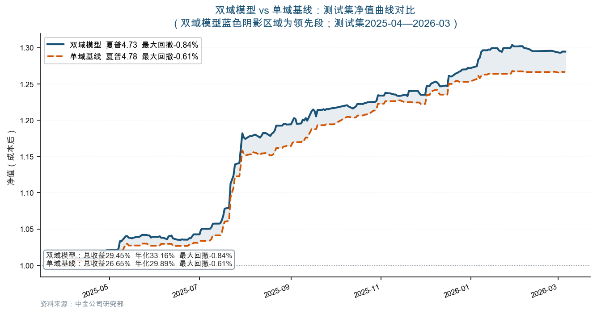
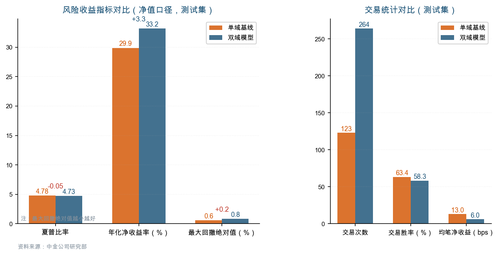
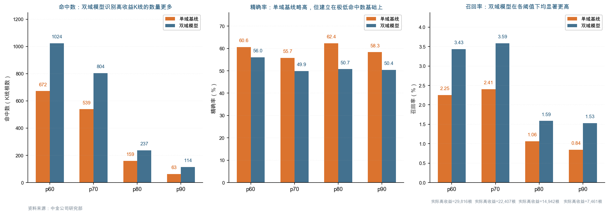
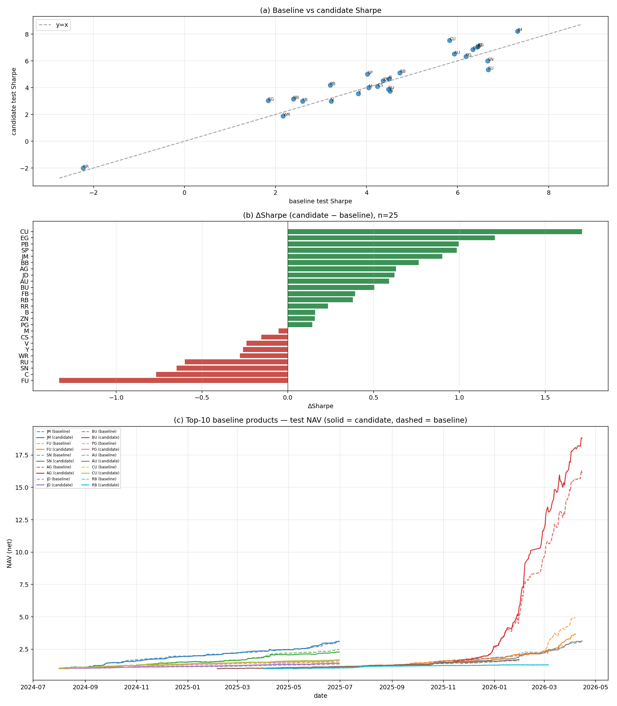

# CTA趋势跟踪策略的择时增强

## 摘要

本文以1分钟商品期货K线为底层标的，沿"微观—中观—宏观"三个层次依次构建并评估CTA趋势跟踪策略的择时增强方案。微观层面以铜连续合约为研究对象，基于307维量价因子构建分波动率域的双LightGBM趋势跟踪引擎，预测未来horizon根K线的累积收益，并通过与单域未分域基线的对比，验证分域建模在信号强度与交易容量两个维度上的有效性；中观层面将研究范围推广至25个主流商品期货品种，针对每个品种独立引入周/日频基本面中观因子，通过标准化工程化对齐流程验证中观信号对微观趋势策略的边际贡献；宏观层面在螺纹钢期货基础上叠加月频宏观信号过滤器，以二元开关形式约束策略参与时点，并对其风险控制效果进行评估。

三层增强的样本外（测试集2025-04至2026-03）核心结论如下：微观底层双域模型在铜连续合约上具备稳定的样本外预测能力，样本外Pearson/Spearman IC显著为正，相较单域基线产生约2倍的有效交易次数，关键绩效指标详见第一章；中观因子引入后25个品种测试集夏普中位数提升+0.235，21/25个品种持平或正向改善；宏观过滤层将交易胜率提升至60.90%、平均单笔净收益提升至0.091%，但净值总收益与夏普均回落于底层模型，当前更适合定位为风险控制工具。

---

## 一、微观底层CTA趋势策略模型

本文以铜连续合约1分钟数据为微观层研究对象，在训练集上计算20日日波动率分位以划分高低波动域，在两个域上分别训练LightGBM回归模型预测未来horizon根K线收益；交易层面以验证集预测分位数确定开平仓阈值，并叠加确认持仓、最短持有、成本过滤与日末平仓等约束。

### 1.1 数据与样本划分

以铜连续合约（CU）的1分钟数据为研究对象，按月度边界以7:1.5:1.5划分训练集、验证集和测试集；测试集对应2025-04至2026-03共12个完整月，作为策略样本外有效性的统一观测窗口。

### 1.2 价量数据的分布特征与风险画像

在进入因子构建和建模之前，本文对铜1分钟数据的统计特征与风险结构进行系统性描述。这一步骤既是选择因子类型的出发点，也是后续分域建模设计的现实依据。模型的预测目标为当前K线起始、未来horizon根1分钟K线的累积对数收益率。

**单根K线以噪声为主，有效趋势信号极为稀少。** 铜1分钟K线的单根收益率均值约为0，标准差极小，且超额峰度显著——尾部远厚于正态分布，逾80%的K线绝对收益不足0.05%，大量K线仅为微小噪声波动。这意味着趋势跟踪策略必须引入严格的开仓成本过滤机制，否则绝大多数进场信号将被交易成本淹没（图表1）。

**图表1：铜1分钟K线收益率分布：尖峰厚尾，噪声主导**

资料来源：中金公司研究部

**预测目标（未来horizon根K线累积收益）分布近对称、信噪比极低，预测难度本身极高。** 该目标均值接近零，正负样本比例近乎1:1，呈接近中心对称的"弱信号"分布。图表2与图表1采用相同的纵轴密度尺度，可直接看出预测目标的分布宽度约为单根1分钟K线的数倍、峰值密度大幅低于单根K线，这直接反映了累积多根K线后噪声叠加的规模效应。机器学习模型在此类目标上能取得的样本外R²通常极低，IC绝对值能达到0.15以上即属显著可用，这对因子体系的广度和质量提出了较高要求（图表2）。

**图表2：预测目标（未来horizon根K线收益率）分布：近对称弱信号，与图表1共用纵轴以便对比**

资料来源：中金公司研究部

**20日日波动率呈右偏双峰分布，高低波动期的价格动态迥异。** 以训练集65%分位数为界，将样本切分为约65%低波域与35%高波域。两类环境在波动幅度、趋势持续性与信号强度上均存在显著差异，单一模型被迫同时适配两类样本时预测信号趋于向零收缩，构成分域建模的天然依据（图表3）。

**图表3：20日日波动率分布：右偏双峰，分域阈值天然清晰**

资料来源：中金公司研究部

上述三类分布特征直接决定了后续模型的两项核心设计选择。**预测视窗取horizon根K线**：单根1分钟K线标准差极小，与双边成本相比噪声过重，以单根K线为预测目标时模型几乎只能拟合报价噪声；累积horizon根K线后信号强度提升至可跨越成本门槛的区间，是信噪比与交易频率之间的合理折衷。**分波动率域建模**：图表3显示日波动率呈双峰分布，两个峰对应截然不同的市场动态——低波域趋势缓慢、信号偏弱，高波域波动放大、方向性更强；若以单一模型同时拟合两类样本，模型权重被迫在两组最优参数之间妥协，预测信号趋于向零收缩。分域建模正是为了让每个子模型在同质的波动环境中独立寻优，以下第1.4节将对此展开详述。

### 1.3 因子体系

原始候选因子池全部由 OHLCV + POSITION + AMOUNT 行情序列在 1 分钟 K 线上动态滚动计算，按构造层次划分为三类：**量价因子**（154 个，在 5/10/20/30/60 五档窗口上对单一价量序列做滚动统计直接得到）、**工程因子**（35 个，经"窗口对齐 + 比值 / 偏离 / 时间编码"等显式语义化运算得到）、**合成因子**（118 个，在更长窗口或多序列组合上做非线性合成 + 交互，并融合以日级 lag 上下文形式计算的 `ret_1d`），裸生成共 **307 个候选因子**。所有因子在每根 bar t 处仅依赖 timestamp ≤ t 的已实现数据，已通过严格的防前视审计。

候选因子在进入模型训练前需经过两道过滤，整个漏斗最终保留约178个因子入模：

- **第一道：列级缺失率与方差过滤（合并训练矩阵阶段）**。对每个候选因子在训练集行上计算缺失率与标准差，丢弃训练集缺失率超过配置阈值（由 `max_factor_missing_ratio` 控制，主要剔除日级 lag / 长窗口因子序列前段大段 NaN 的列）或训练集标准差极低（由 `min_factor_std` 控制，剔除近似常数列）的因子。约 **245 个因子**通过此关进入因子审计。
- **第二道：walk-forward 月度 IC × ICIR 审计**。在训练集上按月切窗，对每个因子计算其与归一化目标 `target_vol_norm` 的月度 Spearman IC 序列，聚合为 `mean_ic / std_ic / icir = mean_ic / std_ic`，结果写入各品种专属的因子注册表（共记录约 **239 个因子**）。再按双过滤规则——`min_abs_ic` 控制信号强度下限、`min_icir` 控制跨期稳定性下限，两者同时满足才被纳入训练——最终约 **178 个因子**进入双域 LightGBM 训练，剩余约 **61 个**因 IC 信号过弱或跨期稳定性不足被剔除。

整个漏斗的层层收敛——**307 → 245 → 239 → 178**——可概括为：原始 307 表达"我能造出多少"；缺失/方差过滤后的 245 表达"哪些在训练样本上有可用观测、不是常数列"；写入注册表的 239 表达"哪些有足够月度样本量做跨期稳定性评估"；最终的 178 表达"哪些既有信号强度、又跨期稳定，值得让模型学习"。

- **154 个量价因子**：量价因子覆盖价格滞后、K 线形态、趋势、波动率、方向计数、成交量与量价相关性，是单一信号在 1 分钟 K 线上的滚动统计量，在 5/10/20/30/60 共 5 档窗口上对单一价格或成交量序列做滚动统计后直接得到，每条因子语义单一、不做跨序列融合或重新归一化。按因子组划分为 7 类：价格滞后（OPEN/HIGH/LOW × 5 lag，15 维）；K 线形态（K 线长度、上下影线、实体相对位置等，9 维）；趋势（MA、ROC、滚动最大 / 最小 × 5 窗口，20 维）；波动率（STD、RSV、上 / 下行分位、滚动极值时差 × 5 窗口，35 维）；方向计数与累积（CNTP/CNTN/CNTD/SUMP/SUMN/SUMD × 5 窗口，30 维）；成交量（VOLUME × 5 lag + VMA/VSTD/VSUMP/VSUMN/VSUMD/WVMA × 5 窗口，35 维）；量价相关性（CORR/CORD × 5 窗口，10 维）。

- **35 个工程因子**：工程因子在量价因子基础上对 1 分钟 K 线做语义层面的二次刻画，由 OHLCV + POSITION + AMOUNT 经"窗口对齐 + 比值 / 偏离 / 时间编码"等显式语义化运算直接得到，单一窗口、不引入跨因子合成或符号交互。按因子组划分为 8 类：单 bar K 线形态（ENG_RET_1 / LOG_RET_1 / RANGE_1 / BODY_1 / BODY_ABS / CLOSE_TO_RANGE / INTRABAR_VOL，7 维）；多窗口收益与波动（ENG_RET_w / RV_w × {5,20,60}，6 维）；价位相对均线偏离（ENG_PRICE_TO_MA_w × {5,20,60}，3 维）；量 / 持仓 / 成交额比（ENG_VOLUME_RATIO_w / POSITION_RATIO_w / AMOUNT_RATIO_w × {5,20,60}，9 维）；真实波幅 ATR（ENG_ATR_20 / ATR_60，2 维）；跨窗口对比（ENG_VOL_RATIO_5_20 / RET_DIFF_5_20，2 维）；价格突破 / 跌破触发（ENG_PRICE_BREAKOUT_20 / PRICE_BREAKDOWN_20，2 维）；时间编码（ENG_TOD_SIN / TOD_COS / WEEKDAY / IS_DAY_SESSION，4 维）。

- **118 个合成因子**：合成因子针对 1 分钟弱信号设计，覆盖长窗口动量、量价 Z-score、日内运行收益、跨日同分钟先验、持仓量、半方差与多因子融合等多类非线性 + 交互信号，由量价 / 工程因子在更长窗口或多序列组合上经显式运算（z-score、几何均值、符号一致度、乘积交互等）合成而来，旨在以条件式 / 交互式信号补足单因子线性视角的盲区。按因子组划分为 9 类：长窗口动量与符号一致性（ENG_RET_w / RV_w / PRICE_TO_MA_w / VOLUME_RATIO_w × {120,240,480} + CLOSE_ZSCORE_120 / SHARPE_120 / SEMIVAR_LOG_RATIO_120 / DIVERGE_20_240 / MOMENTUM_CONSISTENCY，17 维）；VWAP 偏离 / Z-score / Parkinson / tick 方向 × 量加权（ENG_VWAP_DEV_20/60、PRICE_POSITION_20/60、PARKINSON_VOL_20/60、TICK_DIR_VW_20/60、INTRADAY_TICK_DIR_CUM、CLOSE_ZSCORE_60、VOL_ZSCORE，11 维）；分钟级日内运行收益（ENG_PREV_CLOSE_LOG_RET 系列、INTRADAY_LOG_RET_CUMSUM、INTRADAY_RV_w、INTRADAY_BAR_PROGRESS 等共 22 维，承载"当日整体趋势"先验，全部以 ≤ t-1 的因果方式构造）；跨日同分钟历史先验（ENG_TYPICAL_INTRADAY_DEV_30、TYPICAL_RET1_Z_60、HIST_SAME_MIN_RET_MEAN_60 等 6 维，groupby(minute).shift(1) 后 rolling 历史同分钟样本，无前视）；半方差对数比与连胜计数（ENG_SEMIVAR_LOG_RATIO_30/60、CONSECUTIVE_DIR_COUNT，3 维）；持仓量 OI（ENG_OI_CHANGE_5/20、OI_PRICE_CONFIRM_5/20、OI_DIVERGE_5/20，6 维）；日级 lag 上下文（ENG_DAILY_RET_*_LAG1 / DAILY_VOL_20_LAG1 / DAILY_GAP_LAG1 等 14 维 + ENG_OVERNIGHT_GAP / OVERNIGHT_GAP_ABS 2 维 + 以日级 lag 计算的 `ret_1d` 1 维，全部基于昨日及更早收盘信息聚合后再 rolling，共 17 维）；合成 alpha 与交互（ENG_SHARPE_w、MOM_ACCEL_w、TREND_X_VOLREG、RANGE_EXPAND、VOL_PRICE_DIVERGE、EFFICIENCY、BREAKOUT_60、DAY_RANGE_POS、DIST_DAY_HIGH/LOW、MULTI_HORIZON_SIGN_AGREE、BUYING_PRESSURE 等 29 维）；因子融合（ENG_FUSED_DAILY_MOMENTUM / DAILY_VOL / INTRADAY_RUN_RET / INTRADAY_DIRECTION / INTRADAY_VOL / INTRADAY_SHARPE / PREV_CLOSE_X_INTRADAY，7 维，同类簇内取均值或几何均值降噪）。

模型以未来horizon根K线累积收益经局部波动率归一化后的标准化值作为预测目标，目的是在波动率显著异质的高频尺度上使训练目标具备方差稳定性，避免模型将高波动样本的大幅波动误当作可预测的趋势信号去拟合。

在进入模型训练之前，本文以训练集对全部候选特征进行单因子信息系数（IC）检验：对每个特征分别计算其与未来horizon根K线收益率的Pearson相关系数，作为该因子在进入模型前的独立预测能力评估。

从组别均值|IC|来看，**工程化特征**最高，**量价因子**紧随其后，**合成因子**整体|IC|最低。这一排序反映三类因子在线性预测维度上的差异：工程化特征与量价因子直接刻画当前K线微观结构与近端历史，与未来horizon根K线收益的线性相关性较强；合成因子设计上即面向非线性交互，单因子线性视角下IC偏低属于预期内现象，其价值需结合模型层面的Gain重要性才能完整判断（图表4）。

**图表4：因子组别平均信息系数|IC|（训练集，进入模型前）**

资料来源：中金公司研究部

在个体因子层面，Top 20单因子|IC|集中在合理区间，均属于刻画当前K线微观结构相对位置的指标；整体|IC|符合1分钟高频弱信号的一般规律；不存在异常高IC的单因子（图表5）。承载"当日整体趋势"先验作用的 `ENG_INTRADAY_LOG_RET_CUMSUM`、`ENG_PREV_CLOSE_LOG_RET` 等分钟级日内运行收益因子，IC 与量价微观结构因子量级相当，后续在模型 Gain 重要性视角下进入 Top 5。

**图表5：训练集Top 20单因子信息系数|IC|（进入模型前，Pearson相关系数）**

资料来源：中金公司研究部

|IC| 仅刻画因子在训练集整体上的线性预测强度，无法识别"在某段时间显著、其它时间失效"的不稳定因子；为此本文引入第二条评估维度——ICIR（信息系数的信噪比，定义为月度 Spearman IC 序列的均值除以标准差），用以衡量单因子预测能力在不同月份之间的稳定性。这两个维度共同构成因子审计的双过滤规则——`min_abs_ic` 控制信号强度下限、`min_icir` 控制跨期稳定性下限，两者同时满足才被纳入训练。从单因子 |ICIR| 视角看（图表6），Top 20 单因子 |ICIR| 集中于合理区间，量价微观结构因子领衔，与图表5中 |IC| 排序结果在头部呈现高度一致——意味着这些因子既具备相对强的线性预测能力、又能在跨月度尺度上保持方向一致性，是模型训练中最值得依赖的"双高"因子。

**图表6：训练集Top 20单因子|ICIR|（进入模型前，walk-forward 月度 Spearman IC 跨期稳定性）**

资料来源：中金公司研究部

从因子有效性的跨期稳定性来看，训练期各月的均值|IC|（跨全部特征平均）始终为正，无单月出现因子整体失效的情形（图表7）。这说明因子组合对horizon根K线收益的预测信号在不同市场状态下均能维持基线有效性，具备作为底层模型输入的稳定性保障。

**图表7：训练期各月因子均值|IC|走势**

资料来源：中金公司研究部

### 1.4 高/低波动域划分及其必要性

若将全量训练样本不作处理直接输入回归模型，模型会由于预测目标的期望靠近0值、方差极大而出现"懒惰表现"——即预测值始终在0值附近波动，无法识别未来高收益样本。在此情况下，若不添加开仓阈值则会因频繁换手导致交易成本大幅侵蚀收益；若添加交易阈值则会出现极低交易次数与低交易胜率，最终收益率极低甚至为负。

据此，本文对模型进行高低波动分域划分处理。具体而言，先以训练集20日日波动率的65%分位数作为分割阈值，将样本逐日打标为低波或高波；为防止前视，分位数严格仅在训练集行上计算，再统一应用到训练/验证/测试三段。划分后在两个域上分别独立拟合LightGBM回归器，并由各自验证集预测分位独立确定交易阈值，整条信号链路在两域之间互不干扰。

分域建模的有效性来自两个层面：统计层面，高/低波域下未来收益的波动率量级差异显著，分域后每一段的目标分布趋于平稳、方差异质性显著降低，模型不再因被高波样本"主导"而对低波样本输出近零预测；交易层面，趋势策略在两类波动环境下的最佳交易行为本身就不同，低波环境更看重微弱漂移与均值回复偏弱信号，高波环境更看重突破延续与方向性放大，分域允许两个LightGBM在超参与特征权重上自然分化，高波域单独使用更大的叶节点最小样本数约束以加强正则、抑制对尾部样本的过拟合。

图表8展示了样本在测试集时段的连续价格序列与高/低波动状态切换，以两种背景色分别标记每一日的波动域，竖线为月度边界。可以看到高波域在样本中呈现明显的事件聚集特征，对应基本面冲击或行情拐点；低波域则更接近震荡市与小幅趋势行情。这一划分对所有25个品种统一使用、不做品种级特殊调整。

**图表8：铜1分钟K线高/低波动域划分（测试集时段）**

资料来源：中金公司研究部

### 1.5 模型参数与交易规则

底层模型在划分后的两个域内分别训练LightGBM回归器，共用由 `num_boost_round` 与 `early_stopping_rounds` 控制的迭代次数上限，所有LightGBM超参（学习率、叶子数、最大深度、特征/样本采样率、正则系数等）统一在 `model.common_params` 中配置；仅高波域单独使用更大的 `min_child_samples` 以加强正则，抑制对尾部样本的过拟合。所有特征经鲁棒标准化后入模。

交易层面，使用验证集预测值绝对值的 `entry_quantile` 分位作为开仓阈值、`exit_quantile` 分位作为平仓阈值，叠加确认持仓 `confirmation_bars` 根、最少持有 `min_hold_bars` 根、冷静期 `cooldown_bars` 根、不允许直接反向（先归零再反向），并以双边成本（`commission_rate`+`slippage_rate`）与 `round_trip_turnover` 倍换手做开仓成本过滤；日盘最后一根强制归零仓，整体执行采用次根撮合（下一根1分钟K线执行）。

### 1.6 铜单品种回测结果

测试集（2025-04至2026-03）口径下，底层模型关键绩效指标如下（图表9）。Pearson IC与Spearman IC均显著为正，说明在引入合成因子与日度状态变量后，模型在1分钟高频弱信号环境下仍具备显著的排序能力，能够较好识别"哪些趋势更值得参与"，从而构成择时增强的有效交易引擎。

**图表9：底层CTA趋势策略模型回测图（铜，2025-04—2026-03）**

资料来源：中金公司研究部

将上述单因子|IC|视角与LightGBM训练完成后的Gain重要性视角对比，两者在头部相互印证、在中段则呈现分歧：低波动域模型Top 20特征累计占总Gain的比例显著，集中度极高。Top Gain 由分钟级日内运行收益族领衔——`ENG_PREV_CLOSE_LOG_RET`（当前 close 相对昨日日终的对数收益，含跨夜跳空 + 今日已发生的因果版本）、`ENG_INTRADAY_LOG_RET_CUMSUM`（当日截至本 bar 的对数累计收益）等占据 Top 5；其后 `ENG_DIST_DAY_LOW`（距日内低点距离）、`ENG_VOL_ZSCORE`（波动率 z-score）、`ENG_DAY_RANGE_POS`（日内区间位置）等合成因子紧随其后；这与图表4中合成因子整体单因子|IC|最低形成鲜明对比，表明**合成因子的价值不在线性预测，而在与其他因子的非线性条件式交互中**——树模型通过分裂条件利用了这些"在某种状态下才显著"的信号。两张图共同揭示了高频弱信号下因子的双重价值结构：基础量价/工程化特征贡献"何时该开仓"的线性信号，而合成因子贡献"在何种状态下该开仓"的条件式精度（图表10）。

**图表10：LightGBM低波动域模型Top 20特征Gain重要性（训练后视角）**

资料来源：中金公司研究部

### 1.7 高低波动分域划分有效性分析

前文阐述了分域建模的理论动机，本节通过受控实验对其样本外价值进行定量验证。我们同时训练单域基线模型与双域模型，二者共用完全相同的307维微观因子集合（154量价因子 + 35工程因子 + 118合成因子）、相同的LightGBM超参与交易执行规则，唯一区别在于：单域基线跳过波动率域划分步骤，直接以原始未来horizon根K线收益率为训练目标，对全量训练样本训练单个回归器。双域模型则以经局部波动率归一化后的标准化值为预测目标，在低波/高波两个子集上分别训练，各自从验证集标定阈值。两组模型均在测试集独立回测，成本参数一致。

**图表11：双域模型与单域基线净值曲线对比（测试集，2025-04—2026-03）**

资料来源：中金公司研究部

**图表12：双域模型与单域基线关键指标对比（测试集，2025-04—2026-03）**

资料来源：中金公司研究部

从净值曲线来看，双域模型全程稳定领先，蓝色阴影区域贯穿整个测试期，无明显落后段；两组模型夏普比率接近，说明每次进场时的信号质量相当；交易容量差异显著，双域模型触发交易次数约为单域基线的2倍以上，年化净收益明显领先。

此外，对测试集进行高收益K线识别能力的分位阈值分析。以实际未来收益率的分位数为阈值τ_q，当某根1分钟K线满足"模型预测收益高于τ_q且实际收益也高于τ_q"时记为命中。在p60、p70、p80、p90四档阈值下，双域模型的命中数约为单域基线的1.5—1.8倍，召回率优势显著；单域基线的精确率略高，但代价是极低的召回率——大量真实高收益机会被漏过。这进一步说明，分域建模通过提升预测信号的同质性与强度，在保持合理精确率的同时大幅提升了高收益K线的识别召回率，这正是其交易次数多、总收益高的根本机制。

**图表13：高收益K线识别能力对比——命中数、精确率、召回率（测试集）**

资料来源：中金公司研究部

综合来看，高低波动分域建模的核心价值体现在两个层面：一是信号同质性提升带来的交易容量扩张，双域模型在测试期触发交易次数约为单域基线的2倍，年化净收益明显领先；二是高收益K线识别能力的显著改善，在p60至p90四档阈值下命中数与召回率全面领先。两组模型夏普比率接近，说明分域并未以牺牲单笔信号质量为代价——而是通过使模型在同质波动环境中独立寻优，在保持进场精度的同时释放了更多可交易机会，验证了分域建模作为底层策略架构基础的合理性。

---

## 二、中观因子的择时增强

### 2.1 多品种推广

前文的底层CTA趋势策略模型仅基于铜连续合约的1分钟数据构建，使用的是纯微观量价因子。在此基础上，本节将研究范围扩展至25个主流商品期货品种（覆盖贵金属、有色金属、黑色系、能源化工、林木板材、农产品六大板块），并在原有微观因子之外，引入周度/日度中观因子——即对每个品种基本面状态有刻画作用的、以周频/日频公布的库存、持仓、产量、进出口等指标，以期在不破坏底层模型结构的前提下，进一步提升趋势策略对品种基本面状态的识别能力。

按品种逐一执行微观基线模型后，25个品种的样本外测试集净值口径回测结果整体稳健：24/25个品种夏普为正，中位夏普较高，多数品种最大回撤控制在-3%以内。从板块维度看，黑色系、贵金属、有色金属与能源化工头部品种夏普整体处于较高水平，林木板材与个别品种夏普偏低，个别异常样本夏普为负。这一基线结果既显示了纯微观模型已具备的样本外有效性，也指出了改进空间的天然分布——薄弱品种主要集中于林木板材与少数化工/农产品。

在保留基线的基础上，本节以"是否引入中观因子"为唯一变量，针对相同25个品种、相同微观骨干因子、相同超参与交易规则，独立训练并回测新模型，以衡量中观因子在不破坏底层结构前提下对趋势策略的边际贡献。

### 2.2 中观因子的选取

每个品种在产品注册表中绑定一份独立的中观因子明细表，采用统一的"指标编号、中文名、频率、单位与来源"四行表头。25个品种合计源指标数4—19条不等，中位数为7条；其中日频源指标（如仓单数量、现货价指数、产量等）占比从14%到100%、中位数约43%，周频源指标（如交易所库存、持仓数据、上下游产品库存等）占比为其余部分。

在指标选取方面，本文遵循"覆盖供给、库存、需求、情绪"四大维度的原则，针对不同板块的产业特征，从公开数据源（同花顺iFinD等）中筛选出能够反映该品种基本面状态变化的指标，归为以下五类：

库存类指标包括各期货交易所注册库存、可用库容量、社会库存、保税库库存等，是中观因子中最具普遍性、对几乎所有品种都适用的一类。仓单类指标多以日频公布，包括注册仓单数量与有效预报数量，对临近交割月合约价格有较强解释力。现货价格类指标包括行业现货价指数、主要现货报价、基差等，在期现联动较强的品种（有色金属、贵金属、部分化工品）上具有先行或同步指示作用。产量与产能类指标包括月度/周度产量、开工率、产能利用率、装置检修情况，直接刻画供给端边际变化，在能源化工与黑色系品种中尤为重要。上下游与进出口类指标包括产业链上游原料价格与库存、下游需求景气度以及进出口数量与价差，用于刻画产业链向当前品种的传导效应。

各品种源指标在数量与构成上的差异，与产业链长度、数据公布完备程度以及外盘可获得指标的丰富度有关。整体来看：贵金属在国内外交易所库存与持仓两端均有覆盖；有色金属与能源化工以周频为主，且较依赖海外交易所持仓数据；黑色系和农产品日频比例相对较高，以国内库存与产量数据为主；林木板材类品种因数据源较少，整体源指标数量偏少。

**图表14：25种期货中观因子源指标画像（节选）**

资料来源：同花顺iFinD、中金公司研究部

### 2.3 中观因子的工程化对齐体系

由于中观因子的发布频率（日频/周频）与底层CTA模型所使用的1分钟K线频率存在显著差异，且普遍存在节假日缺失、上线晚于K线起点、个别周次跳报等数据形态问题，无法将原始指标直接拼接到1分钟训练矩阵上使用。为此，本文设计了一套从原始稀疏观测到1分钟训练矩阵的标准化工程化对齐方案，所有25个品种共用同一套规则，不做任何品种级特殊调整，以避免对单品种过拟合。下面分步骤展开说明。

**第1步——多频指标的读取与统一格式化。** 按统一表头格式读入各品种的中观因子明细表，将原本以观测时间为索引的稀疏宽表转换为带时间戳、带频率元数据、带单位与来源标签的标准结构。该步骤完整保留每条源指标的"原始观测网格"——周频指标仅在每周公布日存在记录、日频指标仅在每个交易日存在记录，不做任何插值或填充，原始稀疏性完整保留以供后续步骤判定。

**第2步——频率感知的质量过滤。** 由于不同频率指标在1分钟K线日历上的"理论最大覆盖率"本身不同（日频理论覆盖率约100%，周频约20%），若用统一覆盖率阈值衡量将系统性误删周频指标。为此本文采用"频率归一化"的有效覆盖率（实际非空率/频率基准，门槛由 `min_active_ratio` 控制）替代统一阈值。此外，本文额外识别并剔除"阶梯哑变量"形态的指标——即首个非空观测出现在序列中后段、首值之后非空率达到90%以上的指标。这类指标本质上反映"该品种该指标自某日起开始公布"，若直接入模，模型会把"指标开始有值"的时点误判为基本面状态切换信号，造成虚假的机制识别。

**第3步——派生因子计算。** 对每条通过质量过滤的源指标，在其原始稀疏观测网格上滚动计算 5 类派生因子：（i）窗口收益率 RET（过去 w 期变化幅度），（ii）窗口标准化值 ZSCORE（过去 w 期标准化偏离），（iii）窗口百分位排名 PCT_RANK（当前值在过去 w 期的百分位，取值 [0,1]），（iv）二阶差分 ACCEL（本期 w 期 pct_change 与 w 期前 w 期 pct_change 之差，捕捉基本面变化的拐点 / 加速度），（v）极端区位标记 HIGH_FLAG / LOW_FLAG（PCT_RANK ≥ 0.85 时 HIGH_FLAG=1、≤ 0.15 时 LOW_FLAG=1，将"基本面极端区位"事件显式编码为 0/1 dummy，避免模型隐式挖掘阈值）。窗口长度取 4、13、52 三档（单位为观测期数；对周频对应约 1 个月、1 季、1 年；对日频对应约 1 周、半月、1 季交易日），分别承载基本面变化的边际动量、中期趋势与长周期信息。所有派生因子均基于稀疏序列的 backward rolling / pct_change，仅依赖过去与当前观测，无前视。

**第4步——1分钟K线网格的时间对齐。** 每条源指标及其派生因子使用向后回溯方式对齐到1分钟K线网格：对每根1分钟K线，取小于等于该K线时间戳的最近一次观测值，严格不引入未来信息；对齐后再做一次仅向前填充，将稀疏观测铺到所有1分钟K线上，形成可观长度的"分段常量"序列。

**第5步——失效裁剪。** 设定约4周的过期阈值（由 `ffill_max_bars` 控制）——任何源指标若在某时点距上一次有效观测超过该阈值，则将其原始水平值与派生因子在该时点之后全部置为缺失，直至下一次新观测出现。该机制对每条源指标独立维护其"上一次有效观测时间戳"，避免某条指标的下线/停报污染1分钟训练矩阵。

**第6步——列形态控制与因子筛选。** 由于中观因子普遍稀疏度高于微观因子，无法与微观因子共用同一套缺失率筛选阈值。本文默认丢弃中观原始水平列（仅保留派生因子与可用性指示列），原因是水平列在1分钟高频尺度上易退化为持续数百根K线的"分段常量"，被模型误用为状态切换信号而挤占微观骨干特征；对中观列采用更宽松的列级缺失率阈值（由 `missing_ratio_relax` 控制），微观列保留更严格的默认阈值（`max_factor_missing_ratio`）；最后对所有候选特征做训练集方差检查，剔除方差极低的列。

**第7步——中微显式交互（mid × micro）。** 实证观察到中观派生因子在剔除前视污染（公布滞后处理）后，单因子 IC 几乎归零，但仍可作为微观信号"何时该信任"的状态修饰：例如"库存高位 + 价格上行突破"的延续概率显著区别于"库存低位 + 同方向突破"。为让 LightGBM 显式见到此类条件结构、而非依赖深层树自行挖掘，本文在派生因子之上构造笛卡尔乘积特征：选取 5 个微观核心因子（跨日运行对数收益 ENG_PREV_CLOSE_LOG_RET、日内累积对数收益 ENG_INTRADAY_LOG_RET_CUMSUM、60-bar 实际波动率 ENG_INTRADAY_RV_60、日内 H/L 区间位置 ENG_DAY_RANGE_POS、60-bar 收益 ENG_RET_60）× 所有 mid PCT_RANK_w 列，逐 bar 做算术乘积，命名 `MIDxMICRO_<micro>_X_<mid>`（前缀直接体现"中观乘以微观"的交互含义）。乘积运算逐 bar 展开，不引入跨 bar 信息，因果性继承自上游 micro 与 mid 各自的因果计算。维度上限设为100列以控制相对微观骨干特征的稀释比例；MIDxMICRO_* 列与微观、中观因子并列进入 LightGBM 训练，其有效性最终由模型 Gain 重要性与跨期 ICIR 共同评判。

### 2.4 25品种回测效果

经过将中观因子入模操作后，按品种独立训练CTA趋势策略模型并回测，每品种采用统一模型超参数与相同微观骨干因子，仅控制是否引入中观因子（v2 vs v0）。

从测试集净值口径的夏普比率结果看，加入中观因子相对于纯微观基线整体能够带来正向改进：25个品种中位夏普增量为**+0.235**，其中12个品种全面提升（ΔSharpe ≥ +0.30）、9个品种基本持平（|ΔSharpe| < 0.30）、4个品种出现明显退步（ΔSharpe ≤ −0.30）。具体来看，提升较为显著的品种包括铜（+1.72）、乙二醇（+1.21）、铅（+1.00）、纸浆（+0.98）、焦煤（+0.90）、胶合板（+0.76）、白银（+0.63）、鸡蛋（+0.62）、黄金（+0.59）、沥青（+0.50）、纤维板（+0.39）、螺纹钢（+0.38）；退步明显的4个品种为天然橡胶（−0.60）、锡（−0.65）、玉米（−0.77）、燃油（−1.33）。

**图表15：加入中观因子后的CTA趋势策略效果总览（v2 vs v0，25品种）**

资料来源：中金公司研究部

效果在不同板块间存在结构性差异，与中观因子的频率构成高度相关。将25个品种按v2相对v0的夏普变化分析后，可以观察到一条清晰规律：周频主导品种（日频占比 < 50%）整体受益；持平组恰好在50%附近；日频主导品种（日频占比 > 50%）整体受损。改善组中位日频占比为34.5%，典型代表为铜（25%）、铅（29%）、黄金（17%）、胶合板（40%）、纤维板（40%）——这些品种的水平列在1分钟网格上是数百根K线的近似常量，若不剔除会挤占微观骨干特征，剔除后骨干信号回归，整体表现明显改善。退步组中位日频占比为59.2%，典型代表为燃油（63%）、玉米（58%）、锡（60%）——这些品种的日频水平列本身填充段较短（约一个交易日），不易被误用为状态切换信号，反而携带了真实的库存、现货、产量副本信息，被统一剔除后造成实质信号损失。

整体来看，引入中观因子能够在不破坏底层结构的前提下稳定提升CTA趋势策略的样本外表现：21/25个品种持平或正向改善，验证了中观基本面信号对1分钟K线趋势策略具有可观的边际贡献；"统一剔除水平列"作为全局规则在大多数品种上是净收益，但对少数日频主导品种存在改进空间，后续可探索基于频率结构的差异化水平列保留策略。

---

## 三、宏观因子的月频择时增强

本文的宏观因子月频择时增强模型不直接替代底层趋势模型，而是在原有微观量价CTA模型之上增加一层月频环境过滤机制。以下均以螺纹钢微观量价模型为基础，探讨宏观因子月频择时对模型效果的影响。

### 3.1 择时指标的选取

择时指标的宏观因子信息主要来自同花顺iFinD、国家统计局和央行月度数据。考虑到宏观数据发布存在天然滞后，本文对三类月度信号均采用1个月滞后处理，以避免前视偏差。

**宏观景气信号**：PPI同比 > 0 且制造业PMI ≥ 49.5。PPI位于正区间意味着商品价格环境整体偏顺风，PMI不低于49.5则用于确认经济景气并未明显落入收缩区间。

**库存周期信号**：PMI新订单 > 50 且PMI产成品库存 < 50。该组合刻画了需求扩张与库存偏低同时出现的状态，有助于识别更具持续性的主动补库环境。

**实体需求信号**：工业增加值同比 > 5.5% 且固定资产投资累计增长 > 3.5%。与前两类信号相比，该指标更直接从实体工作量角度刻画商品需求强弱，能够对黑色系品种的中游制造业和基建需求形成补充确认。

### 3.2 仓位调整机制与执行

底层模型负责在1分钟K线维度识别交易信号，上层模块则负责判断当月是否允许策略运行。择时增强的重点不在于改变交易方向，而在于控制策略何时参与、何时收缩。三类指标中任意一项满足，即允许当月保留底层CTA仓位；若三者均不满足，则该月所有1分钟K线强制空仓。因此当前的择时框架本质上是一个"月频二元过滤器"，而非连续打分模型。

### 3.3 择时增强回测效果

从样本外测试期（2025-04至2026-03，共12个月）结果看，基础微观量价模型仍是当前策略收益的主要来源（净值总收益31.32%、年化35.59%、夏普4.79、最大回撤-0.85%、交易265次），是择时增强能够展开讨论的前提。

**单指标结果。** 三类单指标的样本外表现存在明显分化。宏观景气信号在采用1个月滞后后，12个月测试期内未单独触发，对应组合无交易。库存周期信号共触发3个月，净值口径总收益15.96%、年化18.08%、夏普3.28、交易90次、交易胜率62.22%、平均单笔净收益0.115%，是三类单指标中表现最好者。实体需求信号同样触发3个月，但总收益仅5.14%、年化5.91%、夏普2.03、交易76次，更适合作为补充确认而难以单独承担择时主信号。从结果看，库存周期信号对黑色系趋势环境的识别能力相对更强，实体需求信号则更多起到辅助筛选作用，宏观景气信号在当前样本外阶段的实际贡献相对有限。

**全指标复合结果。** 采用"三项指标任意一项满足则允许开仓"的复合规则。样本外测试期12个月中，共有5个月允许策略运行，分别为2025-04至2025-07以及2026-01，其余7个月全部强制空仓。复合过滤后，策略净值总收益19.01%、年化21.54%、夏普3.70、最大回撤-0.85%、交易次数降至133。可以看到，复合过滤显著压缩了交易频率，并将交易胜率由56.60%提升至60.90%、平均单笔净收益由0.066%提升至0.091%，说明月度环境过滤确实筛除了部分低质量交易；但另一方面，由于过滤器同时错过了若干基础模型仍有正收益的月份（2025-08、09、12等），且基础模型最大回撤区间恰好出现在过滤器允许开仓的2025年4月，因此总收益、夏普比率和最大回撤均未较基础模型进一步改善。

图表16展示了测试集口径下单指标与全指标复合的净值曲线对比。

**图表16：单指标与全指标择时增强回测图（测试集，2025-04—2026-03）**

注：宏观过滤框架下，空仓等待期也计入策略运行时间，在观察胜率与有效回撤时应关注实际有仓位的日期口径。

资料来源：中金公司研究部

| 指标 | 底层模型（无过滤）| 库存周期 | 实体需求 | 复合过滤（三类任一）|
|---|---|---|---|---|
| 净值总收益 | 31.32% | 15.96% | 5.14% | 19.01% |
| 年化收益 | 35.59% | 18.08% | 5.91% | 21.54% |
| 夏普比率 | 4.79 | 3.28 | 2.03 | 3.70 |
| 最大回撤 | -0.85% | -0.85% | -0.85% | -0.85% |
| 交易次数 | 265 | 90 | 76 | 133 |
| 交易胜率 | 56.60% | 62.22% | 53.95% | 60.90% |
| 平均单笔净收益 | 0.066% | 0.115% | 0.038% | 0.091% |

除测试集样本外，本文还对训练集、验证集与测试集的全区间进行了统一回放（图表17）。需要说明的是，这样做的目的并非将样本内结果作为策略有效性的主要证据，而是为了在控制底层模型、交易阈值与执行规则均保持不变的前提下，更完整地观察月频择时过滤器对收益波动、回撤路径和交易频率的影响。正式的策略有效性判断，仍以测试集样本外结果为准。

**图表17：单指标与全指标择时回测图（全区间，含训练集/验证集/测试集）**

注：全区间回放用于辅助判断择时模块是否稳定改善了波动率与回撤特征，训练集/验证集区间不引入额外的未来函数或前视偏差。

资料来源：中金公司研究部

全区间75个月中，复合过滤共保留45个月仓位（宏观景气信号18个月、库存周期信号32个月、实体需求信号16个月），整体回放体现出与测试集一致的"交易频率压缩、单笔质量提升、总收益让渡"的特征。

最终来看，当前宏观因子月频择时增强模块无法替代底层趋势模型创造额外收益，其主要价值在于通过月频环境过滤对策略参与时点进行约束，起到一定的风险控制与交易筛选作用。在三类宏观信号中，库存周期信号的识别效果相对更稳健；实体需求信号更适合作为辅助确认；宏观景气信号在当前样本外阶段的实际贡献相对有限。当前择时框架更适合作为底层CTA策略的风控增强模块，后续仍需在连续化打分和动态仓位调整方向进一步优化。

---

## 四、"微观—中观—宏观"择时增强总结

本文按微观、中观、宏观三个层次，依次构建并评估了对CTA趋势跟踪策略的择时增强方案。三层在数据频率上分别对应1分钟、日/周与月度，在信号性质上分别对应量价、基本面与宏观环境，在策略中分别承担生成交易信号、补充品种识别能力与约束策略参与时点的职能。

**微观层面是策略收益的主要来源，高低波分域有效提升模型效果与交易容量。** 使用训练集20日日波动率65%分位将样本进行高低波分域处理后再独立建模，可以有效规避目标期望近零、方差较大时回归模型预测值围零震荡的"懒惰表现"，提升模型对高收益样本的识别能力。铜测试集（2025-04至2026-03）结果显示，底层模型具备稳定样本外有效性，相较单域基线，双域模型产生约2倍的有效交易次数，高收益1分钟K线识别召回率显著提升。

**中观层面在不破坏底层结构的前提下提供边际增量，周频主导品种受益最为显著。** 我们将研究范围扩展至25个主流商品期货品种，构建统一的工程化对齐方案，将周/日频中观基本面因子并入模型训练。通过25个品种测试集净值口径夏普比率比对，加入中观因子后夏普中位数较纯微观基线提升+0.235，其中21个品种持平或正向改善，铜（+1.72）、乙二醇（+1.21）、铅（+1.00）等周频主导品种受益最为显著；中观因子的效果与频率结构高度相关，改善组日频占比中位数为34.5%、退步组为59.2%，统一规则在以周频为主的品种上为净收益，在少数日频主导品种上仍存在改进空间。

**宏观层面识别趋势跟踪策略的运行环境，收益增强角度作用尚不充分，但能剔除部分低效交易、压缩无效风险暴露。** 以"PPI/PMI景气、库存周期、实体需求"三类滞后1个月的月频信号构建"任一触发即开仓"的二元过滤器，在螺纹钢测试期12个月中，复合规则共保留5个月仓位。过滤后交易胜率由56.60%提升至60.90%、平均单笔净收益由0.066%提升至0.091%；但由于同步错过若干正收益月份，净值年化收益（21.54%）与夏普（3.70）均回落于底层模型。三类单信号中，库存周期信号表现最稳健（夏普3.28、胜率62.22%）；实体需求信号更适合作为辅助确认；宏观景气信号在测试期未单独触发。

后续优化方向包括：在中观工程化对齐体系中针对日频主导品种引入差异化水平列保留策略；将宏观二元过滤器替换为基于多信号的连续打分与动态仓位调整；以及将宏观增强从单品种推广至全品种，结合品种—宏观因子的相关性进一步精细化择时。
