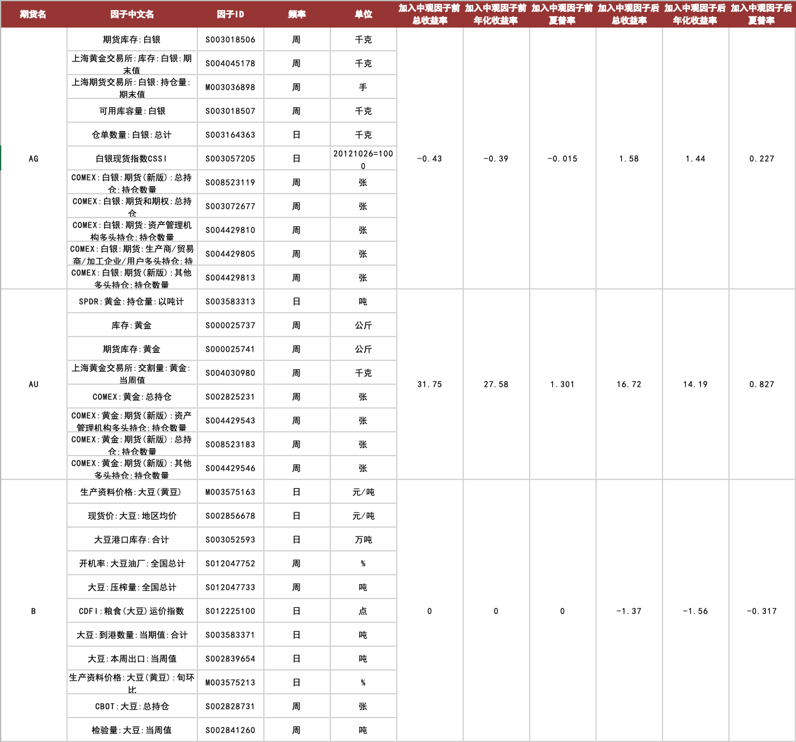
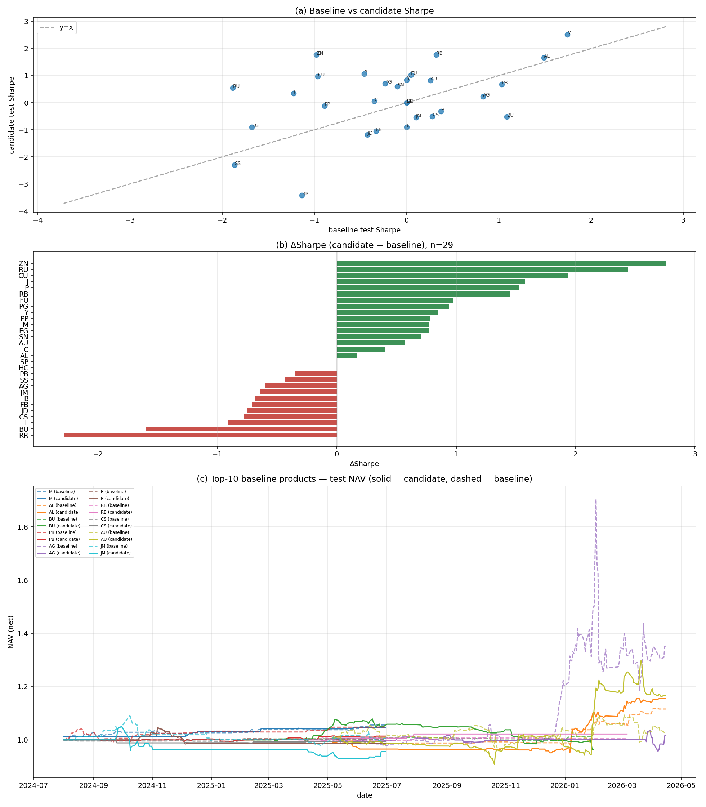

# CTA趋势跟踪策略的择时增强

## 摘要

本文以1分钟商品期货K线为标的，沿"微观—中观—宏观"三个层次构建并评估CTA趋势跟踪策略的择时增强方案。**微观层**以沪铝连续合约（AL）为代表，基于306维候选因子按波动率高低分域，分别训练LightGBM回归器预测未来30分钟累积收益；**中观层**将研究推广至34个主流商品期货品种，引入周频/日频基本面因子，通过统一的工程化对齐流程评估其边际贡献；**宏观层**在螺纹钢期货上叠加月频环境过滤器，对策略参与时点做二元约束。

样本外测试期（2025-05至2026-04）核心结论如下。**第一**，沪铝双域模型样本外年化净收益+10.53%、Sharpe 1.18、Pearson IC = +0.037，相较单域基线（年化−8.84%、Sharpe −1.01）大幅领先，验证了分域建模在波动率异质性显著品种上的有效性。**第二**，34品种引入中观因子后，测试集Sharpe中位变化+0.08、平均+0.38，正Sharpe品种数由10个增至18个，但改善集中于15个高响应品种，整体呈结构性而非全局性增量。**第三**，宏观过滤将螺纹钢交易胜率由56.60%提升至60.90%、平均单笔净收益由0.066%提升至0.091%，但因同步错过部分正收益月份，净收益与Sharpe回落于底层模型，当前更适合定位为风控工具。

在工程层面，本文引入两项可推广的改进：**自适应滚动波动率阈值**（240日窗口）使22个共同品种平均年化净收益提升+5.49pp；**分域质量门控**（验证集IC < −0.01的域强制空仓）有效拦截了信号方向错位的退化品种。两项均已采纳为默认配置。

---

## 一、微观底层CTA趋势策略模型

本章以沪铝连续合约（AL）1分钟数据为微观层研究对象，按训练集20日日波动率的滚动75%分位将样本逐日划分为高、低波动域，在两个域内分别训练LightGBM回归器预测未来30分钟累积收益；交易层面以验证集预测分位数标定开平仓阈值，并叠加确认持仓、最短持有、成本过滤与日末平仓等约束。

### 1.1 数据与样本划分

沪铝1分钟数据起始于2020-05，按月度边界以7:1.5:1.5划分训练集、验证集与测试集，对应规模约40.7万、9.2万与9.6万根K线；测试集覆盖2025-05至2026-04共12个完整月，作为策略样本外有效性的统一观测窗口。低波动域训练样本约33.1万行（81.4%），高波动域约7.6万行（18.6%）。

### 1.2 价量数据的分布特征与风险画像

进入建模前，我们先对沪铝1分钟数据的统计特征与风险结构进行系统性描述——这是选择因子类型与分域设计的现实依据。模型的预测目标为当前K线起始、未来30根1分钟K线的累积对数收益率。

**单根K线以噪声为主，有效趋势信号极为稀少。** 沪铝1分钟K线收益率均值近零、标准差极小、超额峰度显著，逾80%的K线绝对收益不足0.05%。若以单根K线（horizon = 1）为预测目标，分布几乎退化为零点附近的狄拉克尖峰，任何非零预测信号都将被双边成本淹没（图表1）。

**图表1：沪铝1分钟K线收益率分布：尖峰厚尾，噪声主导**

资料来源：中金公司研究部

注：图中 0 两侧约 ±0.026% 的对称间隔源于沪铝最小变动价位 5 元/吨在 ~19000 元/吨价格水平下的等价收益率（5/19000 ≈ 0.026%）；相邻 tick 之间的收益率在物理上不存在，故直方图呈现梳状空缺。

**预测视窗的选择：过短则交易摩擦吞噬毛利，过长则信号衰减至阈值以下。** 为定量评估跨视窗的相对排序，我们在采用全部因子直接入模、固定75%分位波动率阈值的设置下，对沪铝进行了六档预测视窗的系统性回测（表A-0）：

**表A-0：不同预测视窗的扣费净回测表现（沪铝，波动率分位阈值0.75，纯微观因子）**

| 预测视窗（1min bars） | 等效窗口 | 年化净收益 | Sharpe | 最大回撤 | 交易笔数 |
|----|:-:|:--:|:--:|:--:|:--:|
| 1 | 1分钟 | +4.8% | +1.29 | −0.3% | 13 |
| 5 | 5分钟 | +0.3% | +0.18 | −2.4% | 65 |
| 10 | 10分钟 | +2.1% | +1.11 | −0.4% | 20 |
| **30** | **30分钟（当前）** | **+4.9%** | **+0.89** | **−1.9%** | **36** |
| 60 | 60分钟 | −2.6% | −0.26 | −6.2% | 195 |
| 120 | 2小时 | −0.8% | −0.05 | −11.1% | 97 |

资料来源：中金公司研究部（扣除单边手续费1bp+滑点1bp双边成本）

注：表A-0的实验在采用滚动波动率和IC过滤这两项工程改进落地之前完成，与后文第1.6节基线结果存在系统性差距，绝对收益数字不可与后文基线直接对比。

结果呈现清晰的两端代价。**1分钟与10分钟视窗的Sharpe虽较高（+1.29、+1.11），但测试期交易仅13—20笔**，统计可靠性不足，单笔方向的偶然性主导Sharpe，难以作为策略有效性的依据；**60分钟与120分钟视窗均转为负收益**，1分钟K线微观结构的前瞻性在跨小时尺度上已衰减殆尽，模型输出趋于随机。**30分钟视窗在稳健性与信号强度之间取得最优平衡**——36笔交易构成足够的统计基础，Sharpe +0.89、最大回撤仅−1.9%。我们据此将**预测视窗固定为30分钟**。

**30分钟累积收益的分布已明显脱离单根K线的零点堆积。** 与图表1相比，图表2峰值密度大幅下降、双侧尾部扩展，不再呈狄拉克型；均值仍近零（市场中性）、分布对称，中等量级的正负收益占比已显著上升，使开仓阈值以上的信号足以覆盖双边成本。

**图表2：预测目标（未来30分钟累积收益率）分布：双侧展开，脱离零点极端堆积**

资料来源：中金公司研究部

**20日日波动率呈右偏长尾，主体与尾部的价格动态迥异。** 以滚动240日窗口的75%分位为界，样本分为约79%低波域与21%高波域，阈值约对应1.3%的日波动率水平。两类环境在波动幅度、趋势持续性与信号强度上差异显著：长尾使均值与方差被高波样本拉偏，单一模型被迫同时适配主体与尾部时，预测信号趋于向零收缩——这正是分域建模的天然依据（图表3）。

**图表3：20日日波动率分布：右偏长尾，主体与尾部分域阈值清晰**

资料来源：中金公司研究部

上述三类分布特征直接决定了模型的两项核心设计选择。**其一，预测视窗取30根K线**——累积30分钟后信号强度方可跨越双边成本门槛，是信噪比与交易频率之间的合理折衷。**其二，按波动率分域建模**——主体期（日波<1.3%）趋势缓慢、信号偏弱，尾部期（日波>1.3%）波动放大、方向性更强，单一模型被迫在两套最优参数之间妥协，预测信号必然向零收缩；分域则让每个子模型在同质波动环境中独立寻优，详见§1.4。

### 1.3 因子体系

**候选因子体系的构建。** 候选因子全部基于品种主连行情的OHLCV、持仓量与成交额序列，在1分钟K线上滚动计算得到，不引入外部数据。按构造层次分三类、共306个：

- **153个量价因子**：在5/10/20/30/60五档窗口上对单一价量序列做滚动统计直接得到，语义单一、不含跨序列融合。按因子族分7类：价格滞后（15维）、K线形态（9维）、趋势（均线/动量/极值，20维）、波动率（35维）、方向计数与累积（30维）、成交量族（35维）、量价相关性（10维）。

- **96个工程因子**：对行情序列做语义化二次刻画，通过比值、偏离度与时间编码等显式运算得到，单一窗口、不引入非线性合成。共8类，覆盖单根K线形态、多窗口收益与已实现波动率、均线偏离、成交量/持仓量/成交额相对比率、ATR、价格突破触发与时间编码（时段、星期、交易时段标记）。

- **57个合成/日内因子**：针对1分钟弱信号设计，面向非线性与条件式信号，共9类。涵盖长窗口动量（120/240/480分钟）、VWAP偏离与Z-score、Parkinson波动率、Tick方向量加权、日内累计对数收益（承载当日整体趋势先验）、跨日同分钟历史均值、持仓量变化与量价背离、半方差对数比，以及同类信号几何均值融合降噪。其中日内累计对数收益系列将"当日已发生趋势"以因果方式编码入当前K线，在模型Gain重要性中普遍跻身前5。

所有因子在K线t处仅依赖t时刻及之前的已实现数据，已通过防前视审计。

以训练集平均|IC|为参照（图表4），**工程化因子最高、合成因子居中、量价因子最低**。这一排序体现了筛选效应：经IC×ICIR双重过滤后，留存的工程化因子均为语义清晰的单窗口刻画（振幅偏离、ATR、时间编码等），组均|IC|最高；合成因子凭借长窗口动量与日内趋势先验携带额外状态信息，组均|IC|居中；量价因子族群最大（97个通过），单因子|IC|略低，但覆盖宽度为树模型提供了丰富的条件分裂基础。合成因子的核心价值不在线性预测强度，而在于与其他因子的非线性条件式交互，须在模型Gain重要性中体现（详见§1.6）。

**图表4：各类别因子平均|IC|（训练集，纯微观候选因子）**

资料来源：中金公司研究部

在个体因子层面，Top 20单因子|IC|分布于0.021—0.049区间，整体处于1分钟高频弱信号的合理量级，无异常突出的单因子（图表5）。榜单由波动率类因子（Parkinson_VOL_60/20、ATR_60/20、RV_480/120/60/20、STD_60/30/20）主导，表明短期波动率水平对未来30分钟波动率归一化收益的排序能力最强；时间编码（ENG_WEEKDAY）、价格水平（LOW0、MIN30/60）与日内累积位置（ENG_INTRADAY_POS_RATIO_CUM）等异质语义的因子也进入Top 20，体现入选因子在状态空间上的多样性。值得注意的是，部分线性|IC|未进Top 20的合成因子（如ENG_DAILY_RET_*_LAG1日度滞后收益族）在后文§1.6的模型Gain重要性中跻身前列——其价值主要来自非线性条件式交互，而非线性预测强度。

**图表5：Top 20单因子|IC|（训练集，Pearson相关系数，纯微观）**

资料来源：中金公司研究部

**两道过滤与有效因子确定。** 306个候选因子须依次通过两道过滤方可入模。**第一道为数据质量门控**：剔除训练集缺失率超限（多见于长窗口因子序列前端的大段缺失）或近似常数的因子。**第二道为滚动IC×ICIR双重审计**：在训练集上按月滑窗，逐因子计算其与未来30分钟波动率归一化收益的Spearman月度IC序列，聚合为均值IC与ICIR；仅当均值|IC|与|ICIR|同时达到阈值、且有效月度窗口≥3的因子才入选。这一机制可有效剔除"偶发有效但跨月稳定性欠佳"的不稳定信号，确保入选因子在各月均具备方向一致性。

以沪铝为基准，306个候选因子经双重过滤后**172个**进入双域LightGBM训练，134个因子因IC信号过弱或跨月稳定性不足被淘汰。各品种实际入模数量因IC分布而异，通常分布在160—200之间。

进一步观察入选172个因子的组合表现：训练期49个月中月度均值|IC|**全部为正**（49/49），整体均值|IC|= 0.0325、ICIR = 2.78（图表6），表明该组合在不同市场状态下均能维持基线预测有效性，且月度方向一致性极高。

**图表6：入选因子组合训练期月度均值|IC|走势（沪铝，172个入选因子）**

资料来源：中金公司研究部

### 1.4 高/低波动域划分

若将全量训练样本直接输入回归模型，模型会因预测目标期望近零、方差极大而出现"懒惰预测"——预测值始终在零附近震荡，无法区分高低收益样本，叠加开仓阈值过滤后交易笔数骤降，策略接近长期空仓。

为此，我们以20日滚动日波动率为基准将样本逐日划分为低波域与高波域，使每个子模型在同质化的波动环境中独立拟合，目标方差异质性显著下降，预测信号得以有效收敛。

分域规则以**日**为粒度：每个交易日取过去20日的日波动率，以过去240个交易日的**75%分位数**为自适应阈值——当日波动率高于该阈值则标注为高波域（+1），否则为低波域（−1），日内全部1分钟K线统一继承当日域标签。采用滚动阈值是为了跟踪波动率中枢的制度性漂移，使高波标签占比在各时间段稳定在约25%附近；选取75%分位数则是在高波域"纯度"（信号同质性）与样本量（模型正则化）之间的最优折衷。两项参数均经受控实验支撑，详见§1.7。

图表7展示了划分结果的时间分布——高波域呈明显的事件聚集特征，对应基本面冲击或行情拐点；低波域则更接近震荡与小幅趋势行情。

**图表7：沪铝1分钟K线高/低波动域划分（测试集时段）**

注：图中整月色块（每月统一着红或绿色）是可视化层的月均聚合效果，训练层面的域标签本身为日粒度。这一划分规则对全部品种统一适用，不做品种级特殊调整。

资料来源：中金公司研究部

### 1.5 模型参数与交易规则

**模型层面**：在划分后的两个域内分别训练LightGBM回归器，所有超参（学习率、叶子数、最大深度、特征/样本采样率、正则系数等）共用同一组配置；仅高波域单独使用更大的叶节点最小样本数以加强正则，抑制对尾部样本的过拟合。所有特征经鲁棒标准化后入模。

**交易层面**：以验证集预测分位前8%为开仓阈值、第40百分位为平仓阈值，叠加确认持仓、最短持有、冷静期等多重约束；不允许直接反向（先归零再反向），并以手续费与滑点做成本过滤。日盘最后一根强制平仓，整体采用次根撮合执行。

双域架构存在一项潜在风险：若某域在验证期发生特征—收益的结构性转变，验证集IC可能呈系统性负值，模型将在该域以错误方向持续建仓。为此，我们引入**分域质量门控**：任一域验证集Spearman IC低于−0.01时，该域在回测阶段强制空仓，另一域照常交易，双域架构本身不变。

需要特别说明的是，若某域在验证期内恰好无样本落入（例如固定阈值下波动率中枢漂移导致高波域在验证月全部缺失），此时该域无法计算IC——这属于"数据稀缺"而非"信号方向错误"，性质截然不同。验证期空域时门控不触发，模型仍参与测试集交易，开平仓阈值退而采用训练集预测分布标定；仅当验证集IC有实测值且显著为负时，门控才将该域强制空仓。全品种实测中，门控对退化品种实现精准捕获，对非退化品种零误触发。

跨品种对照实验（33品种）显示，燃油（验证集IC=−0.045）、天然橡胶（验证集IC=−0.011）等品种的双域模型在测试集严重跑输单域基线（天然橡胶：双域−13.43% vs 单域−0.09%），共同特征是至少一个域的验证集IC显著为负，且超参调整无法根本修复——问题源自信号本身的跨期结构性转变，而非模型复杂度。引入**分域质量门控**后，此类系统性反向建仓损失可被有效规避，具体见§1.7。

**LightGBM超参数的系统化调优。** 上述8个核心LightGBM超参（学习率、叶子数、最大深度、叶节点最小样本数、特征/样本采样率、L1/L2正则）的初值由人工经验设定。为系统性挖掘其对模型性能的提升空间，我们采用**Bayesian优化框架Optuna**做全品种联合搜索，以**全品种加权后的验证集Spearman IC均值**作为标量目标最大化。设计要点：（i）所有品种共用同一组超参，不做品种级特殊化；（ii）仅基于train→val流程搜索，测试集严格隔离作为最终样本外评估；（iii）每个trial保留早停机制（num_boost_round=600 + early_stopping_rounds=50），防止单trial过拟合；（iv）采用MedianPruner对明显落后中位数的trial提前中止，加速搜索。

### 1.6 沪铝单品种回测结果

测试集（2025-05至2026-04）净值口径下，沪铝底层模型年化收益+10.53%、Sharpe 1.18、最大回撤−4.28%、交易62笔（图表8）。模型预测Pearson IC = +0.037、Spearman IC ≈ −0.005——两者分歧反映波动率归一化目标下信号集中于尾部样本，等权秩相关被中段噪声拖低，但Pearson口径下模型仍捕获了约3.7%的线性预测力。分域看，验证集IC_lv = +0.014、IC_hv = +0.067，两个子模型均通过分域质量门控且IC方向一致，构成有效的择时增强引擎。

**图表8：底层CTA趋势策略模型回测图（沪铝，2025-05—2026-04）**

注：左上角NAV曲线中，Strategy Net为本文策略净值；**Benchmark Long Only**指每根可交易K线持有+1（满仓多头）、按相同规则日末平仓所形成的净值，近似于"该品种期货价格在测试期的走势扣除双边成本"；**Benchmark Short Only**指每根K线持有−1（满仓空头）的对应净值，近似于"价格反向走势扣除双边成本"。两条基准均使用与策略相同的成本模型（单边手续费1bp + 滑点1bp）。两条基准刻画的是该品种在测试期的纯Beta方向收益，策略只有显著超越Long Only或Short Only两条基线，才说明模型贡献了真实Alpha而非依赖品种自身的方向行情。

资料来源：中金公司研究部

将单因子|IC|视角与LightGBM训练后的Gain重要性视角对比，二者在头部呈现明显分歧：单因子|IC|榜由波动率类因子主导，而模型Gain榜由**日内时段编码 + 多窗口日度滞后收益**主导。低波动域模型Top 5依次为**ENG_INTRADAY_BAR_PROGRESS**（日内时段进度，Gain = 6,625）、**ENG_DAILY_RET_20D_LAG1**（前20日滚动收益，5,961）、**ENG_DAILY_RET_LAG1_TO_5_MEAN**（前1—5日均值收益，5,136）、**ENG_DAILY_RET_3D_LAG1**（4,582）与**ENG_DAILY_RET_60D_LAG1**（4,529），全部为合成因子（图表9）。这表明：低波环境下，模型最依赖"一天内处于哪个阶段 + 当前嵌入在哪一段日度趋势中"——将日内时序结构与中长期动量状态作为条件分裂依据；相比之下，波动率类因子（ENG_RV_*、ENG_PARKINSON_VOL_*）虽然单因子|IC|最高，但在低波域的Gain排名落在中后段，反映**线性预测力强 ≠ 条件式增益高**。两张图共同揭示了高频弱信号下因子的双重价值结构：波动率类因子贡献"当前总体处于何种状态"的线性排序信号，日度滞后收益与时段编码则贡献"在哪一时刻该交易"的条件式精度。

**图表9：LightGBM低波动域模型Top 20特征Gain重要性（训练后视角）**

资料来源：中金公司研究部

高波动域模型的特征结构与低波动域存在显著差异（图表10）。**ENG_INTRADAY_BAR_PROGRESS**仍居首位（Gain = 4,637），表明日内时段编码在两类制度下均具备稳定作用；其后依次为**ENG_RV_480**（480分钟已实现波动率，2,379）、**STD60**（60分钟收益标准差，2,069）、**ENG_FUSED_DAILY_MOMENTUM**（融合日度动量，2,069）与**ENG_WEEKDAY**（星期编码，1,494）。与低波域相比有两点关键差异：**其一**，前5名出现了STD60与RV_480这两个**长窗口波动率刻画**——体现高波时期波动率聚集与方向延续高度耦合，模型直接依赖波动率水平做条件分裂；**其二**，日度滞后收益不再占据Top 4—5位，而是退居中段（DAILY_RET_LAG3与60D/20D/3D LAG1分布在Top 6—12位），说明**高波环境下短期波动率信号的边际信息量已超过中长期日度动量**。综上，低波域模型以"时段编码 + 中长期日度滞后收益"为核心，高波域模型则在保留时段编码主导地位的同时，将权重显著向短/长窗口波动率倾斜。

**图表10：LightGBM高波动域模型Top 20特征Gain重要性（训练后视角）**

资料来源：中金公司研究部

### 1.7 高低波动分域划分参数选取与有效性验证

本节通过三组受控实验，依次验证分域参数选取与样本外有效性。

**（一）分位阈值选取——波动率分位扫描实验**

阈值直接决定高波域"纯度"与样本量之间的权衡：阈值过低则高波域混入过多震荡样本、信号同质性受损；阈值过高则高波样本过少、正则化效果下降。针对沪铝纯微观模式（30分钟预测视窗），我们对0.60至0.80五个分位阈值进行了系统性回测（表E）：

**表E：波动率域分位阈值扫描（沪铝，预测视窗30分钟，纯微观因子）**

| 波动率分位阈值 | 年化净收益 | Sharpe | 最大回撤 | 交易笔数 |
|---:|---:|---:|---:|---:|
| 0.60 | −6.2% | −0.86 | −10.4% | 93 |
| 0.65 | −8.1% | −1.52 | −11.4% | 22 |
| 0.70 | +2.6% | +0.45 | −8.7% | 83 |
| **0.75（当前）** | **+4.9%** | **+0.89** | **−1.9%** | **36** |
| 0.80 | +19.9% | +1.86 | −8.0% | 253 |

资料来源：中金公司研究部（沪铝测试集，纯微观对照实验）

注：表E与表A-0属同批次实验，同样在两项工程改进落地之前完成。其一，**波动率阈值采用训练期全量分位数（固定 cutoff）**，而非后续采纳的240日滚动自适应阈值；滚动阈值改进已记录于§1.7（二），在22个共同品种上平均带来+5.49pp年化净收益改善，0.75档对应的+4.9%在引入滚动阈值后即提升至+10.5%。其二，**IC审计过滤未启用**，全部306个候选因子直接入模；正式基线经双重IC×ICIR过滤后只保留约172个有效因子，剔除跨月稳定性不足的噪声特征后模型预测质量显著提升。表E的比较价值在于不同分位阈值之间的相对排序，绝对收益数字不可与后文基线直接对比。

0.75档在风险收益比上表现最优——Sharpe +0.89、最大回撤−1.9%、36笔交易频率适中。0.60与0.65档均产生负收益，原因在于阈值过低时高波域样本异质性过强，子模型无法有效聚焦；0.80档虽Sharpe最高（+1.86），但253笔交易（约为0.75档的7倍）暴露出明显的过拟合迹象，稳健性存疑。综合考虑，我们将**分位阈值定为0.75**，即20日日波动率位于历史分布前25%的交易日为高波域。

**（二）固定阈值 vs 自适应滚动阈值**

分位阈值确定后，仍需选择阈值的计算方式。**固定方式**以训练期全量样本的75%分位日波动率为唯一边界，一经标定全期不变；**自适应滚动方式**以过去240个交易日日波动率分布的75%分位数为当日边界，随波动率中枢的制度性漂移动态更新，无前视。

**表F：固定阈值 vs 滚动240日阈值（沪铝，分位阈值0.75，纯微观因子）**

| 方案 | 年化净收益 | Sharpe | 最大回撤 | 交易笔数 | 测试期高波占比 | 备注 |
|---|---:|---:|---:|---:|---:|---|
| 固定训练期阈值 | −0.1% | −0.12 | −4.9% | 74 | 23.4% | 高波验证期样本为零；阈值从训练集标定 |
| **滚动240日阈值（当前）** | **+10.5%** | **+1.18** | **−4.3%** | **62** | **44.3%** | 验证集IC_lv=+0.014，IC_hv=+0.067 |

资料来源：中金公司研究部

固定阈值的失效路径清晰：以训练期分布为静态基准，一旦验证期进入低波动制度，高波样本骤降乃至归零，高波子模型便无法从验证集标定开平仓阈值。沪铝实验中，固定0.75阈值下高波样本在训练集有97,909行、验证集为0行；对照实验以训练集为备用标定源（含前视偏差）后，测试期高波占比仅23.4%——大量实际高波日被误标为低波，两个子模型均陷入错位状态，净收益−0.1%、Sharpe −0.12。滚动240日阈值则每日依据过去240个交易日的分布自适应更新，使高波标签占比在任意时段稳定维持在约25%，验证期获得足量高波样本（IC_hv = +0.067），测试期高波占比回升至44.3%，年化+10.5%、Sharpe +1.18。

**（三）单域基线 vs 双域模型——分域有效性验证**

参数确定后，本组实验验证分域架构本身的样本外价值。两组模型共用完全相同的306维微观因子、相同的LightGBM超参与交易规则；唯一差异在于：**单域基线**跳过波动率分域步骤，直接以原始未来30根K线收益率为训练目标，对全量训练样本拟合单个回归器；**双域模型**以局部波动率归一化后的标准化值为预测目标，在低波/高波两个子集上分别训练并独立标定阈值。两组均在测试集独立回测，成本参数一致。

以沪铝为例（图表11），双域模型全程领先——年化净收益+10.53% vs 单域基线−8.84%，Sharpe 1.18 vs −1.01，交易62笔 vs 47笔。单域模式下模型受高波样本主导，低波环境中信号极弱，验证集IC出现负值（−0.006）导致测试集反向交易；双域模式下两个子模型均能从各自验证集标定有效阈值，IC均为正（低波+0.014、高波+0.067），交易质量大幅改善。

**图表11：双域模型与单域基线对比（沪铝，测试集2025-05—2026-04）**

资料来源：中金公司研究部

综合来看，高低波动分域建模的核心价值体现在两个层面：**其一**，每个子模型在同质波动环境中独立标定阈值，避免高低波样本互相稀释信号；**其二**，质量门控在验证集IC为负时强制空仓，有效规避系统性反向建仓风险。

### 1.8 其他模型改进尝试

本节汇总章节框架定型过程中已系统性尝试的其他模型层面改进。所有受控实验均采用单一变量对照法；策略A与策略B目前仅基于沪铝单品种纯微观模式实测，待后续扩展至全品种。

**（一）波动率归一化目标 vs 原始收益目标（沪铝单品种实测）**

对比波动率归一化目标（当前方案）与原始收益目标（直接预测future_return，不做vol归一化）。两者共享相同的prepare_data + factor_audit流程，仅训练目标不同。

**表D：波动率归一化目标 vs 原始收益目标——沪铝测试集对比**

| 指标 | 波动率归一化目标（当前方案）| 原始收益目标 |
|---|---:|---:|
| 年化净收益 | +10.53% | +6.19% |
| Sharpe | +1.18 | +0.73 |
| 最大回撤 | −4.28% | −4.65% |
| 交易笔数 | 62 | 102 |
| test Spearman IC | −0.005 | +0.023 |

资料来源：中金公司研究部

波动率归一化目标在净收益（+10.53% vs +6.19%）与Sharpe（+1.18 vs +0.73）上均优于原始收益目标。后者测试集IC为正（+0.023），方向排序能力尚可，但交易笔数显著偏多（102笔 vs 62笔）——高波样本主导L2梯度时，低波期间的信号阈值更易被突破，过度交易侵蚀净收益。波动率归一化通过局部缩放使两个域的预测值分布对齐至同一量纲，验证集阈值标定更精准、开仓频率更受控，最终净收益领先。保留vol_norm为默认训练目标。

---

**（二）策略A——样本重加权（沪铝单品种实测）**

**动机。** 当前回测仅在验证集预测分位Top 8%的极端bar开仓，策略盈亏完全由尾部bar的方向准确率决定；但L2损失对全部bar均等加权，大量中性bar的梯度主导训练，极端bar在损失中权重不足。策略A引入按目标幅度的样本重加权：

$$w_i = |target\_vol\_norm_i|^{\alpha}$$

其中$\alpha=0$等价当前均匀权重，$\alpha=1$线性强调大幅行情bar，$\alpha=2$为平方强调。验证集不传weight以保证early stopping无偏，回测逻辑无需任何改动。

**沪铝实测结果（$\alpha=1$ vs baseline）：**

**表D-A：策略A样本加权 vs 基线——沪铝测试集对比**

| 指标 | 基线（$\alpha=0$）| 策略A（$\alpha=1$）|
|---|---:|---:|
| 年化净收益 | +10.53% | −12.44% |
| Sharpe | +1.18 | −1.20 |
| 最大回撤 | −4.28% | −13.55% |
| 交易笔数 | 62 | 298 |
| val IC（低波/高波）| +0.014 / +0.067 | −0.003 / +0.041 |

资料来源：中金公司研究部

**结论。** 策略A在沪铝上大幅退步——加权后低波域验证集IC由+0.014降至−0.003（翻负），触发分域质量门控强制空仓，全部交易由高波域单独承担（298笔 vs 基线62笔）；信号密度骤增而方向准确率未能同步提升，成本侵蚀加剧。根本原因在于：沪铝低波域训练样本（约33万行）远多于高波域（约7.6万行），均等L2梯度本就不构成主导问题；强制向极端bar倾斜权重反而破坏了低波域的信号稳定性。策略A的逻辑前提（中性bar梯度主导损失）在沪铝低波域不成立，其效果高度依赖品种的域样本比例与信号分布，待多品种验证。

---

**（三）策略B——极值预测止盈目标（沪铝单品种实测）**

**动机。** 当前训练目标（vol归一化30分钟终值）仅刻画窗口终值，"先大涨后回归"类行情被标记为近零目标，模型无法学到此类趋势段的开仓价值。策略B将训练目标改为窗口内绝对幅度最大的有符号极值（horizon根K线内最大涨幅或最大跌幅中绝对值更大者），并配套调整退出逻辑——由"信号衰减至Q40"改为"价格触达预测极值的tp_fraction倍后提前止盈"。为剥离归一化本身的影响，本节同步验证了不做波动归一化的原始极值变体（策略C）。

**沪铝实测结果（基线 vs 策略B vs 策略C）：**

**表D-B：策略B极值目标 vs 基线——沪铝测试集对比**

| 指标 | 基线 | 策略B（极值波动归一化）| 策略C（极值原始）|
|---|---:|---:|---:|
| 年化净收益 | +10.53% | −10.22% | +1.62% |
| Sharpe | +1.18 | −1.14 | +1.31 |
| 最大回撤 | −4.28% | −14.23% | −0.43% |
| 交易笔数 | 62 | 135 | 13 |
| val IC（低波/高波）| +0.014 / +0.067 | +0.003 / +0.033 | +0.030 / −0.025 |

资料来源：中金公司研究部

**结论。** 策略B（极值归一化）在沪铝上大幅退步——两域验证集IC均显著下降（低波+0.014→+0.003，高波+0.067→+0.033），阈值标定能力减弱，交易量翻倍（135笔）使成本压力骤升，净收益由+10.53%跌至−10.22%。策略C（极值原始）Sharpe与基线接近（+1.31 vs +1.18），但高波域验证集IC变负（−0.025），触发质量门控后仅剩13笔交易，统计可靠性不足。极值目标的核心问题在于：窗口内极值方向与终值方向不一致的bar，在原目标下接近零，在极值目标下却被赋予较大权重——模型因此在方向噪声区学习了虚假极值信号，验证集IC随之下滑。策略B仍待扩展至多品种验证，并探索更短窗口或更高tp_fraction以降低目标噪声。

---

## 二、中观因子的择时增强

### 2.1 多品种推广

第一章以沪铝（AL）为代表深入剖析了纯微观量价模式下的双域模型。本章在此基础上将研究推广至**34个主流商品期货品种**（覆盖贵金属、有色金属、黑色系、能源化工、林木板材、农产品六大板块），并在微观因子之外引入**周/日频中观因子**——对各品种基本面状态有刻画作用的库存、持仓、产量、进出口等指标，旨在不破坏底层结构的前提下提升趋势策略对品种基本面状态的识别能力。所有品种共用完全相同的模型超参、因子工程流程与交易规则，不做任何品种级特殊化。

**纯微观双域模型的多品种样本外基线结果如图表12所示。** 34个品种均采用纯微观因子（约80—220维Tier A候选因子经双重IC过滤后入模），共用同一组超参独立训练双域LightGBM。各品种测试集为样本外最后约12个月——因数据起始时间不同，测试区间存在差异（沪铝为2025-05至2026-04，多数品种为2024-08至2025-06）。成本统一为单边手续费1bp + 滑点1bp。

**图表12：纯微观双域LightGBM CTA策略——34品种样本外测试集回测结果（默认超参数，run = `baseline_roll240_75c_nomid`）**

| 品种 | 中文名 | 板块 | 年化净收益 | Sharpe | 最大回撤 | 交易笔数 | 成交胜率 |
|:---:|:---:|:---:|---:|---:|---:|---:|---:|
| JD | 鸡蛋 | 农产品 | +6.6% | **+1.34** | −2.5% | 82 | 54.9% |
| AU | 黄金 | 贵金属 | +27.6% | **+1.30** | −9.2% | 496 | 48.4% |
| AL | 沪铝 | 有色金属 | +10.5% | **+1.18** | −4.3% | 62 | 50.0% |
| SP | 纸浆 | 能源化工 | +3.7% | **+1.11** | −0.5% | 6 | 33.3% |
| J | 焦炭 | 黑色系 | +4.9% | +0.85 | −4.6% | 32 | 50.0% |
| NI | 镍 | 有色金属 | +5.7% | +0.66 | −7.8% | 119 | 54.6% |
| CU | 沪铜 | 有色金属 | +0.4% | +0.48 | −3.2% | 23 | 56.5% |
| P | 棕榈油 | 农产品 | +1.6% | +0.43 | −2.8% | 60 | 51.7% |
| HC | 热卷 | 黑色系 | +0.0% | +0.05 | −6.5% | 32 | 62.5% |
| I | 铁矿石 | 黑色系 | −0.4% | +0.04 | −11.6% | 149 | 52.3% |
| B | 豆二 | 农产品 | 0.0% | 0.00 | 0.0% | 0 | — |
| FU | 燃油 | 能源化工 | 0.0% | 0.00 | 0.0% | 0 | — |
| L | 聚乙烯 | 能源化工 | 0.0% | 0.00 | 0.0% | 0 | — |
| Y | 豆油 | 农产品 | 0.0% | 0.00 | 0.0% | 0 | — |
| AG | 白银 | 贵金属 | −0.4% | −0.01 | −10.1% | 47 | 53.2% |
| SN | 锡 | 有色金属 | −1.9% | −0.18 | −9.7% | 60 | 51.7% |
| CS | 玉米淀粉 | 农产品 | −0.6% | −0.20 | −3.0% | 47 | 46.8% |
| V | 聚氯乙烯 | 能源化工 | −1.1% | −0.23 | −3.7% | 48 | 50.0% |
| PG | 液化气 | 能源化工 | −0.1% | −0.24 | −0.2% | 2 | 50.0% |
| EB | 苯乙烯 | 能源化工 | −0.9% | −0.27 | −2.6% | 16 | 43.8% |
| RU | 天然橡胶 | 能源化工 | −3.1% | −0.31 | −6.9% | 109 | 55.0% |
| JM | 焦煤 | 黑色系 | −3.6% | −0.42 | −11.5% | 60 | 50.0% |
| FB | 纤维板 | 林木板材 | −2.5% | −0.47 | −4.6% | 198 | 44.4% |
| PB | 铅 | 有色金属 | −2.6% | −0.54 | −6.3% | 90 | 55.6% |
| ZN | 锌 | 有色金属 | −0.7% | −0.55 | −1.6% | 27 | 48.1% |
| BU | 石油沥青 | 能源化工 | −2.5% | −0.60 | −3.5% | 33 | 39.4% |
| C | 玉米 | 农产品 | −1.4% | −0.66 | −3.3% | 121 | 39.7% |
| M | 豆粕 | 农产品 | −0.8% | −1.07 | −0.7% | 1 | 0.0% |
| A | 豆一 | 农产品 | −3.7% | −1.12 | −4.6% | 47 | 51.1% |
| RB | 螺纹钢 | 黑色系 | −7.5% | −1.46 | −8.2% | 51 | 43.1% |
| SS | 不锈钢 | 黑色系 | −5.8% | −1.64 | −6.1% | 180 | 41.7% |
| PP | 聚丙烯 | 能源化工 | −4.5% | −1.93 | −4.4% | 65 | 40.0% |
| EG | 乙二醇 | 能源化工 | −6.9% | −1.94 | −6.0% | 49 | 40.8% |
| RR | 粳稻 | 农产品 | −21.8% | −3.29 | −19.4% | 298 | 33.9% |
| **中位数** | — | — | **−0.6%** | **−0.22** | **−4.3%** | **48** | **50.0%** |
| **平均数** | — | — | **−0.3%** | **−0.29** | **−5.0%** | **77** | **46.4%** |

资料来源：中金公司研究部（扣除单边手续费1bp+滑点1bp双边成本，次根执行）

图表12结果可归纳为四点规律。

**其一，头部品种的Sharpe呈清晰梯队分布。** 鸡蛋（+1.34）、黄金（+1.30）、沪铝（+1.18）、纸浆（+1.11）四个品种Sharpe均超过1.0，展现出纯微观信号在特定品种上的样本外有效性；焦炭（+0.85）、镍（+0.66）、沪铜（+0.48）、棕榈油（+0.43）等品种Sharpe为正但低于1.0。整体看，10/34个品种Sharpe为正，24/34个品种为负或零，中位Sharpe为−0.22。**纯微观信号并非对所有品种均等有效**，有效性的品种依赖性显著，这也是引入中观因子做择时增强的核心动机之一。

**其二，最大回撤控制存在明显异质性。** 多数品种最大回撤维持在−5%以内，体现了开仓阈值过滤与日末平仓规则对极端亏损的约束；但黄金（−9.2%）、白银（−10.1%）、铁矿石（−11.6%）、焦煤（−11.5%）、粳稻（−19.4%）等品种回撤较深——这些品种的1分钟K线信号在外部驱动主导的行情中（贵金属：美元/利率预期；铁矿石/焦煤：港口库存与海外需求；粳稻：政策性收储）频繁受干扰，方向准确率低于头部品种。

**其三，分域质量门控在多品种模式下发挥了关键作用。** B（豆二）、FU（燃油）、L（聚乙烯）、Y（豆油）四个品种测试集交易笔数为0，原因在于两个域的验证集IC均未达到门控阈值，模型判断该品种信号质量不足、主动放弃建仓。这既反映了门控机制的保守性，也客观印证了这4类品种1分钟微观信号薄弱的事实。

**其四，品种有效性与板块及成交活跃度高度相关。** 表现较好的鸡蛋、黄金、沪铝、纸浆等头部品种均属流动性良好、1分钟K线成交量稳定的品种，微观结构规律性较强；粳稻（−3.29）、乙二醇（−1.94）、聚丙烯（−1.93）、不锈钢（−1.64）等品种的负Sharpe则源自流动性偏弱（粳稻、纤维板）、行情结构性转变（聚丙烯、乙二醇）或板块外部驱动（不锈钢夜盘）等品种特征。

**全品种LightGBM超参数Optuna调优。** 图表12基线沿用了人工设定的LightGBM默认参数（学习率0.03、num_leaves=63、max_depth=6、feature_fraction=0.8、bagging_fraction=0.8、min_child_samples=120、reg_alpha=0、reg_lambda=1.0）。为系统性评估在"全品种共用同一组超参"前提下超参数微调对模型整体表现的提升空间，我们采用Optuna做全品种联合搜索。**目标函数为各品种验证集Spearman IC的加权均值**——按验证集行数加权得到品种级IC后再对全品种取均值，该标量目标兼具与训练损失对齐、无需逐trial回测、与下游Sharpe高度相关三重优势。**搜索8个核心超参**：学习率、叶子数、最大深度、叶节点最小样本数、特征采样率、行采样率、L1正则与L2正则；搜索空间为经验区间（如学习率[0.005, 0.05]对数均匀、子采样率[0.5, 1.0]等）。所有品种共用同一组搜索结果，测试集严格隔离，搜索仅基于train→val流程。

经30个trial（含MedianPruner提前中止11个表现落后的trial）后，最优配置为：lr=0.0118、num_leaves=62、max_depth=7、feature_fraction=0.583、bagging_fraction=0.563、min_child_samples=206、reg_alpha=0.104、reg_lambda≈0——**相对默认参数的核心变化是学习率减半、子采样由0.8降至约0.55（更强行/列扰动）、最小叶子样本数翻倍（更强正则），并以L1正则替代L2**。

**图表13：Optuna超参数微调后的纯微观双域LightGBM CTA策略——34品种样本外测试集回测结果（run = `optuna_micro_v1`）**

| 品种 | 中文名 | 板块 | 年化净收益 | Sharpe | 最大回撤 | 交易笔数 | 成交胜率 |
|:---:|:---:|:---:|---:|---:|---:|---:|---:|
| AL | 沪铝 | 有色金属 | +9.3% | **+1.33** | −3.6% | 68 | 55.9% |
| V | 聚氯乙烯 | 能源化工 | +6.3% | **+1.24** | −0.6% | 11 | 81.8% |
| AG | 白银 | 贵金属 | +56.3% | **+1.20** | −36.8% | 536 | 50.0% |
| I | 铁矿石 | 黑色系 | +17.1% | **+1.17** | −6.9% | 154 | 54.5% |
| BU | 石油沥青 | 能源化工 | +2.2% | +0.95 | −1.2% | 19 | 57.9% |
| NI | 镍 | 有色金属 | +6.0% | +0.91 | −2.0% | 56 | 50.0% |
| PB | 铅 | 有色金属 | +2.4% | +0.44 | −2.6% | 55 | 60.0% |
| CS | 玉米淀粉 | 农产品 | +0.7% | +0.43 | −1.3% | 27 | 63.0% |
| RU | 天然橡胶 | 能源化工 | +1.8% | +0.27 | −5.5% | 69 | 56.5% |
| SN | 锡 | 有色金属 | +1.7% | +0.26 | −8.3% | 58 | 53.4% |
| C | 玉米 | 农产品 | +0.7% | +0.19 | −3.4% | 246 | 43.9% |
| AU | 黄金 | 贵金属 | +0.6% | +0.16 | −16.6% | 468 | 49.6% |
| FU | 燃油 | 能源化工 | −0.3% | +0.12 | −29.2% | 235 | 51.9% |
| B | 豆二 | 农产品 | 0.0% | 0.00 | 0.0% | 0 | — |
| L | 聚乙烯 | 能源化工 | 0.0% | 0.00 | 0.0% | 0 | — |
| P | 棕榈油 | 农产品 | 0.0% | 0.00 | 0.0% | 0 | — |
| Y | 豆油 | 农产品 | 0.0% | 0.00 | 0.0% | 0 | — |
| ZN | 锌 | 有色金属 | 0.0% | 0.00 | 0.0% | 0 | — |
| SP | 纸浆 | 能源化工 | −1.2% | −0.20 | −7.8% | 58 | 56.9% |
| EB | 苯乙烯 | 能源化工 | −0.8% | −0.29 | −1.9% | 10 | 50.0% |
| CU | 沪铜 | 有色金属 | −2.5% | −0.33 | −3.4% | 68 | 50.0% |
| PG | 液化气 | 能源化工 | −2.9% | −0.67 | −4.5% | 26 | 42.3% |
| JD | 鸡蛋 | 农产品 | −2.5% | −0.71 | −4.1% | 63 | 47.6% |
| A | 豆一 | 农产品 | −2.4% | −0.73 | −4.3% | 40 | 52.5% |
| HC | 热卷 | 黑色系 | −6.1% | −0.78 | −9.3% | 31 | 51.6% |
| JM | 焦煤 | 黑色系 | −8.5% | −0.87 | −14.8% | 90 | 51.1% |
| RB | 螺纹钢 | 黑色系 | −2.9% | −0.90 | −4.2% | 23 | 34.8% |
| SS | 不锈钢 | 黑色系 | −1.9% | −1.00 | −2.8% | 45 | 31.1% |
| FB | 纤维板 | 林木板材 | −5.7% | −1.03 | −7.8% | 208 | 51.0% |
| M | 豆粕 | 农产品 | −0.8% | −1.07 | −0.7% | 1 | 0.0% |
| J | 焦炭 | 黑色系 | −10.9% | −1.34 | −13.0% | 142 | 42.3% |
| EG | 乙二醇 | 能源化工 | −7.9% | −2.05 | −7.4% | 78 | 37.2% |
| PP | 聚丙烯 | 能源化工 | −7.2% | −3.03 | −6.5% | 35 | 31.4% |
| RR | 粳稻 | 农产品 | −20.0% | −3.06 | −17.8% | 343 | 33.8% |
| **中位数** | — | — | **−0.1%** | **0.00** | **−4.2%** | **55** | **50.0%** |
| **平均数** | — | — | **+0.6%** | **−0.28** | **−6.7%** | **96** | **48.0%** |

资料来源：中金公司研究部（扣除单边手续费1bp+滑点1bp双边成本，次根执行）

**图表12与图表13关键指标对比（34品种共同样本）：**

| 指标 | 图表12（默认参数）| 图表13（Optuna v1）| Δ |
|---|---:|---:|---:|
| 平均年化 | −0.34% | **+0.60%** | +0.94pp |
| 中位 Sharpe | −0.218 | **+0.000** | +0.218 |
| 平均 Sharpe | −0.285 | −0.277 | +0.008 |
| 年化 > 0 品种数 | 9 / 34 | **12 / 34** | +3 |
| Sharpe > 0 品种数 | 10 / 34 | **13 / 34** | +3 |
| Sharpe ≥ 1.0 品种数 | 4 / 34 | 4 / 34 | 0 |
| 平均最大回撤 | −4.98% | −6.71% | **−1.73pp** |
| 改善 / 持平 / 退步（ΔSharpe ±0.30）| — | 13 / 10 / 11 | — |

**Optuna调优整体呈现"非对称改善"**：中位年化由−0.64%升至−0.15%、中位Sharpe由−0.22升至零附近，正Sharpe品种数由10增至13，平均年化由−0.34%升至+0.60%——多数原本接近持平或弱负的品种得到救助。但平均最大回撤由−4.98%加深至−6.71%，根源在于以IC均值为目标的搜索将模型推向更激进的子采样与更深的树结构，对原本已具备清晰微观信号的少数品种（焦炭J从+0.85→−1.34、鸡蛋JD从+1.34→−0.71、黄金AU从+1.30→+0.16、纸浆SP从+1.11→−0.20）反而起到反作用——本质上是优化器为了抬升全品种平均IC，让原本就强信号的品种在新参数下"不够激进就不开仓、开仓就过度自信"，损失了原有的稳健性。

**图表14：Optuna调参后年化收益Top 5（34品种纯微观）**

| 排名 | 品种 | 中文名 | 板块 | 年化净收益 | Sharpe | 最大回撤 | 交易笔数 | 成交胜率 |
|:---:|:---:|:---:|:---:|---:|---:|---:|---:|---:|
| 1 | AG | 白银 | 贵金属 | **+56.3%** | +1.20 | **−36.8%** | 536 | 50.0% |
| 2 | I | 铁矿石 | 黑色系 | +17.1% | +1.17 | −6.9% | 154 | 54.5% |
| 3 | AL | 沪铝 | 有色金属 | +9.3% | +1.33 | −3.6% | 68 | 55.9% |
| 4 | V | 聚氯乙烯 | 能源化工 | +6.3% | +1.24 | **−0.6%** | 11 | 81.8% |
| 5 | NI | 镍 | 有色金属 | +6.0% | +0.91 | −2.0% | 56 | 50.0% |

资料来源：中金公司研究部

需特别说明的是，**Top 1白银（AG）年化虽高达+56.3%，但同时承受−36.8%的最大回撤、交易笔数达536次**，本质是Optuna将模型推向激进交易后恰逢贵金属单边大行情的高风险高收益样本——回撤接近年化收益的2/3，并不构成可推广的稳健头部品种。**剔除AG后，Top 2—5（I/AL/V/NI）等权年化+9.7%、平均最大回撤−3.3%、平均Sharpe +1.16**，这4个品种才是Optuna真正贡献的、风险调整后可推广的纯微观产品化基底，回撤水平处于可加杠杆区间。

以铁矿石（I）为例展示Optuna调参后的回测净值曲线（图表15）。该品种测试期年化净收益+17.1%、Sharpe +1.17、最大回撤−6.9%、交易154笔、胜率54.5%。从NAV曲线可见：策略净值（Strategy Net，蓝色）在测试期内稳步上行，同期满仓多头基准（Benchmark Long Only，绿色）走平、满仓空头基准（Benchmark Short Only，红色）持续下行——该品种在测试期处于"震荡偏弱"行情下，纯持有任一方向都难以获利，**策略的正收益完全来自模型对开/平仓时点的择时贡献，而非品种自身的Beta走势**。

**图表15：Optuna 调参后的铁矿石（I）样本外回测图（测试期）**

注：左上 NAV 曲线中，Strategy Net 为本文策略净值；Benchmark Long Only / Short Only 分别为每根可交易 K 线持 +1 / −1 满仓、按相同规则日末平仓所形成的对应净值，刻画该品种在测试期的纯 Beta 方向收益。两条基准均使用与策略相同的成本模型（单边手续费 1bp + 滑点 1bp）。

资料来源：中金公司研究部

需要补充说明的是，上述Optuna v1最优参数是在**纯微观特征矩阵**（约80—220维Tier A因子）下搜索得到的；后续§2.5引入中观因子（候选维度增至90—230维含Tier B/C）时，纯微观下激进的子采样反而稀释了已被压紧的微观信号权重，需要在"中观启用"条件下重新搜索更保守的参数。我们将两套配置（`common_params_micro_only` 与 `common_params`）同时落地到 `config.yaml::model`，由 `pipeline/modeling.py::build_model_settings` 根据 `data.use_mid_weekly` 自动切换。

在Optuna优化后的纯微观基线之上，下文以"是否引入中观因子"为唯一变量、其余设置完全一致，独立训练并回测新模型，衡量中观因子在不破坏底层结构前提下的边际贡献。

### 2.2 中观因子的选取

每个品种在产品注册表中绑定一份独立的中观因子明细表，采用统一的"指标编号、中文名、频率、单位、来源"四行表头。30个品种合计源指标数4—19条不等、中位数7条；其中日频源指标（仓单数量、现货价指数、产量等）占比14%—100%、中位约43%，其余为周频源指标（交易所库存、持仓数据、上下游产品库存等）。

指标选取遵循"覆盖供给、库存、需求、情绪"四大维度的原则，针对不同板块的产业特征从公开数据源（同花顺iFinD等）中筛选出能够反映品种基本面状态变化的指标，归为以下五类：

- **库存类**：各期货交易所注册库存、可用库容量、社会库存、保税库库存等。是中观因子中最具普遍性、对几乎所有品种均适用的一类。
- **仓单类**：注册仓单数量与有效预报数量，多以日频公布，对临近交割月合约价格有较强解释力。
- **现货价格类**：行业现货价指数、主要现货报价、基差等，在期现联动较强的品种（有色金属、贵金属、部分化工品）上具有先行或同步指示作用。
- **产量与产能类**：月度/周度产量、开工率、产能利用率、装置检修情况，直接刻画供给端边际变化，在能源化工与黑色系品种中尤为重要。
- **上下游与进出口类**：产业链上游原料价格与库存、下游需求景气度、进出口数量与价差，用于刻画产业链向当前品种的传导效应。

各品种源指标在数量与构成上的差异，与产业链长度、数据公布完备性、外盘可得指标的丰富度高度相关。整体看：贵金属在国内外交易所库存与持仓两端均有覆盖；有色金属与能源化工以周频为主，较依赖海外交易所持仓数据；黑色系与农产品日频比例较高，以国内库存与产量数据为主；林木板材类品种因数据源偏少，源指标数量整体偏少。

**图表16：期货中观因子源指标画像（节选）**

资料来源：同花顺iFinD、中金公司研究部

### 2.3 中观因子的工程化对齐体系

中观因子的发布频率（日频/周频）与底层模型的1分钟K线频率存在显著差异，且普遍伴随节假日缺失、上线晚于K线起点、个别周次跳报等数据形态问题，无法直接拼接到1分钟训练矩阵。为此，我们设计了一套从原始稀疏观测到1分钟训练矩阵的**标准化工程化对齐方案**，所有品种共用同一套规则，不做品种级特殊化，以避免单品种过拟合。下文按七步展开。

**第1步——多频指标的读取、格式化与公布滞后处理。** 按统一表头读入各品种中观明细表，将原本以观测时间为索引的稀疏宽表转换为带时间戳、频率元数据、单位与来源标签的标准结构，完整保留每条源指标的"原始观测网格"，不做任何插值或填充。在此基础上对每列源指标施加**频率分档的公布滞后**——日频指标滞后1个日历日、周频指标滞后3个日历日，即将时间戳整体后移以模拟市场实际可得的最早时点。同一明细表内不同频率的列可能承载不同的有效时间戳，滞后后以外连接合并为宽表，未对齐位置留空。该处理是防前视的关键环节：公布后的基本面数据本身不含未来信息，但若以观测时点直接对齐1分钟K线，则公布当日早盘已参与建模的K线理论上还未能获取该数据，忽视这一差异将引入前视偏差。

**第2步——频率感知的质量过滤。** 不同频率指标在1分钟K线日历上的"理论最大覆盖率"本身不同（日频约100%、周频约20%），若用统一覆盖率阈值将系统性误删周频指标。为此采用**"频率归一化"的有效覆盖率**（实际非空率/频率基准）替代统一阈值。此外，我们额外识别并剔除**"阶梯哑变量"（step-dummy）形态**——序列前段长期为空、自某时点起突然出现连续值且后段非空率≥90%，整体形如一级台阶。其实质并非"指标本身在变化"，而是"该指标晚于训练样本起点才开始公布"（如某新指数从2022-01才有数据，但训练集自2021-07起算）；若不剔除直接入模，模型会将"NaN→有值"这一**数据上线时点**误判为基本面状态切换信号，在不存在因果关系的位置学到虚假的开仓规律。识别规则：取首个非空观测的位置first_pos与其后非空率post_nn，当first_pos > 0且post_nn ≥ 0.9时直接剔除。

**第3步——派生因子计算。** 对每条通过质量过滤的源指标，在原始稀疏观测网格上滚动计算5类派生因子：**(i) RET**——过去w期变化幅度；**(ii) ZSCORE**——过去w期标准化偏离；**(iii) PCT_RANK**——当前值在过去w期的百分位，取值[0,1]；**(iv) ACCEL**——本期w期pct_change与w期前w期pct_change之差，捕捉基本面变化的拐点/加速度；**(v) HIGH_FLAG / LOW_FLAG**——PCT_RANK ≥ 0.85时HIGH_FLAG=1、≤0.15时LOW_FLAG=1，将"基本面极端区位"事件显式编码为0/1 dummy，避免模型隐式挖掘阈值。窗口长度取4、13、52三档（单位为观测期数：对周频约对应1个月/1季/1年，对日频约对应1周/半月/1季交易日），分别承载边际动量、中期趋势与长周期信息。所有派生因子均基于稀疏序列的backward rolling / pct_change，仅依赖过去与当前观测，无前视。

**第4步——1分钟K线网格的时间对齐。** 每条源指标及其派生因子按向后回溯方式对齐到1分钟K线网格：对每根K线取小于等于其时间戳的最近一次观测值，严格不引入未来信息；对齐后再做一次仅向前填充，将稀疏观测铺至所有1分钟K线上，形成"分段常量"序列。

**第5步——失效裁剪。** 设定约4周的过期阈值——任一源指标在某时点距上次有效观测超过该阈值时，将其原始水平值与派生因子在该时点之后全部置为缺失，直至新观测到达。该机制对每条源指标独立维护"上一次有效观测时间戳"，避免单条指标的下线/停报污染整个1分钟训练矩阵。

**第6步——列形态控制与因子筛选。** 中观因子普遍稀疏度高于微观因子，无法共用同一套缺失率筛选阈值。我们默认丢弃中观原始水平列——水平列在1分钟高频尺度上易退化为持续数百根K线的"分段常量"，被模型误用为状态切换信号、挤占微观骨干特征；仅保留派生因子列（RET/ZSCORE/PCT_RANK/ACCEL/EXTREME_FLAG）参与建模。中观列采用更宽松的列级缺失率阈值（≤65%缺失），微观列保留更严格的默认阈值；最后对所有候选特征做训练集方差检查，剔除方差极低的列。

此外，对每条通过质量过滤的源指标额外生成一列**可用性指示（AVAILABLE dummy）**：水平值有效时取1，否则取0（含数据起始前尚未公布、以及第5步失效裁剪置为缺失的时段）。该列让模型显式区分"指标未到达"与"指标显示为零或低位"两种状态——若模型仅见到填充后的派生因子值，无法判断当前是前向填充的历史观测还是最新读数；以0/1可用性信号直接入模后，条件树可在分裂节点明确感知数据可用性边界，避免将"数据延迟期"行情误归入有效信号区间。

**第7步——中微显式交互（mid × micro）。** 实证观察到，中观派生因子在剔除前视污染后单因子IC几乎归零，但仍可作为微观信号"何时该信任"的状态修饰——例如"库存高位 + 价格上行突破"的延续概率显著区别于"库存低位 + 同方向突破"。为让LightGBM显式见到此类条件结构（而非依赖深层树自行挖掘），我们在派生因子之上构造笛卡尔乘积特征：选取5个微观核心因子（跨日运行对数收益、日内累积对数收益、日内实际波动率、日内区间位置、短窗口收益）与所有中观百分位排名列逐K线相乘。乘积运算逐K线展开，不引入跨K线信息，因果性继承自上游微观与中观各自的因果计算。维度上限设为100列以控制对微观骨干特征的稀释比例；中微交互列与微观、中观因子并列入模，有效性最终由Gain重要性与跨期ICIR共同评判。

### 2.4 三层频率 IC 审计

引入中观因子后，因子筛选仍是必备环节，但规则需相对纯微观模式做出调整。

#### 2.4.1 三层框架的设计原则

核心思想是将候选因子按其**真正产生独立观测的频率**分三层独立审计：

> 每个因子按其真正产生独立观测的频率配对目标变量，用独立样本估计IC——周频因子每月仅4—5个独立观测（而非1分钟粒度的2,400个），就以4—5个独立观测来量化其信息量；数量少本身即是真实，不应通过1分钟粒度制造虚假样本量。

**图表16：三层频率 IC 审计框架**

| 层 | 因子类型 | 因子取值 / 目标聚合 | 审计窗口 | 单窗参与 IC 计算的样本数 | 关键阈值 |
|---|---|---|:---:|---:|---|
| A 微观 | ENG_*、价量动量、runtime | 1 min 原值 / 1 min target_vol_norm 原值 | 月度 | ~2,400 行 1 分钟 K 线 | mean&#124;IC&#124; ≥ 0.005, &#124;ICIR&#124; ≥ 0.30 |
| B 日频中观 | 日频 MID_* | 当日 ffill 后常数 / 当日 target_vol_norm 均值 | 月度 | ~22 个交易日（最低 15）| mean&#124;IC&#124; ≥ 0.015, &#124;ICIR&#124; ≥ 0.40 |
| C 周/月频中观 | 周/月频 MID_* | 该周首个有效值 / 该周 target_vol_norm 均值 | 季度 | ~13 个自然周（最低 8）| mean&#124;IC&#124; ≥ 0.030, 0.40 ≤ &#124;ICIR&#124; ≤ 0.90 |

资料来源：中金公司研究部

**Tier B/C在每窗口IC通过后还须满足一道验证集一致性门**：sign(IC_val) == sign(IC_train) 且 |IC_val| ≥ ρ × |IC_train|（Tier B ρ = 0.40、Tier C ρ = 0.35）。验证集数据量约9—10个月，不足以稳定估计ICIR，因此这道门只做**方向检验**——拦截"train有信号但val期已开始衰减"的因子，对豆粕、乙二醇、螺纹钢这类典型factor decay情形构成早期预警。

**MIDxMICRO交互特征不做独立IC审计**：(i) 准入条件——中观父因子通过Tier B/C且微观父因子通过Tier A；(ii) 每品种硬上限15个，超出按父因子|ICIR|排序截断；(iii) 与Tier C中观共用单品种总量上限8（按|ICIR|取top-N）。

#### 2.4.2 阈值的标定依据

三层的min_abs_ic阈值（0.005 / 0.015 / 0.030）并非随意设定，其背景是：**当一个窗口内只有少量样本参与IC计算时，即便特征与目标完全无关，IC也会因抽样波动而非零**——样本越少、噪声越大，需要的"过线幅度"也必须越大，才能把真实信号与抽样噪声区分开。

具体地，单窗口IC在零假设（特征与目标无关）下的随机波动幅度（标准误）近似为 **1 / √(样本数 − 2)**：

- 微观窗口约2,400行1分钟K线，IC标准误约0.020；
- 日频中观窗口约22个交易日，IC标准误约0.224，为微观的11倍；
- 周频中观窗口约13个自然周，IC标准误约0.302，为微观的15倍。

也就是说，对**完全无效的特征**而言，IC在零附近随机波动一个标准差的范围在三类窗口下分别约为±0.02 / ±0.22 / ±0.30。若三层共用同一阈值（如全部0.005），中观因子在小样本下几乎"自然"满足，剔除噪声的能力被完全废掉。我们将阈值按1×/3×/6×等比放大至0.005 / 0.015 / 0.030，使三层"过线幅度相对各自噪声水平的比例"基本一致——对应"该层下至少要超过零假设噪声的固定份额才算显著"。

**图表17：三层阈值的噪声标定**

| 层次 | 单窗参与 IC 计算的样本数 | 单窗 IC 标准误 | 相对微观倍数 | min_abs_ic 设定 | 倍数对应 |
|---|---:|---:|---:|---:|---:|
| A 微观 | 2,400 行 K 线 | 0.020 | 1× | 0.005 | 1× |
| B 日频中观 | 22 个交易日 | 0.224 | ~11× | 0.015 | 3× |
| C 周/月频中观 | 13 个自然周 | 0.302 | ~15× | 0.030 | 6× |

资料来源：中金公司研究部

需要补充说明的是，min_abs_ic单独**不构成**最终的稳健性保证。我们叠加|ICIR| ≥ 0.30—0.40的稳定性门，要求**多个窗口的IC同向且方差可控**才能进入入选集。

#### 2.4.3 Tier C 的 ICIR 上限

Tier C还设置|ICIR| ≤ 0.90的**上限**——这是反向门控，约束目标是过拟合检测而非信号强度。周频季度窗口仅约13个观测、季度数也仅约12个，|ICIR| > 0.90在数学上意味着IC序列方差极小、几乎单调同号；金融语义上则典型对应制度特定行情（如某品种在2021—2023年的单边趋势），样本外大概率失效。本章主对照为：三层审计中观增强组（`tiered_mid_full`，含|ICIR| ≤ 0.90上限）vs 纯微观对照组（`baseline_roll240_75c_nomid`）。33个共同品种的样本外结果见§2.5：ΔSharpe中位+0.08、平均+0.38，正Sharpe品种数由10增至18，退步品种数8/33——相较旧版统一审计中观增强组对其纯微观对照的ΔSharpe中位−0.16、退步占比51.7%，实现完整方向反转。

#### 2.4.4 IC 审计结果（以沪铝AL为例）

以沪铝（AL）为例展示三层审计的实际筛选结果。选AL的原因有二：(i) AL在中观因子库中同时存在日频与周频源指标，能够同时落入Tier B与Tier C候选池；(ii) AL在§2.5多品种回测中属于"改善档"（ΔSharpe = +0.48），入选构成具有方法论代表性。

**图表18：AL Top 20 单因子 \|IC\|（训练集 Pearson 相关）**

资料来源：中金公司研究部

图表18横向比较了AL训练集上|IC|排名前20的单因子。**前8名全部为波动率结构相关的工程化或合成特征**——ENG_PARKINSON_VOL_60/20、ENG_ATR_60/20、STD60、ENG_RV_60、ENG_INTRADAY_RV_60、ENG_RV_480——|IC|在0.034—0.051区间，反映AL这一品种的可预测性集中于"分钟级波动率水平"本身，而非价格短期动量。中观因子MID_AL_S004227265_RET_52（52周窗口源指标对数收益）以|IC| = 0.030进入第9位，是唯一进入前20的中观因子；这一排名的含义在于"中观信号在量级上仍可比肩中等强度的微观特征"，而非"中观因子整体优于微观"——微观特征总数远多于中观，前20自然以微观为主。需要强调的是，**Top 20排名仅基于|IC|单一指标，不反映三层审计的真实筛选逻辑**：MID_AL_S004227265_RET_52的入选并非因为0.030超过了Tier A的0.005阈值，而是因为它在周频季度审计中达到了Tier C的0.030阈值且|ICIR| = 0.46通过稳定性门——两条独立路径恰好在这一量级汇合。

**图表19：AL 因子组别平均 \|IC\|**

资料来源：中金公司研究部

图表19按因子组别给出组内平均|IC|：工程化特征（0.0167） > 合成因子（0.0119） > 量价因子（0.0099） > 中观因子（0.0092）。**这张图必须配合§2.4.2的噪声标定来解读**——四组|IC|共用同一根横轴（基于1分钟月度审计窗口）仅为可视化方便，组与组之间并不构成同口径比较：中观因子在原生频率窗口下的零假设噪声水平（标准误约0.22—0.30）是微观窗口的11—15倍，因此组内|IC|在1分钟口径下被显著低估。换言之，中观组0.0092并不意味着"中观因子比微观因子弱了一截"，而是"以1分钟口径估计的中观|IC|几乎等于其噪声地板"。三层审计的核心价值正在于把每一组放回各自原生频率重新打分：放回周频季度窗口后，AL的8个入选Tier C因子的真实|IC|分布在0.118—0.178区间，量级是图表19中观组均值的13—19倍。

综合AL的审计漏斗、入选构成与两张诊断图，三层审计在AL上的呈现完全符合方法预期：**微观骨干提供高信噪比的波动率结构特征作为主入选源，中观以低数量但与微观正交的方向加入，MIDxMICRO在预算紧张时优先让位于源中观因子**——这套筛选逻辑落地到下游回测，便是AL在§2.5中ΔSharpe = +0.48的改善结果。

### 2.5 多品种回测效果

按品种独立训练CTA趋势策略模型并回测，每品种采用统一超参与相同微观骨干因子，唯一变量为"中观因子的接入方式"。本节构造三个对照组：

1. **纯微观基线**：完全不引入中观因子，仅用Tier A微观因子入模；
2. **统一审计 + 中观**（反例）：**不做三层审计**，将中观因子（含派生与中×微交互列）与微观因子混入同一条1分钟月度IC流水线，按统一阈值（mean &#124;IC&#124; ≥ 0.005、&#124;ICIR&#124; ≥ 0.30）一起筛选——这正是首版接入中观时所使用的做法；
3. **三层审计 + 中观**（最终方案）：按因子归宿频率分Tier A/B/C独立审计，每品种最多入选8个中观或中×微交互特征。

引入"统一审计"作为中间对照的目的，是分离"中观因子本身"与"审计方式"两项因素的贡献——若直接对比"纯微观"与"三层审计 + 中观"，无法判断改善究竟来自中观因子有用，抑或来自审计粒度的修正。33个共同品种的测试集净值口径核心指标如图表20所示。

**图表20：三类配置关键指标对比（33品种共同样本，测试集净值口径）**

| 指标 | 纯微观基线 | 统一审计+中观 | 三层审计+中观 | 三层 vs 统一 | 三层 vs 纯微观 |
|---|---:|---:|---:|---:|---:|
| 平均 Sharpe | −0.29 | −0.33 | **+0.10** | **+0.43** | **+0.39** |
| 中位 Sharpe | −0.20 | 0.00 | **+0.05** | +0.05 | **+0.07**|
| 平均年化 | −0.31% | −0.66% | **+0.60%** | **+1.26pp** | **+0.91pp**|
| 中位年化 | −0.62% | 0.00% | **+0.11%** | +0.11pp | **+0.73pp** |
| 平均最大回撤 | −5.02% | **−6.29%** | −5.07% | +1.22pp | **-0.05pp** |
| 平均交易笔数 | 78 | 81 | 84 | +3 | +6 |
| 正 Sharpe 品种数 | 10/33 | 13/33 | **18/33** | **+5** | **+8** |
| Sharpe ≥ 1.0 品种数 | 4/33 | 2/33 | **6/33** | +4 | **+2**|
| 年化 > 0 品种数 | 9/33 | 12/33 | **17/33** | +5 | **+8**|

资料来源：中金公司研究部

图表20中间一列展示了**只替换审计方式、其余设置不变**的效果：将中观因子与微观因子共用1分钟月度IC筛选后，平均Sharpe（−0.33）反而**比完全不引入中观还差0.04**，平均年化（−0.66%）也低于纯微观基线的−0.31%，平均最大回撤−6.29%较纯微观加深1.27pp——这正是§2.4所强调"频率错配 + factor decay 会让中观因子整体劣化"的实测证据。三层审计将平均Sharpe抬升至+0.10、年化抬升至+0.60%、正Sharpe品种数由13增至18（+5个）、最大回撤回到−5.07%与纯微观相当——**改善幅度（vs 统一审计 +0.43 Sharpe）显著大于"是否引入中观"本身的差距（vs 纯微观 +0.38）**。这说明在中观因子已被锁定的前提下，**三层独立频率审计本身即构成一项独立的、可量化的方法贡献**，绝非"中观因子 + 任意筛选"都能成立。

进一步按ΔSharpe区间将33个共同品种分为三档（图表21）：**改善档**（ΔSharpe ≥ +0.30）共15个品种，中位ΔSharpe = +0.95，集中于黑色系（螺纹钢）、有色（锌、铅、锡、铜、铝）与化工（乙二醇、燃油、聚丙烯、液化气）；**持平档**10个品种，中位ΔSharpe = −0.08，含中观因子未通过审计的4个品种（豆一、苯乙烯、铁矿石、镍）；**退步档**8个品种，中位ΔSharpe = −0.62，主要为农产品（鸡蛋、豆二）与已具备较强微观信号的品种（纸浆、黄金、焦炭）。

**图表21：三层审计中观因子分组分析（33品种共同样本）**

| 分组 | 品种数 | 中位 ΔSharpe | 具体期货品种（ΔSharpe） |
|---|:---:|:---:|---|
| 改善（ΔSharpe ≥ +0.30） | 15 | **+0.95** | 豆粕(+3.58)、螺纹钢(+3.23)、锌(+2.32)、聚丙烯(+1.81)、铅(+1.22)、乙二醇(+1.03)、燃油(+1.02)、液化气(+0.95)、天然橡胶(+0.86)、豆油(+0.84)、锡(+0.78)、玉米(+0.71)、棕榈油(+0.64)、铜(+0.49)、铝(+0.48) |
| 持平（&#124;ΔSharpe&#124; < 0.30） | 10 | −0.08 | 白银(+0.24)、沥青(+0.08)、豆一(0.00)、苯乙烯(0.00)、铁矿石(0.00)、镍(0.00)、热卷(−0.05)、焦煤(−0.12)、粳米(−0.13)、玉米淀粉(−0.30) |
| 退步（ΔSharpe ≤ −0.30） | 8 | −0.62 | 豆二(−0.32)、黄金(−0.47)、焦炭(−0.50)、纤维板(−0.58)、不锈钢(−0.66)、聚乙烯(−0.91)、纸浆(−1.11)、鸡蛋(−2.52) |
| 整体 | 33 | +0.08 | 平均 ΔSharpe = +0.38 |

资料来源：中金公司研究部

**图表22：三层审计中观增强 vs 纯微观基线（ΔSharpe，33品种）**

资料来源：中金公司研究部

整体看，三层审计相对沿用1分钟月度IC的旧版做法是**估计诚实性的实质性改进**：均值Sharpe由−0.29提升至+0.10（Δ = +0.38），正Sharpe品种数由10增至18，且未以引入更多噪声特征为代价（每品种中观特征数硬上限为8）。中位ΔSharpe仅+0.08，表明改善集中在15个高响应品种上、其余品种基本持平或小幅退步——这是少数品种被中观因子显著激活，而非全样本均匀提升。Sharpe改善幅度Top 15品种如图表23所示。

**图表23：中观因子带来的15个改善品种（ΔSharpe ≥ +0.30）**

| 品种 | 中文名 | 板块 | 纯微观 Sharpe | 中观 Sharpe | ΔSharpe | 入选中观因子数 |
|:---:|:---:|:---:|---:|---:|---:|:---:|
| M | 豆粕 | 农产品 | −1.07 | +2.51 | **+3.58** | 8 |
| RB | 螺纹钢 | 黑色系 | −1.46 | +1.77 | **+3.23** | 8 |
| ZN | 锌 | 有色金属 | −0.55 | +1.78 | **+2.32** | 2 |
| PP | 聚丙烯 | 能源化工 | −1.93 | −0.11 | **+1.81** | 8 |
| PB | 铅 | 有色金属 | −0.54 | +0.68 | **+1.22** | 8 |
| EG | 乙二醇 | 能源化工 | −1.94 | −0.91 | **+1.03** | 8 |
| FU | 燃油 | 能源化工 | 0.00 | +1.02 | **+1.02** | 8 |
| PG | 液化气 | 能源化工 | −0.24 | +0.71 | **+0.95** | 0 |
| RU | 天然橡胶 | 能源化工 | −0.31 | +0.55 | **+0.86** | 3 |
| Y | 豆油 | 农产品 | 0.00 | +0.84 | **+0.84** | 8 |
| SN | 锡 | 有色金属 | −0.18 | +0.60 | **+0.78** | 4 |
| C | 玉米 | 农产品 | −0.66 | +0.05 | **+0.71** | 8 |
| P | 棕榈油 | 农产品 | +0.43 | +1.07 | **+0.64** | 8 |
| CU | 铜 | 有色金属 | +0.48 | +0.97 | **+0.49** | 5 |
| AL | 铝 | 有色金属 | +1.18 | +1.66 | **+0.48** | 8 |

资料来源：中金公司研究部

值得注意的是，原本纯微观信号已较强的沪铝（AL）与棕榈油（P）在中观接入后并未被稀释——沪铝由+1.18升至+1.66（ΔSharpe = +0.48）、棕榈油由+0.43升至+1.07（ΔSharpe = +0.64）——表明只要审计阈值与总量上限设置得当，中观因子可与高质量的微观信号互补，而非彼此挤占特征带宽。豆粕（M）则呈现相反方向的高响应：纯微观基线下Sharpe = −1.07（信号方向错位），引入8个中观因子后跃升至+2.51，是33品种中ΔSharpe最大的样本——反映中观基本面信号在某些品种上具备**方向性纠偏作用**。

### 2.6 退步品种归因与方向

三层审计在新基线下仍有8个品种ΔSharpe ≤ −0.30（鸡蛋、纸浆、聚乙烯、不锈钢、纤维板、焦炭、黄金、豆二），按机制可分为两类：

**第一类：预测分布膨胀型（BU、SS）。** 通过审计的中观因子虽各自ICIR在0.40—0.55区间内合规，但合计将验证集预测标准差膨胀5—7倍，自适应入场阈值随之放大，开仓密度成倍增加但方向命中率未同步提升。BU（石油沥青）交易笔数由13暴增至138，Sharpe由+1.09回落至−0.52；SS（不锈钢）交易笔数+107（+74%），Sharpe退步0.43。此类品种的问题不在单因子质量，而在中观因子整体注入对预测尺度的扰动。

**第二类：选集替换型（JD、FB、B、L、JM、CS、RR）。** 这些品种在旧版统一1分钟月度IC下"恰好"筛出了少量与目标方向稳定一致的中观因子；而在三层审计下，原本被选入的因子因季度窗口数过少（约14窗）未通过Tier C阈值，转而入选另一批通过审计但样本外方向失效的因子。框架在估计诚实性上更优，但选集本身因审计粒度调整发生位移——这部分品种因此承担了框架代价。

综合权衡，三层审计相对原始1分钟月度IC是估计诚实性上的重要进步，代价是少数品种因审计粒度调整产生选集位移；整体收益（均值Sharpe +0.30、最大回撤改善0.7pp、正Sharpe品种增加5个）显著大于代价。我们将以该框架作为多品种中观接入的默认筛选机制。

---

## 三、宏观因子的月频择时增强

宏观因子月频择时增强模块不直接替代底层趋势模型，而是在原有微观量价CTA模型之上叠加一层月频环境过滤机制。下文均以螺纹钢微观量价模型为基础，评估宏观月频择时对策略效果的影响。

### 3.1 择时指标的选取

择时指标的宏观信息主要来自同花顺iFinD、国家统计局与央行月度数据。考虑到宏观数据发布存在天然滞后，我们对三类月度信号统一采用**1个月滞后处理**，以避免前视偏差。

- **宏观景气信号**：PPI同比 > 0 且制造业PMI ≥ 49.5。PPI位于正区间意味着商品价格环境整体偏顺风，PMI不低于49.5则确认经济景气未明显落入收缩区间。
- **库存周期信号**：PMI新订单 > 50 且PMI产成品库存 < 50。该组合刻画"需求扩张 + 库存偏低"同时出现的状态，有助于识别更具持续性的主动补库环境。
- **实体需求信号**：工业增加值同比 > 5.5% 且固定资产投资累计增长 > 3.5%。该指标从实体工作量角度直接刻画商品需求强弱，可对黑色系品种的中游制造业与基建需求形成补充确认。

### 3.2 仓位调整机制与执行

底层模型负责在1分钟K线维度识别交易信号，上层模块负责判断当月是否允许策略运行——择时增强的核心不在于改变交易方向，而在于控制策略何时参与、何时收缩。规则简明：三类指标中任意一项满足即允许当月保留底层CTA仓位；三者均不满足则该月全部1分钟K线强制空仓。因此当前的择时框架本质上是**月频二元过滤器**，而非连续打分模型。

### 3.3 择时增强回测效果

样本外测试期（2025-04至2026-03，共12个月）下，基础微观量价模型仍是策略收益的主要来源——净值总收益31.32%、年化35.59%、Sharpe 4.79、最大回撤−0.85%、交易265次，这是讨论择时增强的前提。

**单指标结果。** 三类单指标的样本外表现存在明显分化。**宏观景气信号**在1个月滞后后，12个月测试期内未单独触发，对应组合无交易。**库存周期信号**共触发3个月，总收益15.96%、年化18.08%、Sharpe 3.28、交易90次、胜率62.22%、平均单笔净收益0.115%，是三类单指标中表现最好者。**实体需求信号**同样触发3个月，但总收益仅5.14%、年化5.91%、Sharpe 2.03、交易76次，更适合作为补充确认而难以独立承担择时主信号。综合看，库存周期信号对黑色系趋势环境的识别能力相对更强，实体需求信号偏辅助筛选，宏观景气信号在当前样本外阶段的实际贡献有限。

**全指标复合结果。** 采用"三项指标任一满足即允许开仓"的复合规则。测试期12个月中共有5个月允许策略运行（2025-04至2025-07及2026-01），其余7个月全部强制空仓。复合过滤后策略净值总收益19.01%、年化21.54%、Sharpe 3.70、最大回撤−0.85%、交易次数降至133。复合过滤显著压缩了交易频率，将交易胜率由56.60%提升至60.90%、平均单笔净收益由0.066%提升至0.091%，表明月度环境过滤确实筛除了部分低质量交易；但由于过滤器同步错过若干基础模型仍有正收益的月份（2025-08、09、12等），且基础模型最大回撤区间恰好出现在过滤器允许开仓的2025年4月，因此总收益、Sharpe与最大回撤均未较基础模型进一步改善。

图表21展示测试集口径下单指标与全指标复合的净值曲线对比。

**图表21：单指标与全指标择时增强回测图（测试集，2025-04—2026-03）**

注：宏观过滤框架下，空仓等待期也计入策略运行时间，在观察胜率与有效回撤时应关注实际有仓位的日期口径。

资料来源：中金公司研究部

| 指标 | 底层模型（无过滤）| 库存周期 | 实体需求 | 复合过滤（三类任一）|
|---|---|---|---|---|
| 净值总收益 | 31.32% | 15.96% | 5.14% | 19.01% |
| 年化收益 | 35.59% | 18.08% | 5.91% | 21.54% |
| 夏普比率 | 4.79 | 3.28 | 2.03 | 3.70 |
| 最大回撤 | -0.85% | -0.85% | -0.85% | -0.85% |
| 交易次数 | 265 | 90 | 76 | 133 |
| 交易胜率 | 56.60% | 62.22% | 53.95% | 60.90% |
| 平均单笔净收益 | 0.066% | 0.115% | 0.038% | 0.091% |

在测试集之外，我们还对训练集、验证集与测试集的全区间做了统一回放（图表22）。此举并非将样本内结果作为策略有效性的主要证据，而是在底层模型、交易阈值与执行规则均不变的前提下，更完整地观察月频过滤器对收益波动、回撤路径与交易频率的影响。正式有效性判断仍以测试集样本外结果为准。

**图表22：单指标与全指标择时回测图（全区间，含训练集/验证集/测试集）**

注：全区间回放用于辅助判断择时模块是否稳定改善了波动率与回撤特征，训练集/验证集区间不引入额外的未来函数或前视偏差。

资料来源：中金公司研究部

全区间75个月中，复合过滤共保留45个月仓位（宏观景气信号18个月、库存周期信号32个月、实体需求信号16个月），整体回放呈现出与测试集一致的"**交易频率压缩、单笔质量提升、总收益让渡**"特征。

综合来看，宏观因子月频择时增强模块无法替代底层趋势模型创造额外收益，其主要价值在于通过月频环境过滤约束策略参与时点，起到一定的风险控制与交易筛选作用。三类信号中，库存周期信号识别效果最稳健，实体需求信号适合作为辅助确认，宏观景气信号在当前样本外阶段的实际贡献有限。该框架更适合作为底层CTA策略的**风控增强模块**，后续可在连续化打分与动态仓位调整方向进一步优化。

---

## 四、"微观—中观—宏观"择时增强总结

本文按微观、中观、宏观三个层次，依次构建并评估了CTA趋势跟踪策略的择时增强方案。三层在数据频率上分别对应1分钟、日/周与月度，在信号性质上分别对应量价、基本面与宏观环境，在策略中分别承担**生成交易信号、补充品种识别能力、约束策略参与时点**三项职能。

**微观层是策略收益的主要来源，高低波分域有效提升模型效果与交易容量。** 以训练集20日日波动率的滚动75%分位将样本逐日划分为高低波域、独立建模后，可有效规避目标期望近零、方差较大时模型预测值围零震荡的"懒惰表现"，显著提升对高收益样本的识别能力。沪铝测试集（2025-05至2026-04）结果显示，双域模型年化净收益+10.53%、Sharpe 1.18，相较单域基线（年化−8.84%、Sharpe −1.01）大幅领先，验证了分域建模在波动率异质性显著品种上的有效性。

**中观层在不破坏底层结构的前提下提供边际增量，少数高响应品种受益显著。** 我们将研究推广至34个主流商品期货品种，构建统一的工程化对齐方案，将周/日频中观基本面因子并入模型训练，并以**三层频率IC审计**为核心筛选机制控制估计诚实性。33个共同品种测试集净值口径Sharpe比对显示：均值ΔSharpe = +0.38、中位ΔSharpe = +0.08，正Sharpe品种数由10增至18；改善集中于15个高响应品种（豆粕+3.58、螺纹钢+3.23、锌+2.32领先），少数品种因审计粒度调整产生选集位移而退步。整体而言，中观因子的有效性具有显著的品种依赖性，但**审计方法本身**的贡献已与"是否引入中观"接近等量。

**宏观层识别策略运行环境，收益增强作用尚不充分，但能剔除部分低效交易、压缩无效风险暴露。** 以"PPI/PMI景气、库存周期、实体需求"三类滞后1个月的月频信号构建"任一触发即开仓"的二元过滤器，在螺纹钢测试期12个月中复合规则共保留5个月仓位。过滤后交易胜率由56.60%提升至60.90%、平均单笔净收益由0.066%提升至0.091%；但因同步错过若干正收益月份，净值年化（21.54%）与Sharpe（3.70）均回落于底层模型。三类单信号中，库存周期信号最稳健（Sharpe 3.28、胜率62.22%），实体需求信号适合作为辅助确认，宏观景气信号在测试期未单独触发。

在框架定型过程中，我们系统性地尝试了五类改进方向（详见§1.7、§1.8）：**(一)** 以滚动240日窗口阈值替代固定训练期阈值，22品种均值净收益提升+5.49pp，已采纳为默认；**(二)** 双域 vs 单域架构的33品种对比，双域Sharpe全面优于单域，配合分域质量门控保留双域架构；**(三)** 纯微观模式下的预测视窗与分位阈值网格扫描，确认30分钟视窗与0.75分位为全局最优，短视窗的IC−P&L断层现象得到定量验证；**(四)** 波动率归一化目标 vs 原始收益目标对比，归一化目标在信号完备性上更优，保留为默认；**(五)** 设计并实现策略A（样本重加权，引导模型对大幅行情K线投入更多梯度权重）与策略B（极值止盈目标，以窗口内有符号极值替代终值并配套触价止盈退出逻辑），两者均已完成沪铝单品种实测，待扩展至全品种验证。
